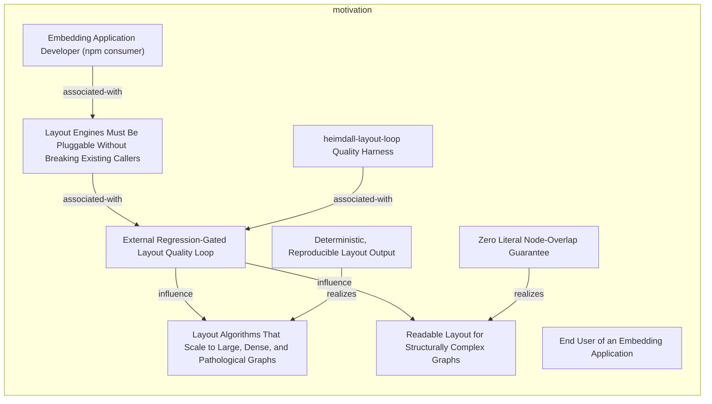
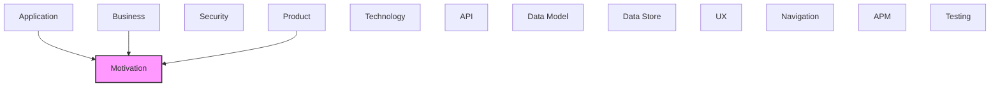

# Motivation

[← Back to README](../README.md)

Goals, requirements, drivers, and strategic outcomes of the architecture.

## Report Index

- [Layer Introduction](#layer-introduction)
- [Intra-Layer Relationships](#intra-layer-relationships)
- [Inter-Layer Dependencies](#inter-layer-dependencies)
- [Inter-Layer Relationships Table](#inter-layer-relationships-table)
- [Element Reference](#element-reference)

## Layer Introduction

| Metric                    | Count |
| ------------------------- | ----- |
| Elements                  | 9     |
| Intra-Layer Relationships | 7     |
| Inter-Layer Relationships | 13    |
| Inbound Relationships     | 13    |
| Outbound Relationships    | 0     |

**Cross-Layer References**:

- **Upstream layers**: [Application](./05-application-layer-report.md), [Business](./02-business-layer-report.md), [Product](./03-product-layer-report.md)

## Intra-Layer Relationships

## Inter-Layer Dependencies

## Inter-Layer Relationships Table

| Relationship ID                                                    | Source Node                                                        | Dest Node                                                                                   | Dest Layer   | Predicate   | Cardinality  | Strength |
| ------------------------------------------------------------------ | ------------------------------------------------------------------ | ------------------------------------------------------------------------------------------- | ------------ | ----------- | ------------ | -------- |
| `application.applicationcomponent.realizes.motivation.goal`        | `application.applicationcomponent.graph-canvas-component`          | `motivation.goal.readable-layout-for-structurally-complex-graphs`                           | `motivation` | `realizes`  | many-to-many | medium   |
| `application.applicationcomponent.realizes.motivation.principle`   | `application.applicationcomponent.graph-canvas-component`          | `motivation.principle.zero-literal-node-overlap-guarantee`                                  | `motivation` | `realizes`  | many-to-many | medium   |
| `application.applicationfunction.satisfies.motivation.requirement` | `application.applicationfunction.clustered-force-layout-algorithm` | `motivation.requirement.layout-engines-must-be-pluggable-without-breaking-existing-callers` | `motivation` | `satisfies` | many-to-many | medium   |
| `application.applicationfunction.satisfies.motivation.requirement` | `application.applicationfunction.force-directed-layout-algorithm`  | `motivation.requirement.layout-engines-must-be-pluggable-without-breaking-existing-callers` | `motivation` | `satisfies` | many-to-many | medium   |
| `business.businessactor.serves.motivation.stakeholder`             | `business.businessactor.embedding-application-developer`           | `motivation.stakeholder.embedding-application-developer-npm-consumer`                       | `motivation` | `serves`    | many-to-many | medium   |
| `business.businessactor.serves.motivation.stakeholder`             | `business.businessactor.end-user-exploring-a-graph-view`           | `motivation.stakeholder.end-user-of-an-embedding-application`                               | `motivation` | `serves`    | many-to-many | medium   |
| `product.capability.supports.motivation.goal`                      | `product.capability.clustered-force-layout-community-bubbles`      | `motivation.goal.layout-algorithms-that-scale-to-large-dense-and-pathological-graphs`       | `motivation` | `supports`  | many-to-many | medium   |
| `product.capability.supports.motivation.goal`                      | `product.capability.force-directed-graph-layout`                   | `motivation.goal.readable-layout-for-structurally-complex-graphs`                           | `motivation` | `supports`  | many-to-many | medium   |
| `product.capability.supports.motivation.goal`                      | `product.capability.galaxy-radial-orbit-layout`                    | `motivation.goal.readable-layout-for-structurally-complex-graphs`                           | `motivation` | `supports`  | many-to-many | medium   |
| `product.capability.supports.motivation.goal`                      | `product.capability.radial-tree-layout`                            | `motivation.goal.readable-layout-for-structurally-complex-graphs`                           | `motivation` | `supports`  | many-to-many | medium   |
| `product.capability.supports.motivation.goal`                      | `product.capability.ux-navigation-tree-layout`                     | `motivation.goal.readable-layout-for-structurally-complex-graphs`                           | `motivation` | `supports`  | many-to-many | medium   |
| `product.persona.realizes.motivation.stakeholder`                  | `product.persona.application-developer-embedding-a-graph-view`     | `motivation.stakeholder.embedding-application-developer-npm-consumer`                       | `motivation` | `realizes`  | many-to-many | medium   |
| `product.persona.realizes.motivation.stakeholder`                  | `product.persona.end-user-exploring-a-rendered-graph`              | `motivation.stakeholder.end-user-of-an-embedding-application`                               | `motivation` | `realizes`  | many-to-many | medium   |

## Element Reference

### External Regression-Gated Layout Quality Loop {#external-regression-gated-layout-quality-loop}

**ID**: `motivation.driver.external-regression-gated-layout-quality-loop`

**Type**: `driver`

Inferred from CHANGELOG.md: forceLayout's resolveOverlaps fix was 'verified against a real 31-node/33-edge reference layer via the project's own layout-quality test loop... the first of 8 proposed changes to that loop's regression-gated test to actually pass it' — i.e. a sibling harness (this very heimdall-layout-loop repo) drives heimdall's own layout-algorithm changes.

#### Attributes

| Name     | Value         |
| -------- | ------------- |
| category | technological |

#### Relationships

| Type        | Related Element                                                                             | Predicate         | Direction |
| ----------- | ------------------------------------------------------------------------------------------- | ----------------- | --------- |
| intra-layer | `motivation.goal.layout-algorithms-that-scale-to-large-dense-and-pathological-graphs`       | `influence`       | outbound  |
| intra-layer | `motivation.goal.readable-layout-for-structurally-complex-graphs`                           | `influence`       | outbound  |
| intra-layer | `motivation.requirement.layout-engines-must-be-pluggable-without-breaking-existing-callers` | `associated-with` | inbound   |
| intra-layer | `motivation.stakeholder.heimdall-layout-loop-quality-harness`                               | `associated-with` | inbound   |

### Layout Algorithms That Scale to Large, Dense, and Pathological Graphs {#layout-algorithms-that-scale-to-large-dense-and-pathological-graphs}

**ID**: `motivation.goal.layout-algorithms-that-scale-to-large-dense-and-pathological-graphs`

**Type**: `goal`

Inferred from graphLayout.ts's MACRO_EDGE_CAP handling of a measured 564-duplicate-edge pathological dense-cluster fixture, and FINAL_CLEANUP_MAX_PASSES's docs about an 18-large-card dense hub-and-spoke case.

#### Attributes

| Name     | Value |
| -------- | ----- |
| priority | high  |

#### Relationships

| Type        | Related Element                                                   | Predicate   | Direction |
| ----------- | ----------------------------------------------------------------- | ----------- | --------- |
| inter-layer | `product.capability.clustered-force-layout-community-bubbles`     | `supports`  | inbound   |
| intra-layer | `motivation.driver.external-regression-gated-layout-quality-loop` | `influence` | inbound   |
| intra-layer | `motivation.principle.deterministic-reproducible-layout-output`   | `realizes`  | inbound   |

### Readable Layout for Structurally Complex Graphs {#readable-layout-for-structurally-complex-graphs}

**ID**: `motivation.goal.readable-layout-for-structurally-complex-graphs`

**Type**: `goal`

Inferred from graphLayout.ts's resolveOverlaps/separationPass documentation and repeated CHANGELOG entries: minimize node overlap and edge crossings, and keep edge-length deviation / neighborhood preservation good, even for bushy hub-and-spoke or large-card-node topologies.

#### Attributes

| Name     | Value |
| -------- | ----- |
| priority | high  |

#### Relationships

| Type        | Related Element                                                   | Predicate   | Direction |
| ----------- | ----------------------------------------------------------------- | ----------- | --------- |
| inter-layer | `application.applicationcomponent.graph-canvas-component`         | `realizes`  | inbound   |
| inter-layer | `product.capability.force-directed-graph-layout`                  | `supports`  | inbound   |
| inter-layer | `product.capability.galaxy-radial-orbit-layout`                   | `supports`  | inbound   |
| inter-layer | `product.capability.radial-tree-layout`                           | `supports`  | inbound   |
| inter-layer | `product.capability.ux-navigation-tree-layout`                    | `supports`  | inbound   |
| intra-layer | `motivation.driver.external-regression-gated-layout-quality-loop` | `influence` | inbound   |
| intra-layer | `motivation.principle.zero-literal-node-overlap-guarantee`        | `realizes`  | inbound   |

### Deterministic, Reproducible Layout Output {#deterministic-reproducible-layout-output}

**ID**: `motivation.principle.deterministic-reproducible-layout-output`

**Type**: `principle`

Inferred from graphClustering.ts's header comment: louvainCluster never uses Math.random or wall-clock time, always iterates in a fixed order, and breaks every tie deterministically, because the layout loop's scoring depends on reproducible layouts across runs of the same input.

#### Attributes

| Name     | Value       |
| -------- | ----------- |
| category | development |

#### Relationships

| Type        | Related Element                                                                       | Predicate  | Direction |
| ----------- | ------------------------------------------------------------------------------------- | ---------- | --------- |
| intra-layer | `motivation.goal.layout-algorithms-that-scale-to-large-dense-and-pathological-graphs` | `realizes` | outbound  |

### Zero Literal Node-Overlap Guarantee {#zero-literal-node-overlap-guarantee}

**ID**: `motivation.principle.zero-literal-node-overlap-guarantee`

**Type**: `principle`

Inferred from repeated 'zero literal overlap' language across graphLayout.ts/galaxyLayout.ts (resolveOverlaps, FINAL_CLEANUP_MAX_PASSES, nodeMargin docs) — every layout engine runs an unpadded final cleanup pass specifically to guarantee this regardless of what padding options were requested.

#### Attributes

| Name     | Value        |
| -------- | ------------ |
| category | architecture |

#### Relationships

| Type        | Related Element                                                   | Predicate  | Direction |
| ----------- | ----------------------------------------------------------------- | ---------- | --------- |
| inter-layer | `application.applicationcomponent.graph-canvas-component`         | `realizes` | inbound   |
| intra-layer | `motivation.goal.readable-layout-for-structurally-complex-graphs` | `realizes` | outbound  |

### Layout Engines Must Be Pluggable Without Breaking Existing Callers {#layout-engines-must-be-pluggable-without-breaking-existing-callers}

**ID**: `motivation.requirement.layout-engines-must-be-pluggable-without-breaking-existing-callers`

**Type**: `requirement`

Inferred from clusteredForceLayout's own docs ('strictly additive/opt-in: it doesn't change forceLayout's behavior for any existing caller, and is only reached if a caller explicitly chooses it') and GraphCanvas's layout prop union growing over multiple CHANGELOG releases (force -&gt; galaxy -&gt; force-clustered -&gt; ux-navigation -&gt; radial-tree) without breaking earlier modes.

#### Attributes

| Name            | Value          |
| --------------- | -------------- |
| priority        | high           |
| requirementType | non-functional |

#### Relationships

| Type        | Related Element                                                       | Predicate         | Direction |
| ----------- | --------------------------------------------------------------------- | ----------------- | --------- |
| inter-layer | `application.applicationfunction.clustered-force-layout-algorithm`    | `satisfies`       | inbound   |
| inter-layer | `application.applicationfunction.force-directed-layout-algorithm`     | `satisfies`       | inbound   |
| intra-layer | `motivation.driver.external-regression-gated-layout-quality-loop`     | `associated-with` | outbound  |
| intra-layer | `motivation.stakeholder.embedding-application-developer-npm-consumer` | `associated-with` | inbound   |

### Embedding Application Developer (npm consumer) {#embedding-application-developer-npm-consumer}

**ID**: `motivation.stakeholder.embedding-application-developer-npm-consumer`

**Type**: `stakeholder`

Inferred: the external developer consuming @tinkermonkey/heimdall-ui's public API (src/index.ts) to embed a graph view in their own product.

#### Attributes

| Name | Value    |
| ---- | -------- |
| type | external |

#### Relationships

| Type        | Related Element                                                                             | Predicate         | Direction |
| ----------- | ------------------------------------------------------------------------------------------- | ----------------- | --------- |
| inter-layer | `business.businessactor.embedding-application-developer`                                    | `serves`          | inbound   |
| inter-layer | `product.persona.application-developer-embedding-a-graph-view`                              | `realizes`        | inbound   |
| intra-layer | `motivation.requirement.layout-engines-must-be-pluggable-without-breaking-existing-callers` | `associated-with` | outbound  |

### End User of an Embedding Application {#end-user-of-an-embedding-application}

**ID**: `motivation.stakeholder.end-user-of-an-embedding-application`

**Type**: `stakeholder`

Inferred: the person who ultimately interacts with a rendered GraphCanvas inside whatever application embedded it, with no awareness of heimdall itself.

#### Attributes

| Name | Value    |
| ---- | -------- |
| type | end-user |

#### Relationships

| Type        | Related Element                                          | Predicate  | Direction |
| ----------- | -------------------------------------------------------- | ---------- | --------- |
| inter-layer | `business.businessactor.end-user-exploring-a-graph-view` | `serves`   | inbound   |
| inter-layer | `product.persona.end-user-exploring-a-rendered-graph`    | `realizes` | inbound   |

### heimdall-layout-loop Quality Harness {#heimdall-layout-loop-quality-harness}

**ID**: `motivation.stakeholder.heimdall-layout-loop-quality-harness`

**Type**: `stakeholder`

Inferred from CHANGELOG.md's reference to 'the project's own layout-quality test loop' — an external, automated regression harness that renders/scores heimdall's layout output and gates which proposed algorithm changes are kept.

#### Attributes

| Name | Value  |
| ---- | ------ |
| type | system |

#### Relationships

| Type        | Related Element                                                   | Predicate         | Direction |
| ----------- | ----------------------------------------------------------------- | ----------------- | --------- |
| intra-layer | `motivation.driver.external-regression-gated-layout-quality-loop` | `associated-with` | outbound  |

---

Generated: 2026-09-18T14:44:15.109Z | Model Version: 0.1.0
