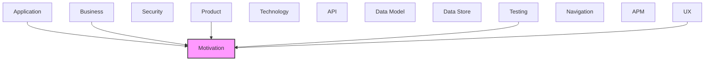

# Motivation

[← Back to README](../README.md)

Goals, requirements, drivers, and strategic outcomes of the architecture.

## Report Index

- [Layer Introduction](#layer-introduction)
- [Intra-Layer Relationships](#intra-layer-relationships)
- [Inter-Layer Dependencies](#inter-layer-dependencies)
- [Inter-Layer Relationships Table](#inter-layer-relationships-table)
- [Element Reference](#element-reference)

## Layer Introduction

| Metric                    | Count |
| ------------------------- | ----- |
| Elements                  | 32    |
| Intra-Layer Relationships | 29    |
| Inter-Layer Relationships | 210   |
| Inbound Relationships     | 210   |
| Outbound Relationships    | 0     |

**Cross-Layer References**:

- **Upstream layers**: [Application](./05-application-layer-report.md), [Business](./02-business-layer-report.md), [Product](./03-product-layer-report.md), [Testing](./13-testing-layer-report.md), [UX](./10-ux-layer-report.md)

## Intra-Layer Relationships

*This layer has >30 elements. Summary table shown instead of diagram.*

| Element                                                                                     | Type          | Relationships |
| ------------------------------------------------------------------------------------------- | ------------- | ------------- |
| `motivation.constraint.every-exported-component-is-covered-by-an-agent-skill`               | `constraint`  | 1             |
| `motivation.constraint.layer-stack-draws-links-as-batched-svg-paths-not-canvas`             | `constraint`  | 0             |
| `motivation.constraint.package-ships-esm-dist-and-agent-skills-only`                        | `constraint`  | 1             |
| `motivation.constraint.visual-changes-pass-per-os-screenshot-baselines`                     | `constraint`  | 0             |
| `motivation.driver.external-regression-gated-layout-quality-loop`                           | `driver`      | 5             |
| `motivation.goal.layout-algorithms-that-scale-to-large-dense-and-pathological-graphs`       | `goal`        | 5             |
| `motivation.goal.low-friction-adoption-in-any-react-toolchain`                              | `goal`        | 6             |
| `motivation.goal.one-consistent-ide-density-ui-across-heimdall-based-tools`                 | `goal`        | 1             |
| `motivation.goal.readable-layout-for-structurally-complex-graphs`                           | `goal`        | 5             |
| `motivation.goal.usable-by-every-end-user`                                                  | `goal`        | 3             |
| `motivation.principle.deterministic-reproducible-layout-output`                             | `principle`   | 2             |
| `motivation.principle.theme-through-tokens-on-two-surfaces-never-color-filters`             | `principle`   | 1             |
| `motivation.principle.zero-literal-node-overlap-guarantee`                                  | `principle`   | 4             |
| `motivation.requirement.components-render-on-the-server`                                    | `requirement` | 1             |
| `motivation.requirement.dropdown-panels-render-in-a-portal-by-default`                      | `requirement` | 0             |
| `motivation.requirement.every-exported-path-resolves-in-the-published-tarball`              | `requirement` | 1             |
| `motivation.requirement.galaxy-keeps-orbits-even-over-round-systems`                        | `requirement` | 2             |
| `motivation.requirement.graph-nodes-and-edges-have-accessible-names`                        | `requirement` | 1             |
| `motivation.requirement.hive-plot-keeps-axis-angles-stable-when-a-layer-is-hidden`          | `requirement` | 0             |
| `motivation.requirement.large-layouts-do-not-block-the-first-paint`                         | `requirement` | 1             |
| `motivation.requirement.layout-engines-must-be-pluggable-without-breaking-existing-callers` | `requirement` | 2             |
| `motivation.requirement.layout-output-is-deterministic-for-a-given-input`                   | `requirement` | 1             |
| `motivation.requirement.live-galaxy-drag-stays-interactive`                                 | `requirement` | 1             |
| `motivation.requirement.motion-honours-reduced-motion-preference`                           | `requirement` | 1             |
| `motivation.requirement.navigation-routing-stays-within-its-time-budget`                    | `requirement` | 1             |
| `motivation.requirement.no-two-node-boxes-overlap-after-any-layout-engine-runs`             | `requirement` | 1             |
| `motivation.requirement.opt-in-component-stylesheets-are-load-order-independent`            | `requirement` | 1             |
| `motivation.requirement.package-loads-as-plain-esm-in-node-ssr-and-test-runners`            | `requirement` | 1             |
| `motivation.requirement.unused-components-drop-out-of-a-consumer-bundle`                    | `requirement` | 1             |
| `motivation.stakeholder.embedding-application-developer-npm-consumer`                       | `stakeholder` | 4             |
| `motivation.stakeholder.end-user-of-an-embedding-application`                               | `stakeholder` | 2             |
| `motivation.stakeholder.heimdall-layout-loop-quality-harness`                               | `stakeholder` | 2             |

## Inter-Layer Dependencies

```mermaid
flowchart TB
  classDef current fill:#f9f,stroke:#333,stroke-width:2px
  motivation["Motivation"]
  business["Business"]
  product["Product"]
  security["Security"]
  application["Application"]
  technology["Technology"]
  api["API"]
  data_model["Data Model"]
  data_store["Data Store"]
  ux["UX"]
  navigation["Navigation"]
  apm["APM"]
  testing["Testing"]
  application --> motivation
  business --> motivation
  product --> motivation
  testing --> motivation
  ux --> motivation
  class motivation current
```

## Inter-Layer Relationships Table

| Relationship ID                                                    | Source Node                                                                                                                           | Dest Node                                                                                   | Dest Layer   | Predicate    | Cardinality  | Strength |
| ------------------------------------------------------------------ | ------------------------------------------------------------------------------------------------------------------------------------- | ------------------------------------------------------------------------------------------- | ------------ | ------------ | ------------ | -------- |
| `application.applicationfunction.satisfies.motivation.requirement` | `application.applicationfunction.clustered-force-layout-algorithm`                                                                    | `motivation.requirement.layout-engines-must-be-pluggable-without-breaking-existing-callers` | `motivation` | `satisfies`  | many-to-many | medium   |
| `application.applicationfunction.satisfies.motivation.requirement` | `application.applicationfunction.dropdown-portal-placement`                                                                           | `motivation.requirement.dropdown-panels-render-in-a-portal-by-default`                      | `motivation` | `satisfies`  | many-to-many | medium   |
| `application.applicationfunction.satisfies.motivation.requirement` | `application.applicationfunction.force-directed-layout-algorithm`                                                                     | `motivation.requirement.layout-engines-must-be-pluggable-without-breaking-existing-callers` | `motivation` | `satisfies`  | many-to-many | medium   |
| `application.applicationfunction.satisfies.motivation.requirement` | `application.applicationfunction.force-directed-layout-algorithm`                                                                     | `motivation.requirement.no-two-node-boxes-overlap-after-any-layout-engine-runs`             | `motivation` | `satisfies`  | many-to-many | medium   |
| `application.applicationfunction.satisfies.motivation.requirement` | `application.applicationfunction.galaxy-live-simulation-step`                                                                         | `motivation.requirement.layout-output-is-deterministic-for-a-given-input`                   | `motivation` | `satisfies`  | many-to-many | medium   |
| `application.applicationfunction.satisfies.motivation.requirement` | `application.applicationfunction.galaxy-live-simulation-step`                                                                         | `motivation.requirement.live-galaxy-drag-stays-interactive`                                 | `motivation` | `satisfies`  | many-to-many | medium   |
| `application.applicationfunction.satisfies.motivation.requirement` | `application.applicationfunction.galaxy-radial-orbit-layout-algorithm`                                                                | `motivation.requirement.galaxy-keeps-orbits-even-over-round-systems`                        | `motivation` | `satisfies`  | many-to-many | medium   |
| `application.applicationfunction.satisfies.motivation.requirement` | `application.applicationfunction.galaxy-radial-orbit-layout-algorithm`                                                                | `motivation.requirement.no-two-node-boxes-overlap-after-any-layout-engine-runs`             | `motivation` | `satisfies`  | many-to-many | medium   |
| `application.applicationfunction.satisfies.motivation.requirement` | `application.applicationfunction.hive-plot-geometry`                                                                                  | `motivation.requirement.hive-plot-keeps-axis-angles-stable-when-a-layer-is-hidden`          | `motivation` | `satisfies`  | many-to-many | medium   |
| `application.applicationfunction.satisfies.motivation.requirement` | `application.applicationfunction.louvain-community-clustering`                                                                        | `motivation.requirement.layout-output-is-deterministic-for-a-given-input`                   | `motivation` | `satisfies`  | many-to-many | medium   |
| `application.applicationfunction.satisfies.motivation.requirement` | `application.applicationfunction.navigation-edge-orthogonal-routing`                                                                  | `motivation.requirement.navigation-routing-stays-within-its-time-budget`                    | `motivation` | `satisfies`  | many-to-many | medium   |
| `application.applicationfunction.satisfies.motivation.requirement` | `application.applicationfunction.node-overlap-separation-pass`                                                                        | `motivation.requirement.no-two-node-boxes-overlap-after-any-layout-engine-runs`             | `motivation` | `satisfies`  | many-to-many | medium   |
| `application.applicationfunction.satisfies.motivation.requirement` | `application.applicationfunction.organic-layout-algorithm`                                                                            | `motivation.requirement.layout-output-is-deterministic-for-a-given-input`                   | `motivation` | `satisfies`  | many-to-many | medium   |
| `application.applicationfunction.satisfies.motivation.requirement` | `application.applicationfunction.organic-layout-algorithm`                                                                            | `motivation.requirement.no-two-node-boxes-overlap-after-any-layout-engine-runs`             | `motivation` | `satisfies`  | many-to-many | medium   |
| `application.applicationfunction.satisfies.motivation.requirement` | `application.applicationfunction.orthogonal-layout-algorithm`                                                                         | `motivation.requirement.layout-output-is-deterministic-for-a-given-input`                   | `motivation` | `satisfies`  | many-to-many | medium   |
| `application.applicationfunction.satisfies.motivation.requirement` | `application.applicationfunction.radial-tree-layout-algorithm`                                                                        | `motivation.requirement.no-two-node-boxes-overlap-after-any-layout-engine-runs`             | `motivation` | `satisfies`  | many-to-many | medium   |
| `application.applicationservice.satisfies.motivation.requirement`  | `application.applicationservice.graph-layout-engine-service`                                                                          | `motivation.requirement.layout-engines-must-be-pluggable-without-breaking-existing-callers` | `motivation` | `satisfies`  | many-to-many | medium   |
| `application.applicationservice.satisfies.motivation.constraint`   | `application.applicationservice.layered-graph-visualization`                                                                          | `motivation.constraint.layer-stack-draws-links-as-batched-svg-paths-not-canvas`             | `motivation` | `satisfies`  | many-to-many | medium   |
| `business.businessactor.references.motivation.stakeholder`         | `business.businessactor.embedding-application-developer`                                                                              | `motivation.stakeholder.embedding-application-developer-npm-consumer`                       | `motivation` | `references` | many-to-many | medium   |
| `business.businessactor.references.motivation.stakeholder`         | `business.businessactor.end-user-exploring-a-graph-view`                                                                              | `motivation.stakeholder.end-user-of-an-embedding-application`                               | `motivation` | `references` | many-to-many | medium   |
| `business.businessservice.realizes.motivation.goal`                | `business.businessservice.hierarchical-and-navigation-structure-visualization`                                                        | `motivation.goal.readable-layout-for-structurally-complex-graphs`                           | `motivation` | `realizes`   | many-to-many | medium   |
| `business.businessservice.realizes.motivation.goal`                | `business.businessservice.large-graph-visualization`                                                                                  | `motivation.goal.layout-algorithms-that-scale-to-large-dense-and-pathological-graphs`       | `motivation` | `realizes`   | many-to-many | medium   |
| `product.persona.references.motivation.stakeholder`                | `product.persona.application-developer-embedding-a-graph-view`                                                                        | `motivation.stakeholder.embedding-application-developer-npm-consumer`                       | `motivation` | `references` | many-to-many | medium   |
| `product.persona.references.motivation.stakeholder`                | `product.persona.end-user-exploring-a-rendered-graph`                                                                                 | `motivation.stakeholder.end-user-of-an-embedding-application`                               | `motivation` | `references` | many-to-many | medium   |
| `product.softwarecapability.supports.motivation.goal`              | `product.softwarecapability.app-navigation`                                                                                           | `motivation.goal.one-consistent-ide-density-ui-across-heimdall-based-tools`                 | `motivation` | `supports`   | many-to-many | medium   |
| `product.softwarecapability.supports.motivation.goal`              | `product.softwarecapability.app-shell`                                                                                                | `motivation.goal.one-consistent-ide-density-ui-across-heimdall-based-tools`                 | `motivation` | `supports`   | many-to-many | medium   |
| `product.softwarecapability.supports.motivation.goal`              | `product.softwarecapability.charting`                                                                                                 | `motivation.goal.one-consistent-ide-density-ui-across-heimdall-based-tools`                 | `motivation` | `supports`   | many-to-many | medium   |
| `product.softwarecapability.supports.motivation.goal`              | `product.softwarecapability.chat-ui`                                                                                                  | `motivation.goal.one-consistent-ide-density-ui-across-heimdall-based-tools`                 | `motivation` | `supports`   | many-to-many | medium   |
| `product.softwarecapability.satisfies.motivation.requirement`      | `product.softwarecapability.clustered-force-layout-community-bubbles`                                                                 | `motivation.requirement.layout-engines-must-be-pluggable-without-breaking-existing-callers` | `motivation` | `satisfies`  | many-to-many | medium   |
| `product.softwarecapability.supports.motivation.goal`              | `product.softwarecapability.clustered-force-layout-community-bubbles`                                                                 | `motivation.goal.layout-algorithms-that-scale-to-large-dense-and-pathological-graphs`       | `motivation` | `supports`   | many-to-many | medium   |
| `product.softwarecapability.supports.motivation.goal`              | `product.softwarecapability.data-display`                                                                                             | `motivation.goal.one-consistent-ide-density-ui-across-heimdall-based-tools`                 | `motivation` | `supports`   | many-to-many | medium   |
| `product.softwarecapability.supports.motivation.goal`              | `product.softwarecapability.force-directed-graph-layout`                                                                              | `motivation.goal.readable-layout-for-structurally-complex-graphs`                           | `motivation` | `supports`   | many-to-many | medium   |
| `product.softwarecapability.supports.motivation.goal`              | `product.softwarecapability.form-input`                                                                                               | `motivation.goal.one-consistent-ide-density-ui-across-heimdall-based-tools`                 | `motivation` | `supports`   | many-to-many | medium   |
| `product.softwarecapability.supports.motivation.goal`              | `product.softwarecapability.galaxy-radial-orbit-layout`                                                                               | `motivation.goal.readable-layout-for-structurally-complex-graphs`                           | `motivation` | `supports`   | many-to-many | medium   |
| `product.softwarecapability.supports.motivation.goal`              | `product.softwarecapability.interactive-graph-exploration`                                                                            | `motivation.goal.readable-layout-for-structurally-complex-graphs`                           | `motivation` | `supports`   | many-to-many | medium   |
| `product.softwarecapability.supports.motivation.goal`              | `product.softwarecapability.layered-graph-visualization`                                                                              | `motivation.goal.one-consistent-ide-density-ui-across-heimdall-based-tools`                 | `motivation` | `supports`   | many-to-many | medium   |
| `product.softwarecapability.supports.motivation.goal`              | `product.softwarecapability.layered-graph-visualization`                                                                              | `motivation.goal.readable-layout-for-structurally-complex-graphs`                           | `motivation` | `supports`   | many-to-many | medium   |
| `product.softwarecapability.supports.motivation.goal`              | `product.softwarecapability.overlays-and-dialogs`                                                                                     | `motivation.goal.one-consistent-ide-density-ui-across-heimdall-based-tools`                 | `motivation` | `supports`   | many-to-many | medium   |
| `product.softwarecapability.supports.motivation.goal`              | `product.softwarecapability.page-patterns`                                                                                            | `motivation.goal.one-consistent-ide-density-ui-across-heimdall-based-tools`                 | `motivation` | `supports`   | many-to-many | medium   |
| `product.softwarecapability.supports.motivation.goal`              | `product.softwarecapability.planning-and-scheduling`                                                                                  | `motivation.goal.one-consistent-ide-density-ui-across-heimdall-based-tools`                 | `motivation` | `supports`   | many-to-many | medium   |
| `product.softwarecapability.supports.motivation.goal`              | `product.softwarecapability.radial-tree-layout`                                                                                       | `motivation.goal.readable-layout-for-structurally-complex-graphs`                           | `motivation` | `supports`   | many-to-many | medium   |
| `product.softwarecapability.supports.motivation.goal`              | `product.softwarecapability.responsive-layout`                                                                                        | `motivation.goal.one-consistent-ide-density-ui-across-heimdall-based-tools`                 | `motivation` | `supports`   | many-to-many | medium   |
| `product.softwarecapability.supports.motivation.goal`              | `product.softwarecapability.run-history-and-observability-views`                                                                      | `motivation.goal.one-consistent-ide-density-ui-across-heimdall-based-tools`                 | `motivation` | `supports`   | many-to-many | medium   |
| `product.softwarecapability.supports.motivation.goal`              | `product.softwarecapability.ui-primitives`                                                                                            | `motivation.goal.one-consistent-ide-density-ui-across-heimdall-based-tools`                 | `motivation` | `supports`   | many-to-many | medium   |
| `product.softwarecapability.supports.motivation.goal`              | `product.softwarecapability.ux-navigation-tree-layout`                                                                                | `motivation.goal.readable-layout-for-structurally-complex-graphs`                           | `motivation` | `supports`   | many-to-many | medium   |
| `testing.testcasesketch.satisfies.motivation.requirement`          | `testing.testcasesketch.aspect-ratio-elliptical-warp-composes-with-separate-groups-group-boundaries-stay-non-overlapping-ff23cd4d`    | `motivation.requirement.no-two-node-boxes-overlap-after-any-layout-engine-runs`             | `motivation` | `satisfies`  | many-to-many | high     |
| `testing.testcasesketch.satisfies.motivation.requirement`          | `testing.testcasesketch.aspect-ratio-elliptical-warp-leaning-a-forest-wide-never-makes-galaxies-overlap`                              | `motivation.requirement.no-two-node-boxes-overlap-after-any-layout-engine-runs`             | `motivation` | `satisfies`  | many-to-many | high     |
| `testing.testcasesketch.satisfies.motivation.requirement`          | `testing.testcasesketch.channel-router-route-navigation-edges-applies-nudge-pass-to-spread-overlapping-segments`                      | `motivation.requirement.no-two-node-boxes-overlap-after-any-layout-engine-runs`             | `motivation` | `satisfies`  | many-to-many | high     |
| `testing.testcasesketch.satisfies.motivation.requirement`          | `testing.testcasesketch.channel-router-route-navigation-edges-nudges-overlapping-segments-while-maintaining-orthogonality`            | `motivation.requirement.no-two-node-boxes-overlap-after-any-layout-engine-runs`             | `motivation` | `satisfies`  | many-to-many | high     |
| `testing.testcasesketch.satisfies.motivation.requirement`          | `testing.testcasesketch.force-layout-keeps-default-sized-chip-nodes-non-overlapping-in-a-simple-chain`                                | `motivation.requirement.no-two-node-boxes-overlap-after-any-layout-engine-runs`             | `motivation` | `satisfies`  | many-to-many | high     |
| `testing.testcasesketch.satisfies.motivation.requirement`          | `testing.testcasesketch.force-layout-keeps-large-card-sized-nodes-non-overlapping-in-a-bushy-hub-and-spoke-topology`                  | `motivation.requirement.no-two-node-boxes-overlap-after-any-layout-engine-runs`             | `motivation` | `satisfies`  | many-to-many | high     |
| `testing.testcasesketch.satisfies.motivation.requirement`          | `testing.testcasesketch.galaxy-layout-galaxies-in-a-busy-forest-never-overlap-packed-by-system-circles`                               | `motivation.requirement.no-two-node-boxes-overlap-after-any-layout-engine-runs`             | `motivation` | `satisfies`  | many-to-many | high     |
| `testing.testcasesketch.satisfies.motivation.requirement`          | `testing.testcasesketch.galaxy-layout-independent-galaxies-never-overlap-whatever-their-depth`                                        | `motivation.requirement.no-two-node-boxes-overlap-after-any-layout-engine-runs`             | `motivation` | `satisfies`  | many-to-many | high     |
| `testing.testcasesketch.satisfies.motivation.requirement`          | `testing.testcasesketch.galaxy-live-drag-287-a-flare-drag-frame-resolves-overlaps-with-grid-local-work-not-all-pairs-every-d4f70636`  | `motivation.requirement.no-two-node-boxes-overlap-after-any-layout-engine-runs`             | `motivation` | `satisfies`  | many-to-many | high     |
| `testing.testcasesketch.satisfies.motivation.requirement`          | `testing.testcasesketch.galaxy-live-drag-287-settles-with-no-overlapping-bodies-the-dropped-node-exactly-on-its-pin-its-e250ab4d`     | `motivation.requirement.no-two-node-boxes-overlap-after-any-layout-engine-runs`             | `motivation` | `satisfies`  | many-to-many | high     |
| `testing.testcasesketch.satisfies.motivation.requirement`          | `testing.testcasesketch.galaxy-simulation-step-a-held-drag-carries-its-subtree-settles-and-leaves-no-overlap`                         | `motivation.requirement.no-two-node-boxes-overlap-after-any-layout-engine-runs`             | `motivation` | `satisfies`  | many-to-many | high     |
| `testing.testcasesketch.satisfies.motivation.requirement`          | `testing.testcasesketch.integration-galaxy-layout-collapse-expand-cards-mode-renders-without-overlaps-after-collapse`                 | `motivation.requirement.no-two-node-boxes-overlap-after-any-layout-engine-runs`             | `motivation` | `satisfies`  | many-to-many | high     |
| `testing.testcasesketch.satisfies.motivation.requirement`          | `testing.testcasesketch.integration-galaxy-layout-collapse-expand-collapse-maintains-zero-overlap-guarantee-for-galaxy-f1dd0343`      | `motivation.requirement.no-two-node-boxes-overlap-after-any-layout-engine-runs`             | `motivation` | `satisfies`  | many-to-many | high     |
| `testing.testcasesketch.satisfies.motivation.requirement`          | `testing.testcasesketch.integration-galaxy-layout-collapse-expand-expand-after-collapse-maintains-zero-overlap-guarantee`             | `motivation.requirement.no-two-node-boxes-overlap-after-any-layout-engine-runs`             | `motivation` | `satisfies`  | many-to-many | high     |
| `testing.testcasesketch.satisfies.motivation.requirement`          | `testing.testcasesketch.integration-galaxy-layout-collapse-expand-multiple-collapses-maintain-zero-overlap-guarantee`                 | `motivation.requirement.no-two-node-boxes-overlap-after-any-layout-engine-runs`             | `motivation` | `satisfies`  | many-to-many | high     |
| `testing.testcasesketch.satisfies.motivation.requirement`          | `testing.testcasesketch.integration-galaxy-layout-collapse-expand-renders-every-node-with-no-overlapping-bounding-boxes`              | `motivation.requirement.no-two-node-boxes-overlap-after-any-layout-engine-runs`             | `motivation` | `satisfies`  | many-to-many | high     |
| `testing.testcasesketch.satisfies.motivation.requirement`          | `testing.testcasesketch.integration-galaxy-layout-lab-poc-dataset-stress-test-renders-every-node-with-no-overlapping-7d5e01b7`        | `motivation.requirement.no-two-node-boxes-overlap-after-any-layout-engine-runs`             | `motivation` | `satisfies`  | many-to-many | high     |
| `testing.testcasesketch.satisfies.motivation.requirement`          | `testing.testcasesketch.integration-graph-canvas-components-bus-view-edge-anchors-curvature-two-edges-between-the-same-node-0c36bb99` | `motivation.requirement.no-two-node-boxes-overlap-after-any-layout-engine-runs`             | `motivation` | `satisfies`  | many-to-many | high     |
| `testing.testcasesketch.satisfies.motivation.requirement`          | `testing.testcasesketch.integration-graph-canvas-components-galaxy-view-layout-relations-cards-mode-renders-substantial-13266211`     | `motivation.requirement.no-two-node-boxes-overlap-after-any-layout-engine-runs`             | `motivation` | `satisfies`  | many-to-many | high     |
| `testing.testcasesketch.satisfies.motivation.requirement`          | `testing.testcasesketch.integration-graph-canvas-components-galaxy-view-layout-relations-hovering-any-body-shows-its-orbit-378f0ade`  | `motivation.requirement.no-two-node-boxes-overlap-after-any-layout-engine-runs`             | `motivation` | `satisfies`  | many-to-many | high     |
| `testing.testcasesketch.satisfies.motivation.requirement`          | `testing.testcasesketch.integration-organic-layout-renders-every-node-without-overlapping-bounding-boxes`                             | `motivation.requirement.no-two-node-boxes-overlap-after-any-layout-engine-runs`             | `motivation` | `satisfies`  | many-to-many | high     |
| `testing.testcasesketch.satisfies.motivation.requirement`          | `testing.testcasesketch.integration-orthogonal-layout-renders-every-node-without-overlapping-bounding-boxes`                          | `motivation.requirement.no-two-node-boxes-overlap-after-any-layout-engine-runs`             | `motivation` | `satisfies`  | many-to-many | high     |
| `testing.testcasesketch.satisfies.motivation.requirement`          | `testing.testcasesketch.integration-trace-viewer-interactions-long-attribute-keys-values-truncate-no-overlap-with-a-hover-35742fa3`   | `motivation.requirement.no-two-node-boxes-overlap-after-any-layout-engine-runs`             | `motivation` | `satisfies`  | many-to-many | high     |
| `testing.testcasesketch.satisfies.motivation.requirement`          | `testing.testcasesketch.layout-lanes-stacks-bands-without-overlap-and-no-two-nodes-overlap`                                           | `motivation.requirement.no-two-node-boxes-overlap-after-any-layout-engine-runs`             | `motivation` | `satisfies`  | many-to-many | high     |
| `testing.testcasesketch.satisfies.motivation.requirement`          | `testing.testcasesketch.nudge-overlapping-segments-does-not-move-a-segment-onto-another-routes-line`                                  | `motivation.requirement.no-two-node-boxes-overlap-after-any-layout-engine-runs`             | `motivation` | `satisfies`  | many-to-many | high     |
| `testing.testcasesketch.satisfies.motivation.requirement`          | `testing.testcasesketch.organic-layout-never-overlaps-nodes-and-honors-minimum-node-distance-as-a-post-condition`                     | `motivation.requirement.no-two-node-boxes-overlap-after-any-layout-engine-runs`             | `motivation` | `satisfies`  | many-to-many | high     |
| `testing.testcasesketch.satisfies.motivation.requirement`          | `testing.testcasesketch.organic-layout-packs-disconnected-components-and-isolates-without-overlap`                                    | `motivation.requirement.no-two-node-boxes-overlap-after-any-layout-engine-runs`             | `motivation` | `satisfies`  | many-to-many | high     |
| `testing.testcasesketch.satisfies.motivation.requirement`          | `testing.testcasesketch.orthogonal-layout-channel-router-graphs-the-lattice-router-cannot-route-survives-a-one-node-drag-db1bbe53`    | `motivation.requirement.no-two-node-boxes-overlap-after-any-layout-engine-runs`             | `motivation` | `satisfies`  | many-to-many | high     |
| `testing.testcasesketch.satisfies.motivation.requirement`          | `testing.testcasesketch.orthogonal-layout-places-every-node-on-the-reported-cell-grid-with-no-overlaps`                               | `motivation.requirement.no-two-node-boxes-overlap-after-any-layout-engine-runs`             | `motivation` | `satisfies`  | many-to-many | high     |
| `testing.testcasesketch.satisfies.motivation.requirement`          | `testing.testcasesketch.place-edge-labels-places-in-priority-order-and-slides-along-the-edge-to-avoid-overlap`                        | `motivation.requirement.no-two-node-boxes-overlap-after-any-layout-engine-runs`             | `motivation` | `satisfies`  | many-to-many | high     |
| `testing.testcasesketch.satisfies.motivation.requirement`          | `testing.testcasesketch.radial-tree-layout-multi-level-single-trunk-does-not-overlap-sibling-nodes-at-the-same-depth`                 | `motivation.requirement.no-two-node-boxes-overlap-after-any-layout-engine-runs`             | `motivation` | `satisfies`  | many-to-many | high     |
| `testing.testcasesketch.satisfies.motivation.requirement`          | `testing.testcasesketch.radial-tree-layout-multiple-disconnected-trunks-arranges-multiple-trunks-without-overlap`                     | `motivation.requirement.no-two-node-boxes-overlap-after-any-layout-engine-runs`             | `motivation` | `satisfies`  | many-to-many | high     |
| `testing.testcasesketch.satisfies.motivation.requirement`          | `testing.testcasesketch.radial-tree-layout-ring-sizing-does-not-overlap-nodes-along-a-chain`                                          | `motivation.requirement.no-two-node-boxes-overlap-after-any-layout-engine-runs`             | `motivation` | `satisfies`  | many-to-many | high     |
| `testing.testcasesketch.satisfies.motivation.requirement`          | `testing.testcasesketch.radial-tree-layout-trunk-boundaries-does-not-overlap-boundaries-of-packed-trunks`                             | `motivation.requirement.no-two-node-boxes-overlap-after-any-layout-engine-runs`             | `motivation` | `satisfies`  | many-to-many | high     |
| `testing.testcasesketch.satisfies.motivation.requirement`          | `testing.testcasesketch.route-lane-gutters-at-dr-scale-synthetic-13-lanes-orientation-uses-about-as-many-gutter-tracks-as-997b2fe9`   | `motivation.requirement.no-two-node-boxes-overlap-after-any-layout-engine-runs`             | `motivation` | `satisfies`  | many-to-many | high     |
| `testing.testcasesketch.satisfies.motivation.requirement`          | `testing.testcasesketch.route-lane-gutters-gives-each-stub-its-own-gap-track-and-overlapping-routes-their-own-gutter-tracks-51c767b0` | `motivation.requirement.no-two-node-boxes-overlap-after-any-layout-engine-runs`             | `motivation` | `satisfies`  | many-to-many | high     |
| `testing.testcasesketch.satisfies.motivation.requirement`          | `testing.testcasesketch.ux-nav-layout-two-page-disconnected-views-do-not-overlap-each-other`                                          | `motivation.requirement.no-two-node-boxes-overlap-after-any-layout-engine-runs`             | `motivation` | `satisfies`  | many-to-many | high     |
| `testing.testcasesketch.satisfies.motivation.requirement`          | `testing.testcasesketch.ux-nav-layout-view-wider-than-2x-view-fan-gap-does-not-overlap-its-parent-page`                               | `motivation.requirement.no-two-node-boxes-overlap-after-any-layout-engine-runs`             | `motivation` | `satisfies`  | many-to-many | high     |
| `testing.testcoveragemodel.satisfies.motivation.constraint`        | `testing.testcoveragemodel.heimdall-graph-layout-test-coverage`                                                                       | `motivation.constraint.visual-changes-pass-per-os-screenshot-baselines`                     | `motivation` | `satisfies`  | many-to-many | medium   |
| `testing.testcoveragemodel.satisfies.motivation.principle`         | `testing.testcoveragemodel.heimdall-graph-layout-test-coverage`                                                                       | `motivation.principle.zero-literal-node-overlap-guarantee`                                  | `motivation` | `satisfies`  | many-to-many | high     |
| `testing.testcoveragemodel.satisfies.motivation.requirement`       | `testing.testcoveragemodel.heimdall-graph-layout-test-coverage`                                                                       | `motivation.requirement.no-two-node-boxes-overlap-after-any-layout-engine-runs`             | `motivation` | `satisfies`  | many-to-many | high     |
| `testing.testcoveragemodel.supports.motivation.goal`               | `testing.testcoveragemodel.heimdall-graph-layout-test-coverage`                                                                       | `motivation.goal.one-consistent-ide-density-ui-across-heimdall-based-tools`                 | `motivation` | `supports`   | many-to-many | high     |
| `ux.librarycomponent.satisfies.motivation.principle`               | `ux.librarycomponent.activity-timeline-ux`                                                                                            | `motivation.principle.theme-through-tokens-on-two-surfaces-never-color-filters`             | `motivation` | `satisfies`  | many-to-many | medium   |
| `ux.librarycomponent.satisfies.motivation.principle`               | `ux.librarycomponent.adjacency-matrix-ux`                                                                                             | `motivation.principle.theme-through-tokens-on-two-surfaces-never-color-filters`             | `motivation` | `satisfies`  | many-to-many | medium   |
| `ux.librarycomponent.satisfies.motivation.principle`               | `ux.librarycomponent.alert-strip-ux`                                                                                                  | `motivation.principle.theme-through-tokens-on-two-surfaces-never-color-filters`             | `motivation` | `satisfies`  | many-to-many | medium   |
| `ux.librarycomponent.satisfies.motivation.principle`               | `ux.librarycomponent.app-title-ux`                                                                                                    | `motivation.principle.theme-through-tokens-on-two-surfaces-never-color-filters`             | `motivation` | `satisfies`  | many-to-many | medium   |
| `ux.librarycomponent.satisfies.motivation.principle`               | `ux.librarycomponent.asset-card-ux`                                                                                                   | `motivation.principle.theme-through-tokens-on-two-surfaces-never-color-filters`             | `motivation` | `satisfies`  | many-to-many | medium   |
| `ux.librarycomponent.satisfies.motivation.principle`               | `ux.librarycomponent.asset-grid-ux`                                                                                                   | `motivation.principle.theme-through-tokens-on-two-surfaces-never-color-filters`             | `motivation` | `satisfies`  | many-to-many | medium   |
| `ux.librarycomponent.satisfies.motivation.principle`               | `ux.librarycomponent.avatar-ux`                                                                                                       | `motivation.principle.theme-through-tokens-on-two-surfaces-never-color-filters`             | `motivation` | `satisfies`  | many-to-many | medium   |
| `ux.librarycomponent.satisfies.motivation.principle`               | `ux.librarycomponent.badge-ux`                                                                                                        | `motivation.principle.theme-through-tokens-on-two-surfaces-never-color-filters`             | `motivation` | `satisfies`  | many-to-many | medium   |
| `ux.librarycomponent.satisfies.motivation.principle`               | `ux.librarycomponent.bar-chart-ux`                                                                                                    | `motivation.principle.theme-through-tokens-on-two-surfaces-never-color-filters`             | `motivation` | `satisfies`  | many-to-many | medium   |
| `ux.librarycomponent.satisfies.motivation.principle`               | `ux.librarycomponent.bar-h-ux`                                                                                                        | `motivation.principle.theme-through-tokens-on-two-surfaces-never-color-filters`             | `motivation` | `satisfies`  | many-to-many | medium   |
| `ux.librarycomponent.satisfies.motivation.principle`               | `ux.librarycomponent.bar-v-ux`                                                                                                        | `motivation.principle.theme-through-tokens-on-two-surfaces-never-color-filters`             | `motivation` | `satisfies`  | many-to-many | medium   |
| `ux.librarycomponent.satisfies.motivation.principle`               | `ux.librarycomponent.bridge-node-list-ux`                                                                                             | `motivation.principle.theme-through-tokens-on-two-surfaces-never-color-filters`             | `motivation` | `satisfies`  | many-to-many | medium   |
| `ux.librarycomponent.satisfies.motivation.principle`               | `ux.librarycomponent.button-ux`                                                                                                       | `motivation.principle.theme-through-tokens-on-two-surfaces-never-color-filters`             | `motivation` | `satisfies`  | many-to-many | medium   |
| `ux.librarycomponent.satisfies.motivation.principle`               | `ux.librarycomponent.calendar-ux`                                                                                                     | `motivation.principle.theme-through-tokens-on-two-surfaces-never-color-filters`             | `motivation` | `satisfies`  | many-to-many | medium   |
| `ux.librarycomponent.satisfies.motivation.principle`               | `ux.librarycomponent.camera-controls-ux`                                                                                              | `motivation.principle.theme-through-tokens-on-two-surfaces-never-color-filters`             | `motivation` | `satisfies`  | many-to-many | medium   |
| `ux.librarycomponent.satisfies.motivation.principle`               | `ux.librarycomponent.chart-wrapper-ux`                                                                                                | `motivation.principle.theme-through-tokens-on-two-surfaces-never-color-filters`             | `motivation` | `satisfies`  | many-to-many | medium   |
| `ux.librarycomponent.satisfies.motivation.principle`               | `ux.librarycomponent.chat-composer-ux`                                                                                                | `motivation.principle.theme-through-tokens-on-two-surfaces-never-color-filters`             | `motivation` | `satisfies`  | many-to-many | medium   |
| `ux.librarycomponent.satisfies.motivation.principle`               | `ux.librarycomponent.chat-container-ux`                                                                                               | `motivation.principle.theme-through-tokens-on-two-surfaces-never-color-filters`             | `motivation` | `satisfies`  | many-to-many | medium   |
| `ux.librarycomponent.satisfies.motivation.principle`               | `ux.librarycomponent.chat-divider-ux`                                                                                                 | `motivation.principle.theme-through-tokens-on-two-surfaces-never-color-filters`             | `motivation` | `satisfies`  | many-to-many | medium   |
| `ux.librarycomponent.satisfies.motivation.principle`               | `ux.librarycomponent.chat-markdown-content-ux`                                                                                        | `motivation.principle.theme-through-tokens-on-two-surfaces-never-color-filters`             | `motivation` | `satisfies`  | many-to-many | medium   |
| `ux.librarycomponent.satisfies.motivation.principle`               | `ux.librarycomponent.chat-message-ux`                                                                                                 | `motivation.principle.theme-through-tokens-on-two-surfaces-never-color-filters`             | `motivation` | `satisfies`  | many-to-many | medium   |
| `ux.librarycomponent.satisfies.motivation.principle`               | `ux.librarycomponent.chat-suggestions-ux`                                                                                             | `motivation.principle.theme-through-tokens-on-two-surfaces-never-color-filters`             | `motivation` | `satisfies`  | many-to-many | medium   |
| `ux.librarycomponent.satisfies.motivation.principle`               | `ux.librarycomponent.chip-ux`                                                                                                         | `motivation.principle.theme-through-tokens-on-two-surfaces-never-color-filters`             | `motivation` | `satisfies`  | many-to-many | medium   |
| `ux.librarycomponent.satisfies.motivation.principle`               | `ux.librarycomponent.command-palette-ux`                                                                                              | `motivation.principle.theme-through-tokens-on-two-surfaces-never-color-filters`             | `motivation` | `satisfies`  | many-to-many | medium   |
| `ux.librarycomponent.satisfies.motivation.principle`               | `ux.librarycomponent.config-tile-ux`                                                                                                  | `motivation.principle.theme-through-tokens-on-two-surfaces-never-color-filters`             | `motivation` | `satisfies`  | many-to-many | medium   |
| `ux.librarycomponent.satisfies.motivation.principle`               | `ux.librarycomponent.confirm-dialog-ux`                                                                                               | `motivation.principle.theme-through-tokens-on-two-surfaces-never-color-filters`             | `motivation` | `satisfies`  | many-to-many | medium   |
| `ux.librarycomponent.satisfies.motivation.principle`               | `ux.librarycomponent.detail-drawer-ux`                                                                                                | `motivation.principle.theme-through-tokens-on-two-surfaces-never-color-filters`             | `motivation` | `satisfies`  | many-to-many | medium   |
| `ux.librarycomponent.satisfies.motivation.principle`               | `ux.librarycomponent.diff-viewer-ux`                                                                                                  | `motivation.principle.theme-through-tokens-on-two-surfaces-never-color-filters`             | `motivation` | `satisfies`  | many-to-many | medium   |
| `ux.librarycomponent.satisfies.motivation.principle`               | `ux.librarycomponent.donut-ux`                                                                                                        | `motivation.principle.theme-through-tokens-on-two-surfaces-never-color-filters`             | `motivation` | `satisfies`  | many-to-many | medium   |
| `ux.librarycomponent.satisfies.motivation.principle`               | `ux.librarycomponent.drawer-ux`                                                                                                       | `motivation.principle.theme-through-tokens-on-two-surfaces-never-color-filters`             | `motivation` | `satisfies`  | many-to-many | medium   |
| `ux.librarycomponent.satisfies.motivation.principle`               | `ux.librarycomponent.entity-picker-ux`                                                                                                | `motivation.principle.theme-through-tokens-on-two-surfaces-never-color-filters`             | `motivation` | `satisfies`  | many-to-many | medium   |
| `ux.librarycomponent.satisfies.motivation.requirement`             | `ux.librarycomponent.entity-picker-ux`                                                                                                | `motivation.requirement.dropdown-panels-render-in-a-portal-by-default`                      | `motivation` | `satisfies`  | many-to-many | medium   |
| `ux.librarycomponent.satisfies.motivation.principle`               | `ux.librarycomponent.field-ux`                                                                                                        | `motivation.principle.theme-through-tokens-on-two-surfaces-never-color-filters`             | `motivation` | `satisfies`  | many-to-many | medium   |
| `ux.librarycomponent.satisfies.motivation.principle`               | `ux.librarycomponent.filter-bar-ux`                                                                                                   | `motivation.principle.theme-through-tokens-on-two-surfaces-never-color-filters`             | `motivation` | `satisfies`  | many-to-many | medium   |
| `ux.librarycomponent.satisfies.motivation.principle`               | `ux.librarycomponent.filter-dropdown-ux`                                                                                              | `motivation.principle.theme-through-tokens-on-two-surfaces-never-color-filters`             | `motivation` | `satisfies`  | many-to-many | medium   |
| `ux.librarycomponent.satisfies.motivation.requirement`             | `ux.librarycomponent.filter-dropdown-ux`                                                                                              | `motivation.requirement.dropdown-panels-render-in-a-portal-by-default`                      | `motivation` | `satisfies`  | many-to-many | medium   |
| `ux.librarycomponent.satisfies.motivation.principle`               | `ux.librarycomponent.follow-control-ux`                                                                                               | `motivation.principle.theme-through-tokens-on-two-surfaces-never-color-filters`             | `motivation` | `satisfies`  | many-to-many | medium   |
| `ux.librarycomponent.satisfies.motivation.principle`               | `ux.librarycomponent.form-callout-ux`                                                                                                 | `motivation.principle.theme-through-tokens-on-two-surfaces-never-color-filters`             | `motivation` | `satisfies`  | many-to-many | medium   |
| `ux.librarycomponent.satisfies.motivation.principle`               | `ux.librarycomponent.graph-canvas-ux`                                                                                                 | `motivation.principle.theme-through-tokens-on-two-surfaces-never-color-filters`             | `motivation` | `satisfies`  | many-to-many | medium   |
| `ux.librarycomponent.satisfies.motivation.requirement`             | `ux.librarycomponent.graph-canvas-ux`                                                                                                 | `motivation.requirement.graph-nodes-and-edges-have-accessible-names`                        | `motivation` | `satisfies`  | many-to-many | medium   |
| `ux.librarycomponent.satisfies.motivation.requirement`             | `ux.librarycomponent.graph-canvas-ux`                                                                                                 | `motivation.requirement.large-layouts-do-not-block-the-first-paint`                         | `motivation` | `satisfies`  | many-to-many | medium   |
| `ux.librarycomponent.satisfies.motivation.requirement`             | `ux.librarycomponent.graph-canvas-ux`                                                                                                 | `motivation.requirement.layout-engines-must-be-pluggable-without-breaking-existing-callers` | `motivation` | `satisfies`  | many-to-many | medium   |
| `ux.librarycomponent.satisfies.motivation.requirement`             | `ux.librarycomponent.graph-canvas-ux`                                                                                                 | `motivation.requirement.motion-honours-reduced-motion-preference`                           | `motivation` | `satisfies`  | many-to-many | medium   |
| `ux.librarycomponent.satisfies.motivation.principle`               | `ux.librarycomponent.graph-collapse-control-ux`                                                                                       | `motivation.principle.theme-through-tokens-on-two-surfaces-never-color-filters`             | `motivation` | `satisfies`  | many-to-many | medium   |
| `ux.librarycomponent.satisfies.motivation.principle`               | `ux.librarycomponent.graph-edge-inspector-ux`                                                                                         | `motivation.principle.theme-through-tokens-on-two-surfaces-never-color-filters`             | `motivation` | `satisfies`  | many-to-many | medium   |
| `ux.librarycomponent.satisfies.motivation.principle`               | `ux.librarycomponent.graph-edge-shape-ux`                                                                                             | `motivation.principle.theme-through-tokens-on-two-surfaces-never-color-filters`             | `motivation` | `satisfies`  | many-to-many | medium   |
| `ux.librarycomponent.satisfies.motivation.principle`               | `ux.librarycomponent.graph-edge-ux`                                                                                                   | `motivation.principle.theme-through-tokens-on-two-surfaces-never-color-filters`             | `motivation` | `satisfies`  | many-to-many | medium   |
| `ux.librarycomponent.satisfies.motivation.principle`               | `ux.librarycomponent.graph-inspector-ux`                                                                                              | `motivation.principle.theme-through-tokens-on-two-surfaces-never-color-filters`             | `motivation` | `satisfies`  | many-to-many | medium   |
| `ux.librarycomponent.satisfies.motivation.principle`               | `ux.librarycomponent.graph-node-ux`                                                                                                   | `motivation.principle.theme-through-tokens-on-two-surfaces-never-color-filters`             | `motivation` | `satisfies`  | many-to-many | medium   |
| `ux.librarycomponent.satisfies.motivation.requirement`             | `ux.librarycomponent.graph-node-ux`                                                                                                   | `motivation.requirement.graph-nodes-and-edges-have-accessible-names`                        | `motivation` | `satisfies`  | many-to-many | medium   |
| `ux.librarycomponent.satisfies.motivation.principle`               | `ux.librarycomponent.graph-toolbar-ux`                                                                                                | `motivation.principle.theme-through-tokens-on-two-surfaces-never-color-filters`             | `motivation` | `satisfies`  | many-to-many | medium   |
| `ux.librarycomponent.satisfies.motivation.principle`               | `ux.librarycomponent.hash-set-diff-ux`                                                                                                | `motivation.principle.theme-through-tokens-on-two-surfaces-never-color-filters`             | `motivation` | `satisfies`  | many-to-many | medium   |
| `ux.librarycomponent.satisfies.motivation.principle`               | `ux.librarycomponent.heatmap-ux`                                                                                                      | `motivation.principle.theme-through-tokens-on-two-surfaces-never-color-filters`             | `motivation` | `satisfies`  | many-to-many | medium   |
| `ux.librarycomponent.satisfies.motivation.principle`               | `ux.librarycomponent.hierarchy-row-ux`                                                                                                | `motivation.principle.theme-through-tokens-on-two-surfaces-never-color-filters`             | `motivation` | `satisfies`  | many-to-many | medium   |
| `ux.librarycomponent.satisfies.motivation.principle`               | `ux.librarycomponent.hierarchy-tree-ux`                                                                                               | `motivation.principle.theme-through-tokens-on-two-surfaces-never-color-filters`             | `motivation` | `satisfies`  | many-to-many | medium   |
| `ux.librarycomponent.satisfies.motivation.principle`               | `ux.librarycomponent.hive-plot-ux`                                                                                                    | `motivation.principle.theme-through-tokens-on-two-surfaces-never-color-filters`             | `motivation` | `satisfies`  | many-to-many | medium   |
| `ux.librarycomponent.satisfies.motivation.requirement`             | `ux.librarycomponent.hive-plot-ux`                                                                                                    | `motivation.requirement.hive-plot-keeps-axis-angles-stable-when-a-layer-is-hidden`          | `motivation` | `satisfies`  | many-to-many | medium   |
| `ux.librarycomponent.satisfies.motivation.principle`               | `ux.librarycomponent.icon-ux`                                                                                                         | `motivation.principle.theme-through-tokens-on-two-surfaces-never-color-filters`             | `motivation` | `satisfies`  | many-to-many | medium   |
| `ux.librarycomponent.satisfies.motivation.principle`               | `ux.librarycomponent.inspector-panel-ux`                                                                                              | `motivation.principle.theme-through-tokens-on-two-surfaces-never-color-filters`             | `motivation` | `satisfies`  | many-to-many | medium   |
| `ux.librarycomponent.satisfies.motivation.principle`               | `ux.librarycomponent.kanban-board-ux`                                                                                                 | `motivation.principle.theme-through-tokens-on-two-surfaces-never-color-filters`             | `motivation` | `satisfies`  | many-to-many | medium   |
| `ux.librarycomponent.satisfies.motivation.principle`               | `ux.librarycomponent.key-value-editor-ux`                                                                                             | `motivation.principle.theme-through-tokens-on-two-surfaces-never-color-filters`             | `motivation` | `satisfies`  | many-to-many | medium   |
| `ux.librarycomponent.satisfies.motivation.principle`               | `ux.librarycomponent.kvgrid-ux`                                                                                                       | `motivation.principle.theme-through-tokens-on-two-surfaces-never-color-filters`             | `motivation` | `satisfies`  | many-to-many | medium   |
| `ux.librarycomponent.satisfies.motivation.principle`               | `ux.librarycomponent.layer-list-ux`                                                                                                   | `motivation.principle.theme-through-tokens-on-two-surfaces-never-color-filters`             | `motivation` | `satisfies`  | many-to-many | medium   |
| `ux.librarycomponent.satisfies.motivation.principle`               | `ux.librarycomponent.layer-pair-list-ux`                                                                                              | `motivation.principle.theme-through-tokens-on-two-surfaces-never-color-filters`             | `motivation` | `satisfies`  | many-to-many | medium   |
| `ux.librarycomponent.satisfies.motivation.principle`               | `ux.librarycomponent.layer-stack-ux`                                                                                                  | `motivation.principle.theme-through-tokens-on-two-surfaces-never-color-filters`             | `motivation` | `satisfies`  | many-to-many | medium   |
| `ux.librarycomponent.satisfies.motivation.principle`               | `ux.librarycomponent.layered-graph-context-ux`                                                                                        | `motivation.principle.theme-through-tokens-on-two-surfaces-never-color-filters`             | `motivation` | `satisfies`  | many-to-many | medium   |
| `ux.librarycomponent.satisfies.motivation.principle`               | `ux.librarycomponent.layered-graph-explorer-ux`                                                                                       | `motivation.principle.theme-through-tokens-on-two-surfaces-never-color-filters`             | `motivation` | `satisfies`  | many-to-many | medium   |
| `ux.librarycomponent.satisfies.motivation.principle`               | `ux.librarycomponent.line-chart-ux`                                                                                                   | `motivation.principle.theme-through-tokens-on-two-surfaces-never-color-filters`             | `motivation` | `satisfies`  | many-to-many | medium   |
| `ux.librarycomponent.satisfies.motivation.principle`               | `ux.librarycomponent.lineage-rail-ux`                                                                                                 | `motivation.principle.theme-through-tokens-on-two-surfaces-never-color-filters`             | `motivation` | `satisfies`  | many-to-many | medium   |
| `ux.librarycomponent.satisfies.motivation.principle`               | `ux.librarycomponent.link-category-filter-ux`                                                                                         | `motivation.principle.theme-through-tokens-on-two-surfaces-never-color-filters`             | `motivation` | `satisfies`  | many-to-many | medium   |
| `ux.librarycomponent.satisfies.motivation.principle`               | `ux.librarycomponent.log-stream-ux`                                                                                                   | `motivation.principle.theme-through-tokens-on-two-surfaces-never-color-filters`             | `motivation` | `satisfies`  | many-to-many | medium   |
| `ux.librarycomponent.satisfies.motivation.principle`               | `ux.librarycomponent.map-canvas-ux`                                                                                                   | `motivation.principle.theme-through-tokens-on-two-surfaces-never-color-filters`             | `motivation` | `satisfies`  | many-to-many | medium   |
| `ux.librarycomponent.satisfies.motivation.principle`               | `ux.librarycomponent.metric-row-ux`                                                                                                   | `motivation.principle.theme-through-tokens-on-two-surfaces-never-color-filters`             | `motivation` | `satisfies`  | many-to-many | medium   |
| `ux.librarycomponent.satisfies.motivation.principle`               | `ux.librarycomponent.mini-calendar-ux`                                                                                                | `motivation.principle.theme-through-tokens-on-two-surfaces-never-color-filters`             | `motivation` | `satisfies`  | many-to-many | medium   |
| `ux.librarycomponent.satisfies.motivation.principle`               | `ux.librarycomponent.modal-ux`                                                                                                        | `motivation.principle.theme-through-tokens-on-two-surfaces-never-color-filters`             | `motivation` | `satisfies`  | many-to-many | medium   |
| `ux.librarycomponent.satisfies.motivation.principle`               | `ux.librarycomponent.nav-item-ux`                                                                                                     | `motivation.principle.theme-through-tokens-on-two-surfaces-never-color-filters`             | `motivation` | `satisfies`  | many-to-many | medium   |
| `ux.librarycomponent.satisfies.motivation.principle`               | `ux.librarycomponent.number-input-ux`                                                                                                 | `motivation.principle.theme-through-tokens-on-two-surfaces-never-color-filters`             | `motivation` | `satisfies`  | many-to-many | medium   |
| `ux.librarycomponent.satisfies.motivation.principle`               | `ux.librarycomponent.ordered-list-ux`                                                                                                 | `motivation.principle.theme-through-tokens-on-two-surfaces-never-color-filters`             | `motivation` | `satisfies`  | many-to-many | medium   |
| `ux.librarycomponent.satisfies.motivation.principle`               | `ux.librarycomponent.page-header-ux`                                                                                                  | `motivation.principle.theme-through-tokens-on-two-surfaces-never-color-filters`             | `motivation` | `satisfies`  | many-to-many | medium   |
| `ux.librarycomponent.satisfies.motivation.principle`               | `ux.librarycomponent.panel-ux`                                                                                                        | `motivation.principle.theme-through-tokens-on-two-surfaces-never-color-filters`             | `motivation` | `satisfies`  | many-to-many | medium   |
| `ux.librarycomponent.satisfies.motivation.principle`               | `ux.librarycomponent.pipeline-card-ux`                                                                                                | `motivation.principle.theme-through-tokens-on-two-surfaces-never-color-filters`             | `motivation` | `satisfies`  | many-to-many | medium   |
| `ux.librarycomponent.satisfies.motivation.principle`               | `ux.librarycomponent.plane-layout-control-ux`                                                                                         | `motivation.principle.theme-through-tokens-on-two-surfaces-never-color-filters`             | `motivation` | `satisfies`  | many-to-many | medium   |
| `ux.librarycomponent.satisfies.motivation.principle`               | `ux.librarycomponent.popover-ux`                                                                                                      | `motivation.principle.theme-through-tokens-on-two-surfaces-never-color-filters`             | `motivation` | `satisfies`  | many-to-many | medium   |
| `ux.librarycomponent.satisfies.motivation.principle`               | `ux.librarycomponent.predicate-label-control-ux`                                                                                      | `motivation.principle.theme-through-tokens-on-two-surfaces-never-color-filters`             | `motivation` | `satisfies`  | many-to-many | medium   |
| `ux.librarycomponent.satisfies.motivation.principle`               | `ux.librarycomponent.progress-bar-ux`                                                                                                 | `motivation.principle.theme-through-tokens-on-two-surfaces-never-color-filters`             | `motivation` | `satisfies`  | many-to-many | medium   |
| `ux.librarycomponent.satisfies.motivation.principle`               | `ux.librarycomponent.quick-access-grid-ux`                                                                                            | `motivation.principle.theme-through-tokens-on-two-surfaces-never-color-filters`             | `motivation` | `satisfies`  | many-to-many | medium   |
| `ux.librarycomponent.satisfies.motivation.principle`               | `ux.librarycomponent.quick-access-tile-ux`                                                                                            | `motivation.principle.theme-through-tokens-on-two-surfaces-never-color-filters`             | `motivation` | `satisfies`  | many-to-many | medium   |
| `ux.librarycomponent.satisfies.motivation.principle`               | `ux.librarycomponent.reach-inspector-ux`                                                                                              | `motivation.principle.theme-through-tokens-on-two-surfaces-never-color-filters`             | `motivation` | `satisfies`  | many-to-many | medium   |
| `ux.librarycomponent.satisfies.motivation.principle`               | `ux.librarycomponent.relationship-builder-ux`                                                                                         | `motivation.principle.theme-through-tokens-on-two-surfaces-never-color-filters`             | `motivation` | `satisfies`  | many-to-many | medium   |
| `ux.librarycomponent.satisfies.motivation.principle`               | `ux.librarycomponent.result-card-ux`                                                                                                  | `motivation.principle.theme-through-tokens-on-two-surfaces-never-color-filters`             | `motivation` | `satisfies`  | many-to-many | medium   |
| `ux.librarycomponent.satisfies.motivation.principle`               | `ux.librarycomponent.row-menu-ux`                                                                                                     | `motivation.principle.theme-through-tokens-on-two-surfaces-never-color-filters`             | `motivation` | `satisfies`  | many-to-many | medium   |
| `ux.librarycomponent.satisfies.motivation.requirement`             | `ux.librarycomponent.row-menu-ux`                                                                                                     | `motivation.requirement.dropdown-panels-render-in-a-portal-by-default`                      | `motivation` | `satisfies`  | many-to-many | medium   |
| `ux.librarycomponent.satisfies.motivation.principle`               | `ux.librarycomponent.segmented-control-ux`                                                                                            | `motivation.principle.theme-through-tokens-on-two-surfaces-never-color-filters`             | `motivation` | `satisfies`  | many-to-many | medium   |
| `ux.librarycomponent.satisfies.motivation.principle`               | `ux.librarycomponent.select-ux`                                                                                                       | `motivation.principle.theme-through-tokens-on-two-surfaces-never-color-filters`             | `motivation` | `satisfies`  | many-to-many | medium   |
| `ux.librarycomponent.satisfies.motivation.requirement`             | `ux.librarycomponent.select-ux`                                                                                                       | `motivation.requirement.dropdown-panels-render-in-a-portal-by-default`                      | `motivation` | `satisfies`  | many-to-many | medium   |
| `ux.librarycomponent.satisfies.motivation.principle`               | `ux.librarycomponent.shell-layout-ux`                                                                                                 | `motivation.principle.theme-through-tokens-on-two-surfaces-never-color-filters`             | `motivation` | `satisfies`  | many-to-many | medium   |
| `ux.librarycomponent.satisfies.motivation.principle`               | `ux.librarycomponent.side-by-side-diff-ux`                                                                                            | `motivation.principle.theme-through-tokens-on-two-surfaces-never-color-filters`             | `motivation` | `satisfies`  | many-to-many | medium   |
| `ux.librarycomponent.satisfies.motivation.principle`               | `ux.librarycomponent.sidebar-ux`                                                                                                      | `motivation.principle.theme-through-tokens-on-two-surfaces-never-color-filters`             | `motivation` | `satisfies`  | many-to-many | medium   |
| `ux.librarycomponent.satisfies.motivation.principle`               | `ux.librarycomponent.sparkline-ux`                                                                                                    | `motivation.principle.theme-through-tokens-on-two-surfaces-never-color-filters`             | `motivation` | `satisfies`  | many-to-many | medium   |
| `ux.librarycomponent.satisfies.motivation.principle`               | `ux.librarycomponent.split-pane-ux`                                                                                                   | `motivation.principle.theme-through-tokens-on-two-surfaces-never-color-filters`             | `motivation` | `satisfies`  | many-to-many | medium   |
| `ux.librarycomponent.satisfies.motivation.principle`               | `ux.librarycomponent.stacked-bar-ux`                                                                                                  | `motivation.principle.theme-through-tokens-on-two-surfaces-never-color-filters`             | `motivation` | `satisfies`  | many-to-many | medium   |
| `ux.librarycomponent.satisfies.motivation.principle`               | `ux.librarycomponent.stat-grid-ux`                                                                                                    | `motivation.principle.theme-through-tokens-on-two-surfaces-never-color-filters`             | `motivation` | `satisfies`  | many-to-many | medium   |
| `ux.librarycomponent.satisfies.motivation.principle`               | `ux.librarycomponent.stat-tile-ux`                                                                                                    | `motivation.principle.theme-through-tokens-on-two-surfaces-never-color-filters`             | `motivation` | `satisfies`  | many-to-many | medium   |
| `ux.librarycomponent.satisfies.motivation.principle`               | `ux.librarycomponent.status-badge-ux`                                                                                                 | `motivation.principle.theme-through-tokens-on-two-surfaces-never-color-filters`             | `motivation` | `satisfies`  | many-to-many | medium   |
| `ux.librarycomponent.satisfies.motivation.principle`               | `ux.librarycomponent.status-timeline-ux`                                                                                              | `motivation.principle.theme-through-tokens-on-two-surfaces-never-color-filters`             | `motivation` | `satisfies`  | many-to-many | medium   |
| `ux.librarycomponent.satisfies.motivation.principle`               | `ux.librarycomponent.statusbar-ux`                                                                                                    | `motivation.principle.theme-through-tokens-on-two-surfaces-never-color-filters`             | `motivation` | `satisfies`  | many-to-many | medium   |
| `ux.librarycomponent.satisfies.motivation.principle`               | `ux.librarycomponent.tab-bar-ux`                                                                                                      | `motivation.principle.theme-through-tokens-on-two-surfaces-never-color-filters`             | `motivation` | `satisfies`  | many-to-many | medium   |
| `ux.librarycomponent.satisfies.motivation.principle`               | `ux.librarycomponent.table-ux`                                                                                                        | `motivation.principle.theme-through-tokens-on-two-surfaces-never-color-filters`             | `motivation` | `satisfies`  | many-to-many | medium   |
| `ux.librarycomponent.satisfies.motivation.principle`               | `ux.librarycomponent.text-area-ux`                                                                                                    | `motivation.principle.theme-through-tokens-on-two-surfaces-never-color-filters`             | `motivation` | `satisfies`  | many-to-many | medium   |
| `ux.librarycomponent.satisfies.motivation.principle`               | `ux.librarycomponent.text-input-ux`                                                                                                   | `motivation.principle.theme-through-tokens-on-two-surfaces-never-color-filters`             | `motivation` | `satisfies`  | many-to-many | medium   |
| `ux.librarycomponent.satisfies.motivation.principle`               | `ux.librarycomponent.thinking-block-ux`                                                                                               | `motivation.principle.theme-through-tokens-on-two-surfaces-never-color-filters`             | `motivation` | `satisfies`  | many-to-many | medium   |
| `ux.librarycomponent.satisfies.motivation.principle`               | `ux.librarycomponent.titlebar-ux`                                                                                                     | `motivation.principle.theme-through-tokens-on-two-surfaces-never-color-filters`             | `motivation` | `satisfies`  | many-to-many | medium   |
| `ux.librarycomponent.satisfies.motivation.principle`               | `ux.librarycomponent.toast-ux`                                                                                                        | `motivation.principle.theme-through-tokens-on-two-surfaces-never-color-filters`             | `motivation` | `satisfies`  | many-to-many | medium   |
| `ux.librarycomponent.satisfies.motivation.principle`               | `ux.librarycomponent.tool-block-ux`                                                                                                   | `motivation.principle.theme-through-tokens-on-two-surfaces-never-color-filters`             | `motivation` | `satisfies`  | many-to-many | medium   |
| `ux.librarycomponent.satisfies.motivation.principle`               | `ux.librarycomponent.tooltip-ux`                                                                                                      | `motivation.principle.theme-through-tokens-on-two-surfaces-never-color-filters`             | `motivation` | `satisfies`  | many-to-many | medium   |
| `ux.librarycomponent.satisfies.motivation.principle`               | `ux.librarycomponent.topbar-ux`                                                                                                       | `motivation.principle.theme-through-tokens-on-two-surfaces-never-color-filters`             | `motivation` | `satisfies`  | many-to-many | medium   |
| `ux.librarycomponent.satisfies.motivation.principle`               | `ux.librarycomponent.topology-node-ux`                                                                                                | `motivation.principle.theme-through-tokens-on-two-surfaces-never-color-filters`             | `motivation` | `satisfies`  | many-to-many | medium   |
| `ux.librarycomponent.satisfies.motivation.principle`               | `ux.librarycomponent.trace-viewer-ux`                                                                                                 | `motivation.principle.theme-through-tokens-on-two-surfaces-never-color-filters`             | `motivation` | `satisfies`  | many-to-many | medium   |
| `ux.librarycomponent.satisfies.motivation.principle`               | `ux.librarycomponent.tri-state-ux`                                                                                                    | `motivation.principle.theme-through-tokens-on-two-surfaces-never-color-filters`             | `motivation` | `satisfies`  | many-to-many | medium   |
| `ux.librarycomponent.satisfies.motivation.principle`               | `ux.librarycomponent.version-pill-ux`                                                                                                 | `motivation.principle.theme-through-tokens-on-two-surfaces-never-color-filters`             | `motivation` | `satisfies`  | many-to-many | medium   |
| `ux.librarycomponent.satisfies.motivation.principle`               | `ux.librarycomponent.version-timeline-ux`                                                                                             | `motivation.principle.theme-through-tokens-on-two-surfaces-never-color-filters`             | `motivation` | `satisfies`  | many-to-many | medium   |
| `ux.librarycomponent.satisfies.motivation.principle`               | `ux.librarycomponent.view-switcher-ux`                                                                                                | `motivation.principle.theme-through-tokens-on-two-surfaces-never-color-filters`             | `motivation` | `satisfies`  | many-to-many | medium   |
| `ux.librarycomponent.satisfies.motivation.principle`               | `ux.librarycomponent.workspace-switcher-dialog-ux`                                                                                    | `motivation.principle.theme-through-tokens-on-two-surfaces-never-color-filters`             | `motivation` | `satisfies`  | many-to-many | medium   |

## Element Reference

### Every Exported Component Is Covered by an Agent Skill {#every-exported-component-is-covered-by-an-agent-skill}

**ID**: `motivation.constraint.every-exported-component-is-covered-by-an-agent-skill`

**Type**: `constraint`

npm run check:skills (scripts/check-skill-coverage.mjs) fails CI when an export of src/index.ts is not documented in agent-skills/.

#### Attributes

| Name           | Value          |
| -------------- | -------------- |
| constraintType | organizational |

#### Relationships

| Type        | Related Element                                                       | Predicate         | Direction |
| ----------- | --------------------------------------------------------------------- | ----------------- | --------- |
| intra-layer | `motivation.stakeholder.embedding-application-developer-npm-consumer` | `associated-with` | inbound   |

### LayerStack Draws Links as Batched SVG Paths, Not Canvas {#layerstack-draws-links-as-batched-svg-paths-not-canvas}

**ID**: `motivation.constraint.layer-stack-draws-links-as-batched-svg-paths-not-canvas`

**Type**: `constraint`

Decision #379: links off the selection's reach are drawn as one &lt;path&gt; per style bucket; overlap compounding within a bucket and 0.1-unit width rounding are accepted.

#### Attributes

| Name           | Value     |
| -------------- | --------- |
| constraintType | technical |

#### Relationships

| Type        | Related Element                                              | Predicate   | Direction |
| ----------- | ------------------------------------------------------------ | ----------- | --------- |
| inter-layer | `application.applicationservice.layered-graph-visualization` | `satisfies` | inbound   |

### Package Ships ESM dist and agent-skills Only {#package-ships-esm-dist-and-agent-skills-only}

**ID**: `motivation.constraint.package-ships-esm-dist-and-agent-skills-only`

**Type**: `constraint`

Decision #343: files is \[dist, agent-skills\]; no src/, no CJS build; d3-delaunay, d3-hierarchy, react-markdown and remark-gfm are externalized and kept in dependencies; sideEffects limited to CSS. Checked in CI by check:package.

#### Attributes

| Name           | Value     |
| -------------- | --------- |
| constraintType | technical |

#### Relationships

| Type        | Related Element                                                       | Predicate         | Direction |
| ----------- | --------------------------------------------------------------------- | ----------------- | --------- |
| intra-layer | `motivation.stakeholder.embedding-application-developer-npm-consumer` | `associated-with` | inbound   |

### Visual Changes Pass Per-OS Screenshot Baselines {#visual-changes-pass-per-os-screenshot-baselines}

**ID**: `motivation.constraint.visual-changes-pass-per-os-screenshot-baselines`

**Type**: `constraint`

CI runs the Playwright suite against committed -linux.png baselines with maxDiffPixelRatio 1%; a visual change ships with regenerated baselines (CLAUDE.md, ci.yml, update-snapshots.yml).

#### Attributes

| Name           | Value     |
| -------------- | --------- |
| constraintType | technical |

#### Relationships

| Type        | Related Element                                                 | Predicate   | Direction |
| ----------- | --------------------------------------------------------------- | ----------- | --------- |
| inter-layer | `testing.testcoveragemodel.heimdall-graph-layout-test-coverage` | `satisfies` | inbound   |

### External Regression-Gated Layout Quality Loop {#external-regression-gated-layout-quality-loop}

**ID**: `motivation.driver.external-regression-gated-layout-quality-loop`

**Type**: `driver`

Inferred from CHANGELOG.md: forceLayout's resolveOverlaps fix was 'verified against a real 31-node/33-edge reference layer via the project's own layout-quality test loop... the first of 8 proposed changes to that loop's regression-gated test to actually pass it' — i.e. a sibling harness (this very heimdall-layout-loop repo) drives heimdall's own layout-algorithm changes.

#### Attributes

| Name     | Value         |
| -------- | ------------- |
| category | technological |

#### Relationships

| Type        | Related Element                                                                             | Predicate         | Direction |
| ----------- | ------------------------------------------------------------------------------------------- | ----------------- | --------- |
| intra-layer | `motivation.goal.layout-algorithms-that-scale-to-large-dense-and-pathological-graphs`       | `influence`       | outbound  |
| intra-layer | `motivation.goal.readable-layout-for-structurally-complex-graphs`                           | `influence`       | outbound  |
| intra-layer | `motivation.principle.zero-literal-node-overlap-guarantee`                                  | `influence`       | outbound  |
| intra-layer | `motivation.requirement.layout-engines-must-be-pluggable-without-breaking-existing-callers` | `influence`       | outbound  |
| intra-layer | `motivation.stakeholder.heimdall-layout-loop-quality-harness`                               | `associated-with` | inbound   |

### Layout Algorithms That Scale to Large, Dense, and Pathological Graphs {#layout-algorithms-that-scale-to-large-dense-and-pathological-graphs}

**ID**: `motivation.goal.layout-algorithms-that-scale-to-large-dense-and-pathological-graphs`

**Type**: `goal`

Inferred from graphLayout.ts's MACRO_EDGE_CAP handling of a measured 564-duplicate-edge pathological dense-cluster fixture, and FINAL_CLEANUP_MAX_PASSES's docs about an 18-large-card dense hub-and-spoke case.

#### Attributes

| Name     | Value |
| -------- | ----- |
| priority | high  |

#### Relationships

| Type        | Related Element                                                          | Predicate   | Direction |
| ----------- | ------------------------------------------------------------------------ | ----------- | --------- |
| inter-layer | `business.businessservice.large-graph-visualization`                     | `realizes`  | inbound   |
| inter-layer | `product.softwarecapability.clustered-force-layout-community-bubbles`    | `supports`  | inbound   |
| intra-layer | `motivation.driver.external-regression-gated-layout-quality-loop`        | `influence` | inbound   |
| intra-layer | `motivation.principle.deterministic-reproducible-layout-output`          | `influence` | inbound   |
| intra-layer | `motivation.requirement.large-layouts-do-not-block-the-first-paint`      | `realizes`  | inbound   |
| intra-layer | `motivation.requirement.live-galaxy-drag-stays-interactive`              | `realizes`  | inbound   |
| intra-layer | `motivation.requirement.navigation-routing-stays-within-its-time-budget` | `realizes`  | inbound   |

### Low-Friction Adoption in Any React Toolchain {#low-friction-adoption-in-any-react-toolchain}

**ID**: `motivation.goal.low-friction-adoption-in-any-react-toolchain`

**Type**: `goal`

A consumer can install the package and import only what it uses, in a browser bundle, an SSR build or a test runner, with paths that resolve and CSS it can load whole or per component.

#### Attributes

| Name     | Value |
| -------- | ----- |
| priority | high  |

#### Relationships

| Type        | Related Element                                                                  | Predicate   | Direction |
| ----------- | -------------------------------------------------------------------------------- | ----------- | --------- |
| intra-layer | `motivation.requirement.components-render-on-the-server`                         | `realizes`  | inbound   |
| intra-layer | `motivation.requirement.every-exported-path-resolves-in-the-published-tarball`   | `realizes`  | inbound   |
| intra-layer | `motivation.requirement.opt-in-component-stylesheets-are-load-order-independent` | `realizes`  | inbound   |
| intra-layer | `motivation.requirement.package-loads-as-plain-esm-in-node-ssr-and-test-runners` | `realizes`  | inbound   |
| intra-layer | `motivation.requirement.unused-components-drop-out-of-a-consumer-bundle`         | `realizes`  | inbound   |
| intra-layer | `motivation.stakeholder.embedding-application-developer-npm-consumer`            | `influence` | inbound   |

### One Consistent IDE-Density UI Across Heimdall-Based Tools {#one-consistent-ide-density-ui-across-heimdall-based-tools}

**ID**: `motivation.goal.one-consistent-ide-density-ui-across-heimdall-based-tools`

**Type**: `goal`

Inferred from README.md and CLAUDE.md: tools built on Heimdall share one two-surface look, IDE-density typography and the same behaviour for every common control, so a team assembles an app from tested parts instead of styling its own.

#### Attributes

| Name     | Value |
| -------- | ----- |
| priority | high  |

#### Relationships

| Type        | Related Element                                                                 | Predicate   | Direction |
| ----------- | ------------------------------------------------------------------------------- | ----------- | --------- |
| inter-layer | `product.softwarecapability.app-navigation`                                     | `supports`  | inbound   |
| inter-layer | `product.softwarecapability.app-shell`                                          | `supports`  | inbound   |
| inter-layer | `product.softwarecapability.charting`                                           | `supports`  | inbound   |
| inter-layer | `product.softwarecapability.chat-ui`                                            | `supports`  | inbound   |
| inter-layer | `product.softwarecapability.data-display`                                       | `supports`  | inbound   |
| inter-layer | `product.softwarecapability.form-input`                                         | `supports`  | inbound   |
| inter-layer | `product.softwarecapability.layered-graph-visualization`                        | `supports`  | inbound   |
| inter-layer | `product.softwarecapability.overlays-and-dialogs`                               | `supports`  | inbound   |
| inter-layer | `product.softwarecapability.page-patterns`                                      | `supports`  | inbound   |
| inter-layer | `product.softwarecapability.planning-and-scheduling`                            | `supports`  | inbound   |
| inter-layer | `product.softwarecapability.responsive-layout`                                  | `supports`  | inbound   |
| inter-layer | `product.softwarecapability.run-history-and-observability-views`                | `supports`  | inbound   |
| inter-layer | `product.softwarecapability.ui-primitives`                                      | `supports`  | inbound   |
| inter-layer | `testing.testcoveragemodel.heimdall-graph-layout-test-coverage`                 | `supports`  | inbound   |
| intra-layer | `motivation.principle.theme-through-tokens-on-two-surfaces-never-color-filters` | `influence` | inbound   |

### Readable Layout for Structurally Complex Graphs {#readable-layout-for-structurally-complex-graphs}

**ID**: `motivation.goal.readable-layout-for-structurally-complex-graphs`

**Type**: `goal`

Inferred from graphLayout.ts's resolveOverlaps/separationPass documentation and repeated CHANGELOG entries: minimize node overlap and edge crossings, and keep edge-length deviation / neighborhood preservation good, even for bushy hub-and-spoke or large-card-node topologies.

#### Attributes

| Name     | Value |
| -------- | ----- |
| priority | high  |

#### Relationships

| Type        | Related Element                                                                | Predicate   | Direction |
| ----------- | ------------------------------------------------------------------------------ | ----------- | --------- |
| inter-layer | `business.businessservice.hierarchical-and-navigation-structure-visualization` | `realizes`  | inbound   |
| inter-layer | `product.softwarecapability.force-directed-graph-layout`                       | `supports`  | inbound   |
| inter-layer | `product.softwarecapability.galaxy-radial-orbit-layout`                        | `supports`  | inbound   |
| inter-layer | `product.softwarecapability.interactive-graph-exploration`                     | `supports`  | inbound   |
| inter-layer | `product.softwarecapability.layered-graph-visualization`                       | `supports`  | inbound   |
| inter-layer | `product.softwarecapability.radial-tree-layout`                                | `supports`  | inbound   |
| inter-layer | `product.softwarecapability.ux-navigation-tree-layout`                         | `supports`  | inbound   |
| intra-layer | `motivation.driver.external-regression-gated-layout-quality-loop`              | `influence` | inbound   |
| intra-layer | `motivation.requirement.galaxy-keeps-orbits-even-over-round-systems`           | `influence` | outbound  |
| intra-layer | `motivation.principle.zero-literal-node-overlap-guarantee`                     | `influence` | inbound   |
| intra-layer | `motivation.requirement.galaxy-keeps-orbits-even-over-round-systems`           | `realizes`  | inbound   |
| intra-layer | `motivation.stakeholder.end-user-of-an-embedding-application`                  | `influence` | inbound   |

### Usable by Every End User {#usable-by-every-end-user}

**ID**: `motivation.goal.usable-by-every-end-user`

**Type**: `goal`

Graph and component UI that works with keyboard and assistive technology and respects motion preferences.

#### Attributes

| Name     | Value |
| -------- | ----- |
| priority | high  |

#### Relationships

| Type        | Related Element                                                      | Predicate   | Direction |
| ----------- | -------------------------------------------------------------------- | ----------- | --------- |
| intra-layer | `motivation.requirement.graph-nodes-and-edges-have-accessible-names` | `realizes`  | inbound   |
| intra-layer | `motivation.requirement.motion-honours-reduced-motion-preference`    | `realizes`  | inbound   |
| intra-layer | `motivation.stakeholder.end-user-of-an-embedding-application`        | `influence` | inbound   |

### Deterministic, Reproducible Layout Output {#deterministic-reproducible-layout-output}

**ID**: `motivation.principle.deterministic-reproducible-layout-output`

**Type**: `principle`

Inferred from graphClustering.ts's header comment: louvainCluster never uses Math.random or wall-clock time, always iterates in a fixed order, and breaks every tie deterministically, because the layout loop's scoring depends on reproducible layouts across runs of the same input.

#### Attributes

| Name     | Value       |
| -------- | ----------- |
| category | development |

#### Relationships

| Type        | Related Element                                                                       | Predicate   | Direction |
| ----------- | ------------------------------------------------------------------------------------- | ----------- | --------- |
| intra-layer | `motivation.goal.layout-algorithms-that-scale-to-large-dense-and-pathological-graphs` | `influence` | outbound  |
| intra-layer | `motivation.requirement.layout-output-is-deterministic-for-a-given-input`             | `realizes`  | inbound   |

### Theme Through Tokens on Two Surfaces, Never Color Filters {#theme-through-tokens-on-two-surfaces-never-color-filters}

**ID**: `motivation.principle.theme-through-tokens-on-two-surfaces-never-color-filters`

**Type**: `principle`

Every screen is built from a shell and a canvas surface; dark canvas overrides every --canvas-\* token explicitly under .dark-canvas, never with filter() or invert() (CLAUDE.md, src/tokens/tokens.css).

#### Attributes

| Name     | Value        |
| -------- | ------------ |
| category | architecture |

#### Relationships

| Type        | Related Element                                                             | Predicate   | Direction |
| ----------- | --------------------------------------------------------------------------- | ----------- | --------- |
| inter-layer | `ux.librarycomponent.activity-timeline-ux`                                  | `satisfies` | inbound   |
| inter-layer | `ux.librarycomponent.adjacency-matrix-ux`                                   | `satisfies` | inbound   |
| inter-layer | `ux.librarycomponent.alert-strip-ux`                                        | `satisfies` | inbound   |
| inter-layer | `ux.librarycomponent.app-title-ux`                                          | `satisfies` | inbound   |
| inter-layer | `ux.librarycomponent.asset-card-ux`                                         | `satisfies` | inbound   |
| inter-layer | `ux.librarycomponent.asset-grid-ux`                                         | `satisfies` | inbound   |
| inter-layer | `ux.librarycomponent.avatar-ux`                                             | `satisfies` | inbound   |
| inter-layer | `ux.librarycomponent.badge-ux`                                              | `satisfies` | inbound   |
| inter-layer | `ux.librarycomponent.bar-chart-ux`                                          | `satisfies` | inbound   |
| inter-layer | `ux.librarycomponent.bar-h-ux`                                              | `satisfies` | inbound   |
| inter-layer | `ux.librarycomponent.bar-v-ux`                                              | `satisfies` | inbound   |
| inter-layer | `ux.librarycomponent.bridge-node-list-ux`                                   | `satisfies` | inbound   |
| inter-layer | `ux.librarycomponent.button-ux`                                             | `satisfies` | inbound   |
| inter-layer | `ux.librarycomponent.calendar-ux`                                           | `satisfies` | inbound   |
| inter-layer | `ux.librarycomponent.camera-controls-ux`                                    | `satisfies` | inbound   |
| inter-layer | `ux.librarycomponent.chart-wrapper-ux`                                      | `satisfies` | inbound   |
| inter-layer | `ux.librarycomponent.chat-composer-ux`                                      | `satisfies` | inbound   |
| inter-layer | `ux.librarycomponent.chat-container-ux`                                     | `satisfies` | inbound   |
| inter-layer | `ux.librarycomponent.chat-divider-ux`                                       | `satisfies` | inbound   |
| inter-layer | `ux.librarycomponent.chat-markdown-content-ux`                              | `satisfies` | inbound   |
| inter-layer | `ux.librarycomponent.chat-message-ux`                                       | `satisfies` | inbound   |
| inter-layer | `ux.librarycomponent.chat-suggestions-ux`                                   | `satisfies` | inbound   |
| inter-layer | `ux.librarycomponent.chip-ux`                                               | `satisfies` | inbound   |
| inter-layer | `ux.librarycomponent.command-palette-ux`                                    | `satisfies` | inbound   |
| inter-layer | `ux.librarycomponent.config-tile-ux`                                        | `satisfies` | inbound   |
| inter-layer | `ux.librarycomponent.confirm-dialog-ux`                                     | `satisfies` | inbound   |
| inter-layer | `ux.librarycomponent.detail-drawer-ux`                                      | `satisfies` | inbound   |
| inter-layer | `ux.librarycomponent.diff-viewer-ux`                                        | `satisfies` | inbound   |
| inter-layer | `ux.librarycomponent.donut-ux`                                              | `satisfies` | inbound   |
| inter-layer | `ux.librarycomponent.drawer-ux`                                             | `satisfies` | inbound   |
| inter-layer | `ux.librarycomponent.entity-picker-ux`                                      | `satisfies` | inbound   |
| inter-layer | `ux.librarycomponent.field-ux`                                              | `satisfies` | inbound   |
| inter-layer | `ux.librarycomponent.filter-bar-ux`                                         | `satisfies` | inbound   |
| inter-layer | `ux.librarycomponent.filter-dropdown-ux`                                    | `satisfies` | inbound   |
| inter-layer | `ux.librarycomponent.follow-control-ux`                                     | `satisfies` | inbound   |
| inter-layer | `ux.librarycomponent.form-callout-ux`                                       | `satisfies` | inbound   |
| inter-layer | `ux.librarycomponent.graph-canvas-ux`                                       | `satisfies` | inbound   |
| inter-layer | `ux.librarycomponent.graph-collapse-control-ux`                             | `satisfies` | inbound   |
| inter-layer | `ux.librarycomponent.graph-edge-inspector-ux`                               | `satisfies` | inbound   |
| inter-layer | `ux.librarycomponent.graph-edge-shape-ux`                                   | `satisfies` | inbound   |
| inter-layer | `ux.librarycomponent.graph-edge-ux`                                         | `satisfies` | inbound   |
| inter-layer | `ux.librarycomponent.graph-inspector-ux`                                    | `satisfies` | inbound   |
| inter-layer | `ux.librarycomponent.graph-node-ux`                                         | `satisfies` | inbound   |
| inter-layer | `ux.librarycomponent.graph-toolbar-ux`                                      | `satisfies` | inbound   |
| inter-layer | `ux.librarycomponent.hash-set-diff-ux`                                      | `satisfies` | inbound   |
| inter-layer | `ux.librarycomponent.heatmap-ux`                                            | `satisfies` | inbound   |
| inter-layer | `ux.librarycomponent.hierarchy-row-ux`                                      | `satisfies` | inbound   |
| inter-layer | `ux.librarycomponent.hierarchy-tree-ux`                                     | `satisfies` | inbound   |
| inter-layer | `ux.librarycomponent.hive-plot-ux`                                          | `satisfies` | inbound   |
| inter-layer | `ux.librarycomponent.icon-ux`                                               | `satisfies` | inbound   |
| inter-layer | `ux.librarycomponent.inspector-panel-ux`                                    | `satisfies` | inbound   |
| inter-layer | `ux.librarycomponent.kanban-board-ux`                                       | `satisfies` | inbound   |
| inter-layer | `ux.librarycomponent.key-value-editor-ux`                                   | `satisfies` | inbound   |
| inter-layer | `ux.librarycomponent.kvgrid-ux`                                             | `satisfies` | inbound   |
| inter-layer | `ux.librarycomponent.layer-list-ux`                                         | `satisfies` | inbound   |
| inter-layer | `ux.librarycomponent.layer-pair-list-ux`                                    | `satisfies` | inbound   |
| inter-layer | `ux.librarycomponent.layer-stack-ux`                                        | `satisfies` | inbound   |
| inter-layer | `ux.librarycomponent.layered-graph-context-ux`                              | `satisfies` | inbound   |
| inter-layer | `ux.librarycomponent.layered-graph-explorer-ux`                             | `satisfies` | inbound   |
| inter-layer | `ux.librarycomponent.line-chart-ux`                                         | `satisfies` | inbound   |
| inter-layer | `ux.librarycomponent.lineage-rail-ux`                                       | `satisfies` | inbound   |
| inter-layer | `ux.librarycomponent.link-category-filter-ux`                               | `satisfies` | inbound   |
| inter-layer | `ux.librarycomponent.log-stream-ux`                                         | `satisfies` | inbound   |
| inter-layer | `ux.librarycomponent.map-canvas-ux`                                         | `satisfies` | inbound   |
| inter-layer | `ux.librarycomponent.metric-row-ux`                                         | `satisfies` | inbound   |
| inter-layer | `ux.librarycomponent.mini-calendar-ux`                                      | `satisfies` | inbound   |
| inter-layer | `ux.librarycomponent.modal-ux`                                              | `satisfies` | inbound   |
| inter-layer | `ux.librarycomponent.nav-item-ux`                                           | `satisfies` | inbound   |
| inter-layer | `ux.librarycomponent.number-input-ux`                                       | `satisfies` | inbound   |
| inter-layer | `ux.librarycomponent.ordered-list-ux`                                       | `satisfies` | inbound   |
| inter-layer | `ux.librarycomponent.page-header-ux`                                        | `satisfies` | inbound   |
| inter-layer | `ux.librarycomponent.panel-ux`                                              | `satisfies` | inbound   |
| inter-layer | `ux.librarycomponent.pipeline-card-ux`                                      | `satisfies` | inbound   |
| inter-layer | `ux.librarycomponent.plane-layout-control-ux`                               | `satisfies` | inbound   |
| inter-layer | `ux.librarycomponent.popover-ux`                                            | `satisfies` | inbound   |
| inter-layer | `ux.librarycomponent.predicate-label-control-ux`                            | `satisfies` | inbound   |
| inter-layer | `ux.librarycomponent.progress-bar-ux`                                       | `satisfies` | inbound   |
| inter-layer | `ux.librarycomponent.quick-access-grid-ux`                                  | `satisfies` | inbound   |
| inter-layer | `ux.librarycomponent.quick-access-tile-ux`                                  | `satisfies` | inbound   |
| inter-layer | `ux.librarycomponent.reach-inspector-ux`                                    | `satisfies` | inbound   |
| inter-layer | `ux.librarycomponent.relationship-builder-ux`                               | `satisfies` | inbound   |
| inter-layer | `ux.librarycomponent.result-card-ux`                                        | `satisfies` | inbound   |
| inter-layer | `ux.librarycomponent.row-menu-ux`                                           | `satisfies` | inbound   |
| inter-layer | `ux.librarycomponent.segmented-control-ux`                                  | `satisfies` | inbound   |
| inter-layer | `ux.librarycomponent.select-ux`                                             | `satisfies` | inbound   |
| inter-layer | `ux.librarycomponent.shell-layout-ux`                                       | `satisfies` | inbound   |
| inter-layer | `ux.librarycomponent.side-by-side-diff-ux`                                  | `satisfies` | inbound   |
| inter-layer | `ux.librarycomponent.sidebar-ux`                                            | `satisfies` | inbound   |
| inter-layer | `ux.librarycomponent.sparkline-ux`                                          | `satisfies` | inbound   |
| inter-layer | `ux.librarycomponent.split-pane-ux`                                         | `satisfies` | inbound   |
| inter-layer | `ux.librarycomponent.stacked-bar-ux`                                        | `satisfies` | inbound   |
| inter-layer | `ux.librarycomponent.stat-grid-ux`                                          | `satisfies` | inbound   |
| inter-layer | `ux.librarycomponent.stat-tile-ux`                                          | `satisfies` | inbound   |
| inter-layer | `ux.librarycomponent.status-badge-ux`                                       | `satisfies` | inbound   |
| inter-layer | `ux.librarycomponent.status-timeline-ux`                                    | `satisfies` | inbound   |
| inter-layer | `ux.librarycomponent.statusbar-ux`                                          | `satisfies` | inbound   |
| inter-layer | `ux.librarycomponent.tab-bar-ux`                                            | `satisfies` | inbound   |
| inter-layer | `ux.librarycomponent.table-ux`                                              | `satisfies` | inbound   |
| inter-layer | `ux.librarycomponent.text-area-ux`                                          | `satisfies` | inbound   |
| inter-layer | `ux.librarycomponent.text-input-ux`                                         | `satisfies` | inbound   |
| inter-layer | `ux.librarycomponent.thinking-block-ux`                                     | `satisfies` | inbound   |
| inter-layer | `ux.librarycomponent.titlebar-ux`                                           | `satisfies` | inbound   |
| inter-layer | `ux.librarycomponent.toast-ux`                                              | `satisfies` | inbound   |
| inter-layer | `ux.librarycomponent.tool-block-ux`                                         | `satisfies` | inbound   |
| inter-layer | `ux.librarycomponent.tooltip-ux`                                            | `satisfies` | inbound   |
| inter-layer | `ux.librarycomponent.topbar-ux`                                             | `satisfies` | inbound   |
| inter-layer | `ux.librarycomponent.topology-node-ux`                                      | `satisfies` | inbound   |
| inter-layer | `ux.librarycomponent.trace-viewer-ux`                                       | `satisfies` | inbound   |
| inter-layer | `ux.librarycomponent.tri-state-ux`                                          | `satisfies` | inbound   |
| inter-layer | `ux.librarycomponent.version-pill-ux`                                       | `satisfies` | inbound   |
| inter-layer | `ux.librarycomponent.version-timeline-ux`                                   | `satisfies` | inbound   |
| inter-layer | `ux.librarycomponent.view-switcher-ux`                                      | `satisfies` | inbound   |
| inter-layer | `ux.librarycomponent.workspace-switcher-dialog-ux`                          | `satisfies` | inbound   |
| intra-layer | `motivation.goal.one-consistent-ide-density-ui-across-heimdall-based-tools` | `influence` | outbound  |

### Zero Literal Node-Overlap Guarantee {#zero-literal-node-overlap-guarantee}

**ID**: `motivation.principle.zero-literal-node-overlap-guarantee`

**Type**: `principle`

Inferred from repeated 'zero literal overlap' language across graphLayout.ts/galaxyLayout.ts (resolveOverlaps, FINAL_CLEANUP_MAX_PASSES, nodeMargin docs) — every layout engine runs an unpadded final cleanup pass specifically to guarantee this regardless of what padding options were requested.

#### Attributes

| Name     | Value        |
| -------- | ------------ |
| category | architecture |

#### Relationships

| Type        | Related Element                                                                 | Predicate         | Direction |
| ----------- | ------------------------------------------------------------------------------- | ----------------- | --------- |
| inter-layer | `testing.testcoveragemodel.heimdall-graph-layout-test-coverage`                 | `satisfies`       | inbound   |
| intra-layer | `motivation.driver.external-regression-gated-layout-quality-loop`               | `influence`       | inbound   |
| intra-layer | `motivation.goal.readable-layout-for-structurally-complex-graphs`               | `influence`       | outbound  |
| intra-layer | `motivation.requirement.no-two-node-boxes-overlap-after-any-layout-engine-runs` | `realizes`        | inbound   |
| intra-layer | `motivation.stakeholder.heimdall-layout-loop-quality-harness`                   | `associated-with` | inbound   |

### Components Render on the Server {#components-render-on-the-server}

**ID**: `motivation.requirement.components-render-on-the-server`

**Type**: `requirement`

Every exported component renders to a string without a DOM (no window or document access during render), so consumers can server-render pages that use them. Checked by src/components/__tests__/serverRender.test.ts.

#### Attributes

| Name            | Value          |
| --------------- | -------------- |
| priority        | medium         |
| requirementType | non-functional |

#### Relationships

| Type        | Related Element                                                | Predicate  | Direction |
| ----------- | -------------------------------------------------------------- | ---------- | --------- |
| intra-layer | `motivation.goal.low-friction-adoption-in-any-react-toolchain` | `realizes` | outbound  |

### Dropdown Panels Render in a Portal by Default {#dropdown-panels-render-in-a-portal-by-default}

**ID**: `motivation.requirement.dropdown-panels-render-in-a-portal-by-default`

**Type**: `requirement`

Decision #328: every .dropdown-panel user (RowMenu, FilterDropdown, Select, EntityPicker) renders its panel in a portal positioned from the trigger rect, flipping when there is no room and repositioning or closing on scroll; portal=\{false\} keeps in-place rendering.

#### Attributes

| Name            | Value      |
| --------------- | ---------- |
| priority        | medium     |
| requirementType | functional |

#### Relationships

| Type        | Related Element                                             | Predicate   | Direction |
| ----------- | ----------------------------------------------------------- | ----------- | --------- |
| inter-layer | `application.applicationfunction.dropdown-portal-placement` | `satisfies` | inbound   |
| inter-layer | `ux.librarycomponent.entity-picker-ux`                      | `satisfies` | inbound   |
| inter-layer | `ux.librarycomponent.filter-dropdown-ux`                    | `satisfies` | inbound   |
| inter-layer | `ux.librarycomponent.row-menu-ux`                           | `satisfies` | inbound   |
| inter-layer | `ux.librarycomponent.select-ux`                             | `satisfies` | inbound   |

### Every Exported Path Resolves in the Published Tarball {#every-exported-path-resolves-in-the-published-tarball}

**ID**: `motivation.requirement.every-exported-path-resolves-in-the-published-tarball`

**Type**: `requirement`

Every path package.json gives consumers (exports, main, types) exists in what npm publishes; 0.9.0 and 0.9.1 shipped a './css' export that pointed at nothing (#303).

#### Attributes

| Name            | Value          |
| --------------- | -------------- |
| priority        | high           |
| requirementType | non-functional |

#### Relationships

| Type        | Related Element                                                | Predicate  | Direction |
| ----------- | -------------------------------------------------------------- | ---------- | --------- |
| intra-layer | `motivation.goal.low-friction-adoption-in-any-react-toolchain` | `realizes` | outbound  |

### Galaxy Keeps Orbits Even Over Round Systems {#galaxy-keeps-orbits-even-over-round-systems}

**ID**: `motivation.requirement.galaxy-keeps-orbits-even-over-round-systems`

**Type**: `requirement`

Decision #288 (2026-11-09): for parents with many satellites or one dominant branch, even orbit slots win over round systems; the trade-off is documented next to SLOT_EVENNESS_BAND and the layout-loop gate is relaxed.

#### Attributes

| Name            | Value   |
| --------------- | ------- |
| priority        | medium  |
| requirementType | quality |

#### Relationships

| Type        | Related Element                                                        | Predicate   | Direction |
| ----------- | ---------------------------------------------------------------------- | ----------- | --------- |
| inter-layer | `application.applicationfunction.galaxy-radial-orbit-layout-algorithm` | `satisfies` | inbound   |
| intra-layer | `motivation.goal.readable-layout-for-structurally-complex-graphs`      | `influence` | inbound   |
| intra-layer | `motivation.goal.readable-layout-for-structurally-complex-graphs`      | `realizes`  | outbound  |

### Graph Nodes and Edges Have Accessible Names {#graph-nodes-and-edges-have-accessible-names}

**ID**: `motivation.requirement.graph-nodes-and-edges-have-accessible-names`

**Type**: `requirement`

Every focusable node, edge and control in a graph has an accessible name (edgeAccessibleName, aria-labels on collapse and toolbar buttons) and can be operated from the keyboard. Checked by tests/graph-a11y-names.spec.ts.

#### Attributes

| Name            | Value          |
| --------------- | -------------- |
| priority        | high           |
| requirementType | non-functional |

#### Relationships

| Type        | Related Element                            | Predicate   | Direction |
| ----------- | ------------------------------------------ | ----------- | --------- |
| inter-layer | `ux.librarycomponent.graph-canvas-ux`      | `satisfies` | inbound   |
| inter-layer | `ux.librarycomponent.graph-node-ux`        | `satisfies` | inbound   |
| intra-layer | `motivation.goal.usable-by-every-end-user` | `realizes`  | outbound  |

### HivePlot Keeps Axis Angles Stable When a Layer Is Hidden {#hiveplot-keeps-axis-angles-stable-when-a-layer-is-hidden}

**ID**: `motivation.requirement.hive-plot-keeps-axis-angles-stable-when-a-layer-is-hidden`

**Type**: `requirement`

Decision #337: a hidden layer leaves a gap and the other axes do not move.

#### Attributes

| Name            | Value      |
| --------------- | ---------- |
| priority        | low        |
| requirementType | functional |

#### Relationships

| Type        | Related Element                                      | Predicate   | Direction |
| ----------- | ---------------------------------------------------- | ----------- | --------- |
| inter-layer | `application.applicationfunction.hive-plot-geometry` | `satisfies` | inbound   |
| inter-layer | `ux.librarycomponent.hive-plot-ux`                   | `satisfies` | inbound   |

### Large Layouts Do Not Block the First Paint {#large-layouts-do-not-block-the-first-paint}

**ID**: `motivation.requirement.large-layouts-do-not-block-the-first-paint`

**Type**: `requirement`

Engine layouts run only after the computing state has painted (yieldToPaint), and layered layouts above ASYNC_LAYOUT_MIN_NODES run in chunks (layoutLayersAsync), so the canvas and its busy indicator appear before heavy work.

#### Attributes

| Name            | Value   |
| --------------- | ------- |
| priority        | high    |
| requirementType | quality |

#### Relationships

| Type        | Related Element                                                                       | Predicate   | Direction |
| ----------- | ------------------------------------------------------------------------------------- | ----------- | --------- |
| inter-layer | `ux.librarycomponent.graph-canvas-ux`                                                 | `satisfies` | inbound   |
| intra-layer | `motivation.goal.layout-algorithms-that-scale-to-large-dense-and-pathological-graphs` | `realizes`  | outbound  |

### Layout Engines Must Be Pluggable Without Breaking Existing Callers {#layout-engines-must-be-pluggable-without-breaking-existing-callers}

**ID**: `motivation.requirement.layout-engines-must-be-pluggable-without-breaking-existing-callers`

**Type**: `requirement`

Inferred from clusteredForceLayout's own docs ('strictly additive/opt-in: it doesn't change forceLayout's behavior for any existing caller, and is only reached if a caller explicitly chooses it') and GraphCanvas's layout prop union growing over multiple CHANGELOG releases (force -&gt; galaxy -&gt; force-clustered -&gt; ux-navigation -&gt; radial-tree) without breaking earlier modes.

#### Attributes

| Name            | Value          |
| --------------- | -------------- |
| priority        | high           |
| requirementType | non-functional |

#### Relationships

| Type        | Related Element                                                       | Predicate         | Direction |
| ----------- | --------------------------------------------------------------------- | ----------------- | --------- |
| inter-layer | `application.applicationfunction.clustered-force-layout-algorithm`    | `satisfies`       | inbound   |
| inter-layer | `application.applicationfunction.force-directed-layout-algorithm`     | `satisfies`       | inbound   |
| inter-layer | `application.applicationservice.graph-layout-engine-service`          | `satisfies`       | inbound   |
| inter-layer | `product.softwarecapability.clustered-force-layout-community-bubbles` | `satisfies`       | inbound   |
| inter-layer | `ux.librarycomponent.graph-canvas-ux`                                 | `satisfies`       | inbound   |
| intra-layer | `motivation.driver.external-regression-gated-layout-quality-loop`     | `influence`       | inbound   |
| intra-layer | `motivation.stakeholder.embedding-application-developer-npm-consumer` | `associated-with` | inbound   |

### Layout Output Is Deterministic for a Given Input {#layout-output-is-deterministic-for-a-given-input}

**ID**: `motivation.requirement.layout-output-is-deterministic-for-a-given-input`

**Type**: `requirement`

The same nodes and edges produce the same positions on every run: no Math.random, no wall-clock stopping, fixed iteration order and tie-breaks (graphClustering.ts, organicLayout.ts headers; galaxyLayout.ts drag frames).

#### Attributes

| Name            | Value          |
| --------------- | -------------- |
| priority        | high           |
| requirementType | non-functional |

#### Relationships

| Type        | Related Element                                                 | Predicate   | Direction |
| ----------- | --------------------------------------------------------------- | ----------- | --------- |
| inter-layer | `application.applicationfunction.galaxy-live-simulation-step`   | `satisfies` | inbound   |
| inter-layer | `application.applicationfunction.louvain-community-clustering`  | `satisfies` | inbound   |
| inter-layer | `application.applicationfunction.organic-layout-algorithm`      | `satisfies` | inbound   |
| inter-layer | `application.applicationfunction.orthogonal-layout-algorithm`   | `satisfies` | inbound   |
| intra-layer | `motivation.principle.deterministic-reproducible-layout-output` | `realizes`  | outbound  |

### Live Galaxy Drag Stays Interactive {#live-galaxy-drag-stays-interactive}

**ID**: `motivation.requirement.live-galaxy-drag-stays-interactive`

**Type**: `requirement`

Dragging a satellite in live galaxy mode must keep per-frame layout time low and settle in few ticks after release, measured by scripts/bench-galaxy-drag.mjs (#287). No pass/fail threshold is encoded.

#### Attributes

| Name            | Value   |
| --------------- | ------- |
| priority        | medium  |
| requirementType | quality |

#### Relationships

| Type        | Related Element                                                                       | Predicate   | Direction |
| ----------- | ------------------------------------------------------------------------------------- | ----------- | --------- |
| inter-layer | `application.applicationfunction.galaxy-live-simulation-step`                         | `satisfies` | inbound   |
| intra-layer | `motivation.goal.layout-algorithms-that-scale-to-large-dense-and-pathological-graphs` | `realizes`  | outbound  |

### Motion Honours Reduced-Motion Preference {#motion-honours-reduced-motion-preference}

**ID**: `motivation.requirement.motion-honours-reduced-motion-preference`

**Type**: `requirement`

Animated transitions (useTween, viewport easing) skip or shorten motion when the user prefers reduced motion (REDUCED_MOTION_QUERY, usePrefersReducedMotion).

#### Attributes

| Name            | Value          |
| --------------- | -------------- |
| priority        | medium         |
| requirementType | non-functional |

#### Relationships

| Type        | Related Element                            | Predicate   | Direction |
| ----------- | ------------------------------------------ | ----------- | --------- |
| inter-layer | `ux.librarycomponent.graph-canvas-ux`      | `satisfies` | inbound   |
| intra-layer | `motivation.goal.usable-by-every-end-user` | `realizes`  | outbound  |

### Navigation Routing Stays Within Its Time Budget {#navigation-routing-stays-within-its-time-budget}

**ID**: `motivation.requirement.navigation-routing-stays-within-its-time-budget`

**Type**: `requirement`

routeNavigationEdges reruns on every re-measure and drag, so its median batch time must stay under 20/40/100/250 ms for 50/100/200/400 boxes with as many edges (bench:router --check). Not run in CI.

#### Attributes

| Name            | Value   |
| --------------- | ------- |
| priority        | medium  |
| requirementType | quality |

#### Relationships

| Type        | Related Element                                                                       | Predicate   | Direction |
| ----------- | ------------------------------------------------------------------------------------- | ----------- | --------- |
| inter-layer | `application.applicationfunction.navigation-edge-orthogonal-routing`                  | `satisfies` | inbound   |
| intra-layer | `motivation.goal.layout-algorithms-that-scale-to-large-dense-and-pathological-graphs` | `realizes`  | outbound  |

### No Two Node Boxes Overlap After Any Layout Engine Runs {#no-two-node-boxes-overlap-after-any-layout-engine-runs}

**ID**: `motivation.requirement.no-two-node-boxes-overlap-after-any-layout-engine-runs`

**Type**: `requirement`

Every engine finishes with a separation pass so rendered node rectangles do not overlap (resolveOverlaps / separationPass / FINAL_CLEANUP_MAX_PASSES in graphLayout.ts and galaxyLayout.ts).

#### Attributes

| Name            | Value   |
| --------------- | ------- |
| priority        | high    |
| requirementType | quality |

#### Relationships

| Type        | Related Element                                                                                                                       | Predicate   | Direction |
| ----------- | ------------------------------------------------------------------------------------------------------------------------------------- | ----------- | --------- |
| inter-layer | `application.applicationfunction.force-directed-layout-algorithm`                                                                     | `satisfies` | inbound   |
| inter-layer | `application.applicationfunction.galaxy-radial-orbit-layout-algorithm`                                                                | `satisfies` | inbound   |
| inter-layer | `application.applicationfunction.node-overlap-separation-pass`                                                                        | `satisfies` | inbound   |
| inter-layer | `application.applicationfunction.organic-layout-algorithm`                                                                            | `satisfies` | inbound   |
| inter-layer | `application.applicationfunction.radial-tree-layout-algorithm`                                                                        | `satisfies` | inbound   |
| inter-layer | `testing.testcasesketch.aspect-ratio-elliptical-warp-composes-with-separate-groups-group-boundaries-stay-non-overlapping-ff23cd4d`    | `satisfies` | inbound   |
| inter-layer | `testing.testcasesketch.aspect-ratio-elliptical-warp-leaning-a-forest-wide-never-makes-galaxies-overlap`                              | `satisfies` | inbound   |
| inter-layer | `testing.testcasesketch.channel-router-route-navigation-edges-applies-nudge-pass-to-spread-overlapping-segments`                      | `satisfies` | inbound   |
| inter-layer | `testing.testcasesketch.channel-router-route-navigation-edges-nudges-overlapping-segments-while-maintaining-orthogonality`            | `satisfies` | inbound   |
| inter-layer | `testing.testcasesketch.force-layout-keeps-default-sized-chip-nodes-non-overlapping-in-a-simple-chain`                                | `satisfies` | inbound   |
| inter-layer | `testing.testcasesketch.force-layout-keeps-large-card-sized-nodes-non-overlapping-in-a-bushy-hub-and-spoke-topology`                  | `satisfies` | inbound   |
| inter-layer | `testing.testcasesketch.galaxy-layout-galaxies-in-a-busy-forest-never-overlap-packed-by-system-circles`                               | `satisfies` | inbound   |
| inter-layer | `testing.testcasesketch.galaxy-layout-independent-galaxies-never-overlap-whatever-their-depth`                                        | `satisfies` | inbound   |
| inter-layer | `testing.testcasesketch.galaxy-live-drag-287-a-flare-drag-frame-resolves-overlaps-with-grid-local-work-not-all-pairs-every-d4f70636`  | `satisfies` | inbound   |
| inter-layer | `testing.testcasesketch.galaxy-live-drag-287-settles-with-no-overlapping-bodies-the-dropped-node-exactly-on-its-pin-its-e250ab4d`     | `satisfies` | inbound   |
| inter-layer | `testing.testcasesketch.galaxy-simulation-step-a-held-drag-carries-its-subtree-settles-and-leaves-no-overlap`                         | `satisfies` | inbound   |
| inter-layer | `testing.testcasesketch.integration-galaxy-layout-collapse-expand-cards-mode-renders-without-overlaps-after-collapse`                 | `satisfies` | inbound   |
| inter-layer | `testing.testcasesketch.integration-galaxy-layout-collapse-expand-collapse-maintains-zero-overlap-guarantee-for-galaxy-f1dd0343`      | `satisfies` | inbound   |
| inter-layer | `testing.testcasesketch.integration-galaxy-layout-collapse-expand-expand-after-collapse-maintains-zero-overlap-guarantee`             | `satisfies` | inbound   |
| inter-layer | `testing.testcasesketch.integration-galaxy-layout-collapse-expand-multiple-collapses-maintain-zero-overlap-guarantee`                 | `satisfies` | inbound   |
| inter-layer | `testing.testcasesketch.integration-galaxy-layout-collapse-expand-renders-every-node-with-no-overlapping-bounding-boxes`              | `satisfies` | inbound   |
| inter-layer | `testing.testcasesketch.integration-galaxy-layout-lab-poc-dataset-stress-test-renders-every-node-with-no-overlapping-7d5e01b7`        | `satisfies` | inbound   |
| inter-layer | `testing.testcasesketch.integration-graph-canvas-components-bus-view-edge-anchors-curvature-two-edges-between-the-same-node-0c36bb99` | `satisfies` | inbound   |
| inter-layer | `testing.testcasesketch.integration-graph-canvas-components-galaxy-view-layout-relations-cards-mode-renders-substantial-13266211`     | `satisfies` | inbound   |
| inter-layer | `testing.testcasesketch.integration-graph-canvas-components-galaxy-view-layout-relations-hovering-any-body-shows-its-orbit-378f0ade`  | `satisfies` | inbound   |
| inter-layer | `testing.testcasesketch.integration-organic-layout-renders-every-node-without-overlapping-bounding-boxes`                             | `satisfies` | inbound   |
| inter-layer | `testing.testcasesketch.integration-orthogonal-layout-renders-every-node-without-overlapping-bounding-boxes`                          | `satisfies` | inbound   |
| inter-layer | `testing.testcasesketch.integration-trace-viewer-interactions-long-attribute-keys-values-truncate-no-overlap-with-a-hover-35742fa3`   | `satisfies` | inbound   |
| inter-layer | `testing.testcasesketch.layout-lanes-stacks-bands-without-overlap-and-no-two-nodes-overlap`                                           | `satisfies` | inbound   |
| inter-layer | `testing.testcasesketch.nudge-overlapping-segments-does-not-move-a-segment-onto-another-routes-line`                                  | `satisfies` | inbound   |
| inter-layer | `testing.testcasesketch.organic-layout-never-overlaps-nodes-and-honors-minimum-node-distance-as-a-post-condition`                     | `satisfies` | inbound   |
| inter-layer | `testing.testcasesketch.organic-layout-packs-disconnected-components-and-isolates-without-overlap`                                    | `satisfies` | inbound   |
| inter-layer | `testing.testcasesketch.orthogonal-layout-channel-router-graphs-the-lattice-router-cannot-route-survives-a-one-node-drag-db1bbe53`    | `satisfies` | inbound   |
| inter-layer | `testing.testcasesketch.orthogonal-layout-places-every-node-on-the-reported-cell-grid-with-no-overlaps`                               | `satisfies` | inbound   |
| inter-layer | `testing.testcasesketch.place-edge-labels-places-in-priority-order-and-slides-along-the-edge-to-avoid-overlap`                        | `satisfies` | inbound   |
| inter-layer | `testing.testcasesketch.radial-tree-layout-multi-level-single-trunk-does-not-overlap-sibling-nodes-at-the-same-depth`                 | `satisfies` | inbound   |
| inter-layer | `testing.testcasesketch.radial-tree-layout-multiple-disconnected-trunks-arranges-multiple-trunks-without-overlap`                     | `satisfies` | inbound   |
| inter-layer | `testing.testcasesketch.radial-tree-layout-ring-sizing-does-not-overlap-nodes-along-a-chain`                                          | `satisfies` | inbound   |
| inter-layer | `testing.testcasesketch.radial-tree-layout-trunk-boundaries-does-not-overlap-boundaries-of-packed-trunks`                             | `satisfies` | inbound   |
| inter-layer | `testing.testcasesketch.route-lane-gutters-at-dr-scale-synthetic-13-lanes-orientation-uses-about-as-many-gutter-tracks-as-997b2fe9`   | `satisfies` | inbound   |
| inter-layer | `testing.testcasesketch.route-lane-gutters-gives-each-stub-its-own-gap-track-and-overlapping-routes-their-own-gutter-tracks-51c767b0` | `satisfies` | inbound   |
| inter-layer | `testing.testcasesketch.ux-nav-layout-two-page-disconnected-views-do-not-overlap-each-other`                                          | `satisfies` | inbound   |
| inter-layer | `testing.testcasesketch.ux-nav-layout-view-wider-than-2x-view-fan-gap-does-not-overlap-its-parent-page`                               | `satisfies` | inbound   |
| inter-layer | `testing.testcoveragemodel.heimdall-graph-layout-test-coverage`                                                                       | `satisfies` | inbound   |
| intra-layer | `motivation.principle.zero-literal-node-overlap-guarantee`                                                                            | `realizes`  | outbound  |

### Opt-In Component Stylesheets Are Load-Order Independent {#opt-in-component-stylesheets-are-load-order-independent}

**ID**: `motivation.requirement.opt-in-component-stylesheets-are-load-order-independent`

**Type**: `requirement`

Any combination of dist/css/&lt;Name&gt;.css sheets, in any order, renders as dist/style.css does.

#### Attributes

| Name            | Value          |
| --------------- | -------------- |
| priority        | medium         |
| requirementType | non-functional |

#### Relationships

| Type        | Related Element                                                | Predicate  | Direction |
| ----------- | -------------------------------------------------------------- | ---------- | --------- |
| intra-layer | `motivation.goal.low-friction-adoption-in-any-react-toolchain` | `realizes` | outbound  |

### Package Loads as Plain ESM in Node, SSR and Test Runners {#package-loads-as-plain-esm-in-node-ssr-and-test-runners}

**ID**: `motivation.requirement.package-loads-as-plain-esm-in-node-ssr-and-test-runners`

**Type**: `requirement`

No JS module in dist imports CSS, so the package can be imported where CSS imports fail (Node, SSR, Vitest). Checked by check:package and src/components/__tests__/serverRender.test.ts.

#### Attributes

| Name            | Value          |
| --------------- | -------------- |
| priority        | high           |
| requirementType | non-functional |

#### Relationships

| Type        | Related Element                                                | Predicate  | Direction |
| ----------- | -------------------------------------------------------------- | ---------- | --------- |
| intra-layer | `motivation.goal.low-friction-adoption-in-any-react-toolchain` | `realizes` | outbound  |

### Unused Components Drop Out of a Consumer Bundle {#unused-components-drop-out-of-a-consumer-bundle}

**ID**: `motivation.requirement.unused-components-drop-out-of-a-consumer-bundle`

**Type**: `requirement`

Each source module is its own dist file and the package is sideEffects-free except CSS, so an app pays only for the components it imports (0.13.0).

#### Attributes

| Name            | Value          |
| --------------- | -------------- |
| priority        | medium         |
| requirementType | non-functional |

#### Relationships

| Type        | Related Element                                                | Predicate  | Direction |
| ----------- | -------------------------------------------------------------- | ---------- | --------- |
| intra-layer | `motivation.goal.low-friction-adoption-in-any-react-toolchain` | `realizes` | outbound  |

### Embedding Application Developer (npm consumer) {#embedding-application-developer-npm-consumer}

**ID**: `motivation.stakeholder.embedding-application-developer-npm-consumer`

**Type**: `stakeholder`

Inferred: the external developer consuming @tinkermonkey/heimdall-ui's public API (src/index.ts) to embed a graph view in their own product.

#### Attributes

| Name | Value    |
| ---- | -------- |
| type | external |

#### Relationships

| Type        | Related Element                                                                             | Predicate         | Direction |
| ----------- | ------------------------------------------------------------------------------------------- | ----------------- | --------- |
| inter-layer | `business.businessactor.embedding-application-developer`                                    | `references`      | inbound   |
| inter-layer | `product.persona.application-developer-embedding-a-graph-view`                              | `references`      | inbound   |
| intra-layer | `motivation.constraint.every-exported-component-is-covered-by-an-agent-skill`               | `associated-with` | outbound  |
| intra-layer | `motivation.constraint.package-ships-esm-dist-and-agent-skills-only`                        | `associated-with` | outbound  |
| intra-layer | `motivation.requirement.layout-engines-must-be-pluggable-without-breaking-existing-callers` | `associated-with` | outbound  |
| intra-layer | `motivation.goal.low-friction-adoption-in-any-react-toolchain`                              | `influence`       | outbound  |

### End User of an Embedding Application {#end-user-of-an-embedding-application}

**ID**: `motivation.stakeholder.end-user-of-an-embedding-application`

**Type**: `stakeholder`

Inferred: the person who ultimately interacts with a rendered GraphCanvas inside whatever application embedded it, with no awareness of heimdall itself.

#### Attributes

| Name | Value    |
| ---- | -------- |
| type | end-user |

#### Relationships

| Type        | Related Element                                                   | Predicate    | Direction |
| ----------- | ----------------------------------------------------------------- | ------------ | --------- |
| inter-layer | `business.businessactor.end-user-exploring-a-graph-view`          | `references` | inbound   |
| inter-layer | `product.persona.end-user-exploring-a-rendered-graph`             | `references` | inbound   |
| intra-layer | `motivation.goal.readable-layout-for-structurally-complex-graphs` | `influence`  | outbound  |
| intra-layer | `motivation.goal.usable-by-every-end-user`                        | `influence`  | outbound  |

### heimdall-layout-loop Quality Harness {#heimdall-layout-loop-quality-harness}

**ID**: `motivation.stakeholder.heimdall-layout-loop-quality-harness`

**Type**: `stakeholder`

Inferred from CHANGELOG.md's reference to 'the project's own layout-quality test loop' — an external, automated regression harness that renders/scores heimdall's layout output and gates which proposed algorithm changes are kept.

#### Attributes

| Name | Value  |
| ---- | ------ |
| type | system |

#### Relationships

| Type        | Related Element                                                   | Predicate         | Direction |
| ----------- | ----------------------------------------------------------------- | ----------------- | --------- |
| intra-layer | `motivation.driver.external-regression-gated-layout-quality-loop` | `associated-with` | outbound  |
| intra-layer | `motivation.principle.zero-literal-node-overlap-guarantee`        | `associated-with` | outbound  |

---

Generated: 2026-11-24T15:33:35.364Z | Model Version: 0.1.0
