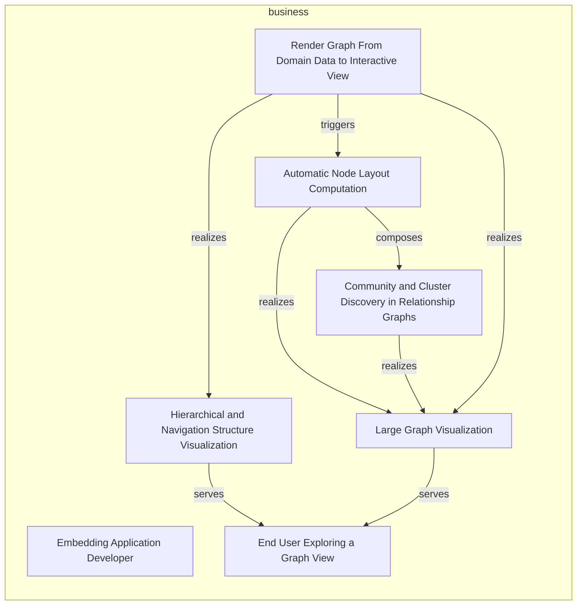
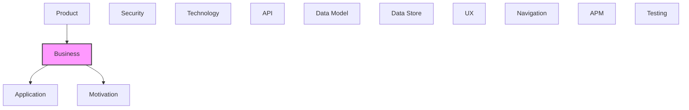

# Business

[← Back to README](../README.md)

Business processes, functions, roles, and services.

## Report Index

- [Layer Introduction](#layer-introduction)
- [Intra-Layer Relationships](#intra-layer-relationships)
- [Inter-Layer Dependencies](#inter-layer-dependencies)
- [Inter-Layer Relationships Table](#inter-layer-relationships-table)
- [Element Reference](#element-reference)

## Layer Introduction

| Metric                    | Count |
| ------------------------- | ----- |
| Elements                  | 7     |
| Intra-Layer Relationships | 8     |
| Inter-Layer Relationships | 10    |
| Inbound Relationships     | 7     |
| Outbound Relationships    | 3     |

**Cross-Layer References**:

- **Upstream layers**: [Product](./03-product-layer-report.md)
- **Downstream layers**: [Application](./05-application-layer-report.md), [Motivation](./01-motivation-layer-report.md)

## Intra-Layer Relationships

## Inter-Layer Dependencies

## Inter-Layer Relationships Table

| Relationship ID                                                      | Source Node                                                                  | Dest Node                                                                          | Dest Layer    | Predicate    | Cardinality  | Strength |
| -------------------------------------------------------------------- | ---------------------------------------------------------------------------- | ---------------------------------------------------------------------------------- | ------------- | ------------ | ------------ | -------- |
| `business.businessactor.serves.motivation.stakeholder`               | `business.businessactor.embedding-application-developer`                     | `motivation.stakeholder.embedding-application-developer-npm-consumer`              | `motivation`  | `serves`     | many-to-many | medium   |
| `business.businessactor.serves.motivation.stakeholder`               | `business.businessactor.end-user-exploring-a-graph-view`                     | `motivation.stakeholder.end-user-of-an-embedding-application`                      | `motivation`  | `serves`     | many-to-many | medium   |
| `business.businessprocess.aggregates.application.applicationprocess` | `business.businessprocess.render-graph-from-domain-data-to-interactive-view` | `application.applicationprocess.graph-render-and-layout-recomputation-pipeline`    | `application` | `aggregates` | many-to-many | medium   |
| `product.capability.realizes.business.businessfunction`              | `product.capability.clustered-force-layout-community-bubbles`                | `business.businessfunction.community-and-cluster-discovery-in-relationship-graphs` | `business`    | `realizes`   | many-to-many | medium   |
| `product.capability.realizes.business.businessfunction`              | `product.capability.force-directed-graph-layout`                             | `business.businessfunction.automatic-node-layout-computation`                      | `business`    | `realizes`   | many-to-many | medium   |
| `product.capability.realizes.business.businessfunction`              | `product.capability.galaxy-radial-orbit-layout`                              | `business.businessfunction.automatic-node-layout-computation`                      | `business`    | `realizes`   | many-to-many | medium   |
| `product.capability.realizes.business.businessfunction`              | `product.capability.radial-tree-layout`                                      | `business.businessfunction.automatic-node-layout-computation`                      | `business`    | `realizes`   | many-to-many | medium   |
| `product.capability.realizes.business.businessfunction`              | `product.capability.ux-navigation-tree-layout`                               | `business.businessfunction.automatic-node-layout-computation`                      | `business`    | `realizes`   | many-to-many | medium   |
| `product.feature.realizes.business.businessservice`                  | `product.feature.node-and-edge-tooltips-and-popovers`                        | `business.businessservice.large-graph-visualization`                               | `business`    | `realizes`   | many-to-many | medium   |
| `product.feature.realizes.business.businessservice`                  | `product.feature.progressive-disclosure-via-node-collapseexpand`             | `business.businessservice.hierarchical-and-navigation-structure-visualization`     | `business`    | `realizes`   | many-to-many | medium   |

## Element Reference

### Embedding Application Developer {#embedding-application-developer}

**ID**: `business.businessactor.embedding-application-developer`

**Type**: `businessactor`

Inferred actor: the developer who installs @tinkermonkey/heimdall-ui and wires GraphCanvas into their own application, choosing a layout mode and supplying node/edge data.

#### Relationships

| Type        | Related Element                                                       | Predicate | Direction |
| ----------- | --------------------------------------------------------------------- | --------- | --------- |
| inter-layer | `motivation.stakeholder.embedding-application-developer-npm-consumer` | `serves`  | outbound  |

### End User Exploring a Graph View {#end-user-exploring-a-graph-view}

**ID**: `business.businessactor.end-user-exploring-a-graph-view`

**Type**: `businessactor`

Inferred actor: the person who ultimately pans, zooms, selects, hovers, drags, and collapses/expands nodes in a rendered GraphCanvas.

#### Relationships

| Type        | Related Element                                                                | Predicate | Direction |
| ----------- | ------------------------------------------------------------------------------ | --------- | --------- |
| inter-layer | `motivation.stakeholder.end-user-of-an-embedding-application`                  | `serves`  | outbound  |
| intra-layer | `business.businessservice.hierarchical-and-navigation-structure-visualization` | `serves`  | inbound   |
| intra-layer | `business.businessservice.large-graph-visualization`                           | `serves`  | inbound   |

### Automatic Node Layout Computation {#automatic-node-layout-computation}

**ID**: `business.businessfunction.automatic-node-layout-computation`

**Type**: `businessfunction`

Inferred business function: given arbitrary node/edge data with no pre-set positions, automatically compute a readable 2D arrangement instead of requiring a consumer to hand-place nodes.

#### Relationships

| Type        | Related Element                                                                    | Predicate  | Direction |
| ----------- | ---------------------------------------------------------------------------------- | ---------- | --------- |
| inter-layer | `product.capability.force-directed-graph-layout`                                   | `realizes` | inbound   |
| inter-layer | `product.capability.galaxy-radial-orbit-layout`                                    | `realizes` | inbound   |
| inter-layer | `product.capability.radial-tree-layout`                                            | `realizes` | inbound   |
| inter-layer | `product.capability.ux-navigation-tree-layout`                                     | `realizes` | inbound   |
| intra-layer | `business.businessfunction.community-and-cluster-discovery-in-relationship-graphs` | `composes` | outbound  |
| intra-layer | `business.businessservice.large-graph-visualization`                               | `realizes` | outbound  |
| intra-layer | `business.businessprocess.render-graph-from-domain-data-to-interactive-view`       | `triggers` | inbound   |

### Community and Cluster Discovery in Relationship Graphs {#community-and-cluster-discovery-in-relationship-graphs}

**ID**: `business.businessfunction.community-and-cluster-discovery-in-relationship-graphs`

**Type**: `businessfunction`

Inferred business function: surface community structure in a relationship graph (via Louvain clustering) so densely-interconnected groups read visually as groups.

#### Relationships

| Type        | Related Element                                               | Predicate  | Direction |
| ----------- | ------------------------------------------------------------- | ---------- | --------- |
| inter-layer | `product.capability.clustered-force-layout-community-bubbles` | `realizes` | inbound   |
| intra-layer | `business.businessfunction.automatic-node-layout-computation` | `composes` | inbound   |
| intra-layer | `business.businessservice.large-graph-visualization`          | `realizes` | outbound  |

### Render Graph From Domain Data to Interactive View {#render-graph-from-domain-data-to-interactive-view}

**ID**: `business.businessprocess.render-graph-from-domain-data-to-interactive-view`

**Type**: `businessprocess`

Inferred end-to-end business process: a consumer's domain data (nodes/edges) enters GraphCanvas, is laid out by the selected engine, and becomes an interactive, explorable view for the end user.

#### Relationships

| Type        | Related Element                                                                 | Predicate    | Direction |
| ----------- | ------------------------------------------------------------------------------- | ------------ | --------- |
| inter-layer | `application.applicationprocess.graph-render-and-layout-recomputation-pipeline` | `aggregates` | outbound  |
| intra-layer | `business.businessservice.hierarchical-and-navigation-structure-visualization`  | `realizes`   | outbound  |
| intra-layer | `business.businessservice.large-graph-visualization`                            | `realizes`   | outbound  |
| intra-layer | `business.businessfunction.automatic-node-layout-computation`                   | `triggers`   | outbound  |

### Hierarchical and Navigation Structure Visualization {#hierarchical-and-navigation-structure-visualization}

**ID**: `business.businessservice.hierarchical-and-navigation-structure-visualization`

**Type**: `businessservice`

Inferred business capability: visualize page/view navigation hierarchies and general tree/DAG structures as radial or top-down layouts — the problem galaxyLayout/uxNavLayout/radialTreeLayout solve.

#### Relationships

| Type        | Related Element                                                              | Predicate  | Direction |
| ----------- | ---------------------------------------------------------------------------- | ---------- | --------- |
| inter-layer | `product.feature.progressive-disclosure-via-node-collapseexpand`             | `realizes` | inbound   |
| intra-layer | `business.businessprocess.render-graph-from-domain-data-to-interactive-view` | `realizes` | inbound   |
| intra-layer | `business.businessactor.end-user-exploring-a-graph-view`                     | `serves`   | outbound  |

### Large Graph Visualization {#large-graph-visualization}

**ID**: `business.businessservice.large-graph-visualization`

**Type**: `businessservice`

Inferred business capability: enable consumers to render and let end users navigate graphs with hundreds of nodes while staying visually readable (non-overlapping, low edge-crossing) — the problem forceLayout/clusteredForceLayout solve.

#### Relationships

| Type        | Related Element                                                                    | Predicate  | Direction |
| ----------- | ---------------------------------------------------------------------------------- | ---------- | --------- |
| inter-layer | `product.feature.node-and-edge-tooltips-and-popovers`                              | `realizes` | inbound   |
| intra-layer | `business.businessfunction.automatic-node-layout-computation`                      | `realizes` | inbound   |
| intra-layer | `business.businessfunction.community-and-cluster-discovery-in-relationship-graphs` | `realizes` | inbound   |
| intra-layer | `business.businessprocess.render-graph-from-domain-data-to-interactive-view`       | `realizes` | inbound   |
| intra-layer | `business.businessactor.end-user-exploring-a-graph-view`                           | `serves`   | outbound  |

---

Generated: 2026-09-18T14:44:15.109Z | Model Version: 0.1.0
