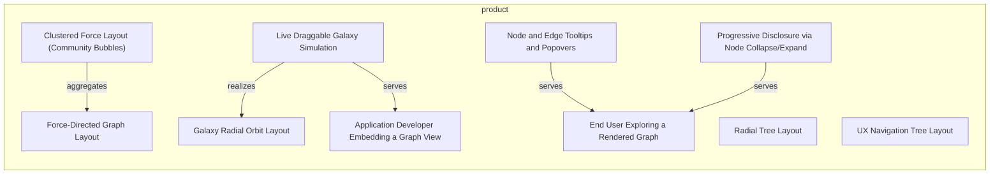
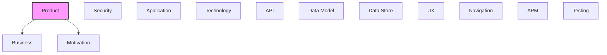

# Product

[← Back to README](../README.md)

Product features, capabilities, personas, and milestones.

## Report Index

- [Layer Introduction](#layer-introduction)
- [Intra-Layer Relationships](#intra-layer-relationships)
- [Inter-Layer Dependencies](#inter-layer-dependencies)
- [Inter-Layer Relationships Table](#inter-layer-relationships-table)
- [Element Reference](#element-reference)

## Layer Introduction

| Metric                    | Count |
| ------------------------- | ----- |
| Elements                  | 10    |
| Intra-Layer Relationships | 5     |
| Inter-Layer Relationships | 14    |
| Inbound Relationships     | 0     |
| Outbound Relationships    | 14    |

**Cross-Layer References**:

- **Downstream layers**: [Business](./02-business-layer-report.md), [Motivation](./01-motivation-layer-report.md)

## Intra-Layer Relationships

## Inter-Layer Dependencies

## Inter-Layer Relationships Table

| Relationship ID                                         | Source Node                                                      | Dest Node                                                                             | Dest Layer   | Predicate  | Cardinality  | Strength |
| ------------------------------------------------------- | ---------------------------------------------------------------- | ------------------------------------------------------------------------------------- | ------------ | ---------- | ------------ | -------- |
| `product.capability.realizes.business.businessfunction` | `product.capability.clustered-force-layout-community-bubbles`    | `business.businessfunction.community-and-cluster-discovery-in-relationship-graphs`    | `business`   | `realizes` | many-to-many | medium   |
| `product.capability.supports.motivation.goal`           | `product.capability.clustered-force-layout-community-bubbles`    | `motivation.goal.layout-algorithms-that-scale-to-large-dense-and-pathological-graphs` | `motivation` | `supports` | many-to-many | medium   |
| `product.capability.realizes.business.businessfunction` | `product.capability.force-directed-graph-layout`                 | `business.businessfunction.automatic-node-layout-computation`                         | `business`   | `realizes` | many-to-many | medium   |
| `product.capability.supports.motivation.goal`           | `product.capability.force-directed-graph-layout`                 | `motivation.goal.readable-layout-for-structurally-complex-graphs`                     | `motivation` | `supports` | many-to-many | medium   |
| `product.capability.realizes.business.businessfunction` | `product.capability.galaxy-radial-orbit-layout`                  | `business.businessfunction.automatic-node-layout-computation`                         | `business`   | `realizes` | many-to-many | medium   |
| `product.capability.supports.motivation.goal`           | `product.capability.galaxy-radial-orbit-layout`                  | `motivation.goal.readable-layout-for-structurally-complex-graphs`                     | `motivation` | `supports` | many-to-many | medium   |
| `product.capability.realizes.business.businessfunction` | `product.capability.radial-tree-layout`                          | `business.businessfunction.automatic-node-layout-computation`                         | `business`   | `realizes` | many-to-many | medium   |
| `product.capability.supports.motivation.goal`           | `product.capability.radial-tree-layout`                          | `motivation.goal.readable-layout-for-structurally-complex-graphs`                     | `motivation` | `supports` | many-to-many | medium   |
| `product.capability.realizes.business.businessfunction` | `product.capability.ux-navigation-tree-layout`                   | `business.businessfunction.automatic-node-layout-computation`                         | `business`   | `realizes` | many-to-many | medium   |
| `product.capability.supports.motivation.goal`           | `product.capability.ux-navigation-tree-layout`                   | `motivation.goal.readable-layout-for-structurally-complex-graphs`                     | `motivation` | `supports` | many-to-many | medium   |
| `product.feature.realizes.business.businessservice`     | `product.feature.node-and-edge-tooltips-and-popovers`            | `business.businessservice.large-graph-visualization`                                  | `business`   | `realizes` | many-to-many | medium   |
| `product.feature.realizes.business.businessservice`     | `product.feature.progressive-disclosure-via-node-collapseexpand` | `business.businessservice.hierarchical-and-navigation-structure-visualization`        | `business`   | `realizes` | many-to-many | medium   |
| `product.persona.realizes.motivation.stakeholder`       | `product.persona.application-developer-embedding-a-graph-view`   | `motivation.stakeholder.embedding-application-developer-npm-consumer`                 | `motivation` | `realizes` | many-to-many | medium   |
| `product.persona.realizes.motivation.stakeholder`       | `product.persona.end-user-exploring-a-rendered-graph`            | `motivation.stakeholder.end-user-of-an-embedding-application`                         | `motivation` | `realizes` | many-to-many | medium   |

## Element Reference

### Clustered Force Layout (Community Bubbles) {#clustered-force-layout-community-bubbles}

**ID**: `product.capability.clustered-force-layout-community-bubbles`

**Type**: `capability`

Shipped capability: nested-bubble layout grouping nodes by Louvain community structure.

#### Attributes

| Name   | Value     |
| ------ | --------- |
| status | delivered |

#### Relationships

| Type        | Related Element                                                                       | Predicate    | Direction |
| ----------- | ------------------------------------------------------------------------------------- | ------------ | --------- |
| inter-layer | `business.businessfunction.community-and-cluster-discovery-in-relationship-graphs`    | `realizes`   | outbound  |
| inter-layer | `motivation.goal.layout-algorithms-that-scale-to-large-dense-and-pathological-graphs` | `supports`   | outbound  |
| intra-layer | `product.capability.force-directed-graph-layout`                                      | `aggregates` | outbound  |

### Force-Directed Graph Layout {#force-directed-graph-layout}

**ID**: `product.capability.force-directed-graph-layout`

**Type**: `capability`

Shipped capability: spring/repulsion-based automatic layout for arbitrary node/edge graphs.

#### Attributes

| Name   | Value     |
| ------ | --------- |
| status | delivered |

#### Relationships

| Type        | Related Element                                                   | Predicate    | Direction |
| ----------- | ----------------------------------------------------------------- | ------------ | --------- |
| inter-layer | `business.businessfunction.automatic-node-layout-computation`     | `realizes`   | outbound  |
| inter-layer | `motivation.goal.readable-layout-for-structurally-complex-graphs` | `supports`   | outbound  |
| intra-layer | `product.capability.clustered-force-layout-community-bubbles`     | `aggregates` | inbound   |

### Galaxy Radial Orbit Layout {#galaxy-radial-orbit-layout}

**ID**: `product.capability.galaxy-radial-orbit-layout`

**Type**: `capability`

Shipped capability: radial hierarchy-of-orbits layout for structural trees/forests.

#### Attributes

| Name   | Value     |
| ------ | --------- |
| status | delivered |

#### Relationships

| Type        | Related Element                                                   | Predicate  | Direction |
| ----------- | ----------------------------------------------------------------- | ---------- | --------- |
| inter-layer | `business.businessfunction.automatic-node-layout-computation`     | `realizes` | outbound  |
| inter-layer | `motivation.goal.readable-layout-for-structurally-complex-graphs` | `supports` | outbound  |
| intra-layer | `product.feature.live-draggable-galaxy-simulation`                | `realizes` | inbound   |

### Radial Tree Layout {#radial-tree-layout}

**ID**: `product.capability.radial-tree-layout`

**Type**: `capability`

Shipped capability: concentric-ring radial tree layout with multi-trunk packing.

#### Attributes

| Name   | Value     |
| ------ | --------- |
| status | delivered |

#### Relationships

| Type        | Related Element                                                   | Predicate  | Direction |
| ----------- | ----------------------------------------------------------------- | ---------- | --------- |
| inter-layer | `business.businessfunction.automatic-node-layout-computation`     | `realizes` | outbound  |
| inter-layer | `motivation.goal.readable-layout-for-structurally-complex-graphs` | `supports` | outbound  |

### UX Navigation Tree Layout {#ux-navigation-tree-layout}

**ID**: `product.capability.ux-navigation-tree-layout`

**Type**: `capability`

Shipped capability: page-tree + view-fan layout for visualizing page/view navigation structures.

#### Attributes

| Name   | Value     |
| ------ | --------- |
| status | delivered |

#### Relationships

| Type        | Related Element                                                   | Predicate  | Direction |
| ----------- | ----------------------------------------------------------------- | ---------- | --------- |
| inter-layer | `business.businessfunction.automatic-node-layout-computation`     | `realizes` | outbound  |
| inter-layer | `motivation.goal.readable-layout-for-structurally-complex-graphs` | `supports` | outbound  |

### Live Draggable Galaxy Simulation {#live-draggable-galaxy-simulation}

**ID**: `product.feature.live-draggable-galaxy-simulation`

**Type**: `feature`

Opt-in continuous elastic simulation for galaxy layout, so dragging a node repositions its subtree in real time instead of freezing after one computed layout.

#### Attributes

| Name     | Value     |
| -------- | --------- |
| priority | medium    |
| size     | m         |
| status   | delivered |

#### Relationships

| Type        | Related Element                                                | Predicate  | Direction |
| ----------- | -------------------------------------------------------------- | ---------- | --------- |
| intra-layer | `product.capability.galaxy-radial-orbit-layout`                | `realizes` | outbound  |
| intra-layer | `product.persona.application-developer-embedding-a-graph-view` | `serves`   | outbound  |

### Node and Edge Tooltips and Popovers {#node-and-edge-tooltips-and-popovers}

**ID**: `product.feature.node-and-edge-tooltips-and-popovers`

**Type**: `feature`

Render-prop tooltip/popover overlays anchored to a hovered/clicked node or edge, positioned via the canvas's own pan/zoom transform.

#### Attributes

| Name     | Value     |
| -------- | --------- |
| priority | low       |
| size     | s         |
| status   | delivered |

#### Relationships

| Type        | Related Element                                       | Predicate  | Direction |
| ----------- | ----------------------------------------------------- | ---------- | --------- |
| inter-layer | `business.businessservice.large-graph-visualization`  | `realizes` | outbound  |
| intra-layer | `product.persona.end-user-exploring-a-rendered-graph` | `serves`   | outbound  |

### Progressive Disclosure via Node Collapse/Expand {#progressive-disclosure-via-node-collapse-expand}

**ID**: `product.feature.progressive-disclosure-via-node-collapseexpand`

**Type**: `feature`

Collapse a node to hide its structural descendants (and their edges) for dense hierarchies, with a hidden-descendant-count badge.

#### Attributes

| Name     | Value     |
| -------- | --------- |
| priority | medium    |
| size     | s         |
| status   | delivered |

#### Relationships

| Type        | Related Element                                                                | Predicate  | Direction |
| ----------- | ------------------------------------------------------------------------------ | ---------- | --------- |
| inter-layer | `business.businessservice.hierarchical-and-navigation-structure-visualization` | `realizes` | outbound  |
| intra-layer | `product.persona.end-user-exploring-a-rendered-graph`                          | `serves`   | outbound  |

### Application Developer Embedding a Graph View {#application-developer-embedding-a-graph-view}

**ID**: `product.persona.application-developer-embedding-a-graph-view`

**Type**: `persona`

Inferred persona: a React/TypeScript developer integrating GraphCanvas into their own product, choosing layout mode and supplying data/callbacks.

#### Attributes

| Name        | Value    |
| ----------- | -------- |
| category    | primary  |
| proficiency | advanced |

#### Relationships

| Type        | Related Element                                                       | Predicate  | Direction |
| ----------- | --------------------------------------------------------------------- | ---------- | --------- |
| inter-layer | `motivation.stakeholder.embedding-application-developer-npm-consumer` | `realizes` | outbound  |
| intra-layer | `product.feature.live-draggable-galaxy-simulation`                    | `serves`   | inbound   |

### End User Exploring a Rendered Graph {#end-user-exploring-a-rendered-graph}

**ID**: `product.persona.end-user-exploring-a-rendered-graph`

**Type**: `persona`

Inferred persona: the person who ultimately interacts with the rendered graph (pan/zoom/select/hover/drag/collapse) without knowledge of the underlying library.

#### Attributes

| Name        | Value  |
| ----------- | ------ |
| category    | served |
| proficiency | novice |

#### Relationships

| Type        | Related Element                                                  | Predicate  | Direction |
| ----------- | ---------------------------------------------------------------- | ---------- | --------- |
| inter-layer | `motivation.stakeholder.end-user-of-an-embedding-application`    | `realizes` | outbound  |
| intra-layer | `product.feature.node-and-edge-tooltips-and-popovers`            | `serves`   | inbound   |
| intra-layer | `product.feature.progressive-disclosure-via-node-collapseexpand` | `serves`   | inbound   |

---

Generated: 2026-09-18T14:44:15.109Z | Model Version: 0.1.0
