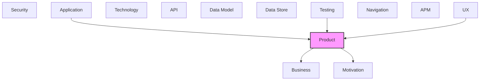

# Product

[← Back to README](../README.md)

Product features, capabilities, personas, and milestones.

## Report Index

- [Layer Introduction](#layer-introduction)
- [Intra-Layer Relationships](#intra-layer-relationships)
- [Inter-Layer Dependencies](#inter-layer-dependencies)
- [Inter-Layer Relationships Table](#inter-layer-relationships-table)
- [Element Reference](#element-reference)

## Layer Introduction

| Metric                    | Count |
| ------------------------- | ----- |
| Elements                  | 41    |
| Intra-Layer Relationships | 28    |
| Inter-Layer Relationships | 194   |
| Inbound Relationships     | 136   |
| Outbound Relationships    | 58    |

**Cross-Layer References**:

- **Upstream layers**: [Application](./05-application-layer-report.md), [Testing](./13-testing-layer-report.md), [UX](./10-ux-layer-report.md)
- **Downstream layers**: [Business](./02-business-layer-report.md), [Motivation](./01-motivation-layer-report.md)

## Intra-Layer Relationships

*This layer has >30 elements. Summary table shown instead of diagram.*

| Element                                                               | Type                 | Relationships |
| --------------------------------------------------------------------- | -------------------- | ------------- |
| `product.feature.branch-map`                                          | `feature`            | 4             |
| `product.feature.edge-selection-and-inspection`                       | `feature`            | 0             |
| `product.feature.fullscreen-canvas`                                   | `feature`            | 0             |
| `product.feature.joint-edge-label-placement`                          | `feature`            | 3             |
| `product.feature.layered-graph-explorer`                              | `feature`            | 2             |
| `product.feature.layout-progress-indicator`                           | `feature`            | 0             |
| `product.feature.link-navigation-with-href`                           | `feature`            | 3             |
| `product.feature.live-draggable-galaxy-simulation`                    | `feature`            | 2             |
| `product.feature.node-and-edge-tooltips-and-popovers`                 | `feature`            | 2             |
| `product.feature.per-component-imports`                               | `feature`            | 2             |
| `product.feature.progressive-disclosure-via-node-collapseexpand`      | `feature`            | 2             |
| `product.feature.server-side-rendering-support`                       | `feature`            | 3             |
| `product.feature.theme-slot`                                          | `feature`            | 2             |
| `product.feature.viewport-history-and-restore`                        | `feature`            | 0             |
| `product.milestone.branch-map-poc`                                    | `milestone`          | 2             |
| `product.persona.application-developer-embedding-a-graph-view`        | `persona`            | 5             |
| `product.persona.end-user-exploring-a-rendered-graph`                 | `persona`            | 5             |
| `product.persona.mirror-maintainer-restyling-the-library`             | `persona`            | 1             |
| `product.softwarecapability.app-navigation`                           | `softwarecapability` | 2             |
| `product.softwarecapability.app-shell`                                | `softwarecapability` | 2             |
| `product.softwarecapability.branch-map-visualization`                 | `softwarecapability` | 2             |
| `product.softwarecapability.charting`                                 | `softwarecapability` | 0             |
| `product.softwarecapability.chat-ui`                                  | `softwarecapability` | 0             |
| `product.softwarecapability.clustered-force-layout-community-bubbles` | `softwarecapability` | 2             |
| `product.softwarecapability.data-display`                             | `softwarecapability` | 0             |
| `product.softwarecapability.force-directed-graph-layout`              | `softwarecapability` | 3             |
| `product.softwarecapability.form-input`                               | `softwarecapability` | 0             |
| `product.softwarecapability.galaxy-radial-orbit-layout`               | `softwarecapability` | 1             |
| `product.softwarecapability.interactive-graph-exploration`            | `softwarecapability` | 2             |
| `product.softwarecapability.layer-lanes-layout`                       | `softwarecapability` | 0             |
| `product.softwarecapability.layered-graph-visualization`              | `softwarecapability` | 1             |
| `product.softwarecapability.organic-graph-layout`                     | `softwarecapability` | 0             |
| `product.softwarecapability.orthogonal-graph-layout`                  | `softwarecapability` | 1             |
| `product.softwarecapability.overlays-and-dialogs`                     | `softwarecapability` | 0             |
| `product.softwarecapability.page-patterns`                            | `softwarecapability` | 0             |
| `product.softwarecapability.planning-and-scheduling`                  | `softwarecapability` | 0             |
| `product.softwarecapability.radial-tree-layout`                       | `softwarecapability` | 0             |
| `product.softwarecapability.responsive-layout`                        | `softwarecapability` | 0             |
| `product.softwarecapability.run-history-and-observability-views`      | `softwarecapability` | 0             |
| `product.softwarecapability.ui-primitives`                            | `softwarecapability` | 2             |
| `product.softwarecapability.ux-navigation-tree-layout`                | `softwarecapability` | 0             |

## Inter-Layer Dependencies

```mermaid
flowchart TB
  classDef current fill:#f9f,stroke:#333,stroke-width:2px
  motivation["Motivation"]
  business["Business"]
  product["Product"]
  security["Security"]
  application["Application"]
  technology["Technology"]
  api["API"]
  data_model["Data Model"]
  data_store["Data Store"]
  ux["UX"]
  navigation["Navigation"]
  apm["APM"]
  testing["Testing"]
  application --> product
  product --> business
  product --> motivation
  testing --> product
  ux --> product
  class product current
```

## Inter-Layer Relationships Table

| Relationship ID                                                      | Source Node                                                                                                                           | Dest Node                                                                                   | Dest Layer   | Predicate    | Cardinality  | Strength |
| -------------------------------------------------------------------- | ------------------------------------------------------------------------------------------------------------------------------------- | ------------------------------------------------------------------------------------------- | ------------ | ------------ | ------------ | -------- |
| `application.applicationservice.realizes.product.softwarecapability` | `application.applicationservice.adjacency-matrix-link-metadata`                                                                       | `product.softwarecapability.layered-graph-visualization`                                    | `product`    | `realizes`   | many-to-many | medium   |
| `application.applicationservice.realizes.product.softwarecapability` | `application.applicationservice.app-shell-components`                                                                                 | `product.softwarecapability.app-shell`                                                      | `product`    | `realizes`   | many-to-many | medium   |
| `application.applicationservice.realizes.product.feature`            | `application.applicationservice.branch-map-layout`                                                                                    | `product.feature.branch-map`                                                                | `product`    | `realizes`   | many-to-many | medium   |
| `application.applicationservice.realizes.product.softwarecapability` | `application.applicationservice.branch-map-layout`                                                                                    | `product.softwarecapability.branch-map-visualization`                                       | `product`    | `realizes`   | many-to-many | medium   |
| `application.applicationservice.realizes.product.softwarecapability` | `application.applicationservice.chart-components`                                                                                     | `product.softwarecapability.charting`                                                       | `product`    | `realizes`   | many-to-many | medium   |
| `application.applicationservice.realizes.product.softwarecapability` | `application.applicationservice.chat-components`                                                                                      | `product.softwarecapability.chat-ui`                                                        | `product`    | `realizes`   | many-to-many | medium   |
| `application.applicationservice.realizes.product.softwarecapability` | `application.applicationservice.cluster-packing`                                                                                      | `product.softwarecapability.clustered-force-layout-community-bubbles`                       | `product`    | `realizes`   | many-to-many | medium   |
| `application.applicationservice.realizes.product.softwarecapability` | `application.applicationservice.controllable-state-hook`                                                                              | `product.softwarecapability.layered-graph-visualization`                                    | `product`    | `realizes`   | many-to-many | medium   |
| `application.applicationservice.realizes.product.softwarecapability` | `application.applicationservice.data-display-components`                                                                              | `product.softwarecapability.data-display`                                                   | `product`    | `realizes`   | many-to-many | medium   |
| `application.applicationservice.realizes.product.softwarecapability` | `application.applicationservice.dropdown-portal-containment`                                                                          | `product.softwarecapability.overlays-and-dialogs`                                           | `product`    | `realizes`   | many-to-many | medium   |
| `application.applicationservice.realizes.product.softwarecapability` | `application.applicationservice.edge-geometry`                                                                                        | `product.softwarecapability.interactive-graph-exploration`                                  | `product`    | `realizes`   | many-to-many | medium   |
| `application.applicationservice.realizes.product.softwarecapability` | `application.applicationservice.force-layout`                                                                                         | `product.softwarecapability.clustered-force-layout-community-bubbles`                       | `product`    | `realizes`   | many-to-many | medium   |
| `application.applicationservice.realizes.product.softwarecapability` | `application.applicationservice.force-layout`                                                                                         | `product.softwarecapability.force-directed-graph-layout`                                    | `product`    | `realizes`   | many-to-many | medium   |
| `application.applicationservice.realizes.product.softwarecapability` | `application.applicationservice.form-input-components`                                                                                | `product.softwarecapability.form-input`                                                     | `product`    | `realizes`   | many-to-many | medium   |
| `application.applicationservice.realizes.product.softwarecapability` | `application.applicationservice.galaxy-layout`                                                                                        | `product.softwarecapability.galaxy-radial-orbit-layout`                                     | `product`    | `realizes`   | many-to-many | medium   |
| `application.applicationservice.realizes.product.softwarecapability` | `application.applicationservice.graph-canvas-context-hook`                                                                            | `product.softwarecapability.interactive-graph-exploration`                                  | `product`    | `realizes`   | many-to-many | medium   |
| `application.applicationservice.realizes.product.softwarecapability` | `application.applicationservice.graph-layout-engine-service`                                                                          | `product.softwarecapability.clustered-force-layout-community-bubbles`                       | `product`    | `realizes`   | many-to-many | medium   |
| `application.applicationservice.realizes.product.softwarecapability` | `application.applicationservice.graph-layout-engine-service`                                                                          | `product.softwarecapability.force-directed-graph-layout`                                    | `product`    | `realizes`   | many-to-many | medium   |
| `application.applicationservice.realizes.product.softwarecapability` | `application.applicationservice.graph-layout-engine-service`                                                                          | `product.softwarecapability.galaxy-radial-orbit-layout`                                     | `product`    | `realizes`   | many-to-many | medium   |
| `application.applicationservice.realizes.product.softwarecapability` | `application.applicationservice.graph-layout-engine-service`                                                                          | `product.softwarecapability.layer-lanes-layout`                                             | `product`    | `realizes`   | many-to-many | medium   |
| `application.applicationservice.realizes.product.softwarecapability` | `application.applicationservice.graph-layout-engine-service`                                                                          | `product.softwarecapability.organic-graph-layout`                                           | `product`    | `realizes`   | many-to-many | medium   |
| `application.applicationservice.realizes.product.softwarecapability` | `application.applicationservice.graph-layout-engine-service`                                                                          | `product.softwarecapability.orthogonal-graph-layout`                                        | `product`    | `realizes`   | many-to-many | medium   |
| `application.applicationservice.realizes.product.softwarecapability` | `application.applicationservice.graph-layout-engine-service`                                                                          | `product.softwarecapability.radial-tree-layout`                                             | `product`    | `realizes`   | many-to-many | medium   |
| `application.applicationservice.realizes.product.softwarecapability` | `application.applicationservice.graph-layout-engine-service`                                                                          | `product.softwarecapability.ux-navigation-tree-layout`                                      | `product`    | `realizes`   | many-to-many | medium   |
| `application.applicationservice.realizes.product.feature`            | `application.applicationservice.interactive-graph-rendering`                                                                          | `product.feature.edge-selection-and-inspection`                                             | `product`    | `realizes`   | many-to-many | medium   |
| `application.applicationservice.realizes.product.feature`            | `application.applicationservice.interactive-graph-rendering`                                                                          | `product.feature.fullscreen-canvas`                                                         | `product`    | `realizes`   | many-to-many | medium   |
| `application.applicationservice.realizes.product.feature`            | `application.applicationservice.interactive-graph-rendering`                                                                          | `product.feature.layout-progress-indicator`                                                 | `product`    | `realizes`   | many-to-many | medium   |
| `application.applicationservice.realizes.product.feature`            | `application.applicationservice.interactive-graph-rendering`                                                                          | `product.feature.live-draggable-galaxy-simulation`                                          | `product`    | `realizes`   | many-to-many | medium   |
| `application.applicationservice.realizes.product.feature`            | `application.applicationservice.interactive-graph-rendering`                                                                          | `product.feature.node-and-edge-tooltips-and-popovers`                                       | `product`    | `realizes`   | many-to-many | medium   |
| `application.applicationservice.realizes.product.feature`            | `application.applicationservice.interactive-graph-rendering`                                                                          | `product.feature.progressive-disclosure-via-node-collapseexpand`                            | `product`    | `realizes`   | many-to-many | medium   |
| `application.applicationservice.realizes.product.feature`            | `application.applicationservice.interactive-graph-rendering`                                                                          | `product.feature.viewport-history-and-restore`                                              | `product`    | `realizes`   | many-to-many | medium   |
| `application.applicationservice.realizes.product.softwarecapability` | `application.applicationservice.interactive-graph-rendering`                                                                          | `product.softwarecapability.interactive-graph-exploration`                                  | `product`    | `realizes`   | many-to-many | medium   |
| `application.applicationservice.realizes.product.softwarecapability` | `application.applicationservice.lane-layout`                                                                                          | `product.softwarecapability.layer-lanes-layout`                                             | `product`    | `realizes`   | many-to-many | medium   |
| `application.applicationservice.realizes.product.softwarecapability` | `application.applicationservice.layered-graph-control-helpers`                                                                        | `product.softwarecapability.layered-graph-visualization`                                    | `product`    | `realizes`   | many-to-many | medium   |
| `application.applicationservice.realizes.product.softwarecapability` | `application.applicationservice.layered-graph-explorer-snapshot`                                                                      | `product.softwarecapability.layered-graph-visualization`                                    | `product`    | `realizes`   | many-to-many | medium   |
| `application.applicationservice.realizes.product.softwarecapability` | `application.applicationservice.layered-graph-framework-service`                                                                      | `product.softwarecapability.layered-graph-visualization`                                    | `product`    | `realizes`   | many-to-many | medium   |
| `application.applicationservice.realizes.product.softwarecapability` | `application.applicationservice.layered-graph-state-hooks`                                                                            | `product.softwarecapability.layered-graph-visualization`                                    | `product`    | `realizes`   | many-to-many | medium   |
| `application.applicationservice.realizes.product.softwarecapability` | `application.applicationservice.layered-graph-utilities`                                                                              | `product.softwarecapability.layered-graph-visualization`                                    | `product`    | `realizes`   | many-to-many | medium   |
| `application.applicationservice.realizes.product.softwarecapability` | `application.applicationservice.layered-graph-visualization`                                                                          | `product.softwarecapability.layered-graph-visualization`                                    | `product`    | `realizes`   | many-to-many | medium   |
| `application.applicationservice.realizes.product.softwarecapability` | `application.applicationservice.layout-components`                                                                                    | `product.softwarecapability.responsive-layout`                                              | `product`    | `realizes`   | many-to-many | medium   |
| `application.applicationservice.realizes.product.feature`            | `application.applicationservice.live-galaxy-simulation-service`                                                                       | `product.feature.live-draggable-galaxy-simulation`                                          | `product`    | `realizes`   | many-to-many | medium   |
| `application.applicationservice.realizes.product.softwarecapability` | `application.applicationservice.louvain-clustering`                                                                                   | `product.softwarecapability.clustered-force-layout-community-bubbles`                       | `product`    | `realizes`   | many-to-many | medium   |
| `application.applicationservice.realizes.product.softwarecapability` | `application.applicationservice.media-query-hook`                                                                                     | `product.softwarecapability.responsive-layout`                                              | `product`    | `realizes`   | many-to-many | medium   |
| `application.applicationservice.realizes.product.softwarecapability` | `application.applicationservice.navigation-components`                                                                                | `product.softwarecapability.app-navigation`                                                 | `product`    | `realizes`   | many-to-many | medium   |
| `application.applicationservice.realizes.product.softwarecapability` | `application.applicationservice.observability-view-components`                                                                        | `product.softwarecapability.run-history-and-observability-views`                            | `product`    | `realizes`   | many-to-many | medium   |
| `application.applicationservice.realizes.product.softwarecapability` | `application.applicationservice.organic-layout`                                                                                       | `product.softwarecapability.organic-graph-layout`                                           | `product`    | `realizes`   | many-to-many | medium   |
| `application.applicationservice.realizes.product.softwarecapability` | `application.applicationservice.orthogonal-layout`                                                                                    | `product.softwarecapability.orthogonal-graph-layout`                                        | `product`    | `realizes`   | many-to-many | medium   |
| `application.applicationservice.realizes.product.softwarecapability` | `application.applicationservice.otlp-trace-adapter`                                                                                   | `product.softwarecapability.run-history-and-observability-views`                            | `product`    | `realizes`   | many-to-many | medium   |
| `application.applicationservice.realizes.product.softwarecapability` | `application.applicationservice.overlay-components`                                                                                   | `product.softwarecapability.overlays-and-dialogs`                                           | `product`    | `realizes`   | many-to-many | medium   |
| `application.applicationservice.realizes.product.softwarecapability` | `application.applicationservice.page-pattern-components`                                                                              | `product.softwarecapability.page-patterns`                                                  | `product`    | `realizes`   | many-to-many | medium   |
| `application.applicationservice.realizes.product.softwarecapability` | `application.applicationservice.pan-and-zoom-hook`                                                                                    | `product.softwarecapability.interactive-graph-exploration`                                  | `product`    | `realizes`   | many-to-many | medium   |
| `application.applicationservice.realizes.product.softwarecapability` | `application.applicationservice.planning-components`                                                                                  | `product.softwarecapability.planning-and-scheduling`                                        | `product`    | `realizes`   | many-to-many | medium   |
| `application.applicationservice.realizes.product.softwarecapability` | `application.applicationservice.primitive-components`                                                                                 | `product.softwarecapability.ui-primitives`                                                  | `product`    | `realizes`   | many-to-many | medium   |
| `application.applicationservice.realizes.product.softwarecapability` | `application.applicationservice.radial-tree-layout`                                                                                   | `product.softwarecapability.radial-tree-layout`                                             | `product`    | `realizes`   | many-to-many | medium   |
| `application.applicationservice.realizes.product.softwarecapability` | `application.applicationservice.reach-relationship-helpers`                                                                           | `product.softwarecapability.layered-graph-visualization`                                    | `product`    | `realizes`   | many-to-many | medium   |
| `application.applicationservice.realizes.product.softwarecapability` | `application.applicationservice.structural-hierarchy`                                                                                 | `product.softwarecapability.interactive-graph-exploration`                                  | `product`    | `realizes`   | many-to-many | medium   |
| `application.applicationservice.realizes.product.softwarecapability` | `application.applicationservice.trace-viewer-model`                                                                                   | `product.softwarecapability.run-history-and-observability-views`                            | `product`    | `realizes`   | many-to-many | medium   |
| `application.applicationservice.realizes.product.softwarecapability` | `application.applicationservice.tween-animation-hooks`                                                                                | `product.softwarecapability.layered-graph-visualization`                                    | `product`    | `realizes`   | many-to-many | medium   |
| `application.applicationservice.realizes.product.softwarecapability` | `application.applicationservice.ux-navigation-edge-visibility`                                                                        | `product.softwarecapability.ux-navigation-tree-layout`                                      | `product`    | `realizes`   | many-to-many | medium   |
| `application.applicationservice.realizes.product.softwarecapability` | `application.applicationservice.ux-navigation-layout`                                                                                 | `product.softwarecapability.ux-navigation-tree-layout`                                      | `product`    | `realizes`   | many-to-many | medium   |
| `application.applicationservice.realizes.product.softwarecapability` | `application.applicationservice.x-ray-trace-adapter`                                                                                  | `product.softwarecapability.run-history-and-observability-views`                            | `product`    | `realizes`   | many-to-many | medium   |
| `product.feature.satisfies.motivation.requirement`                   | `product.feature.branch-map`                                                                                                          | `motivation.requirement.branch-map-groups-stay-within-a-lane-budget`                        | `motivation` | `satisfies`  | many-to-many | medium   |
| `product.feature.satisfies.motivation.requirement`                   | `product.feature.branch-map`                                                                                                          | `motivation.requirement.branch-map-labels-sit-beside-their-stations-without-overlap`        | `motivation` | `satisfies`  | many-to-many | medium   |
| `product.feature.satisfies.motivation.requirement`                   | `product.feature.branch-map`                                                                                                          | `motivation.requirement.branch-map-library-stays-vocabulary-free`                           | `motivation` | `satisfies`  | many-to-many | medium   |
| `product.feature.satisfies.motivation.requirement`                   | `product.feature.per-component-imports`                                                                                               | `motivation.requirement.consumers-bundle-only-the-components-they-import`                   | `motivation` | `satisfies`  | many-to-many | medium   |
| `product.feature.satisfies.motivation.requirement`                   | `product.feature.server-side-rendering-support`                                                                                       | `motivation.requirement.server-rendered-output-hydrates-without-mismatch`                   | `motivation` | `satisfies`  | many-to-many | medium   |
| `product.feature.satisfies.motivation.requirement`                   | `product.feature.theme-slot`                                                                                                          | `motivation.requirement.a-mirror-can-restyle-the-library-from-one-file`                     | `motivation` | `satisfies`  | many-to-many | medium   |
| `product.feature.satisfies.motivation.requirement`                   | `product.feature.theme-slot`                                                                                                          | `motivation.requirement.upstream-publishing-workflows-are-inert-in-a-mirror`                | `motivation` | `satisfies`  | many-to-many | medium   |
| `product.persona.references.motivation.stakeholder`                  | `product.persona.application-developer-embedding-a-graph-view`                                                                        | `motivation.stakeholder.embedding-application-developer-npm-consumer`                       | `motivation` | `references` | many-to-many | medium   |
| `product.persona.references.motivation.stakeholder`                  | `product.persona.end-user-exploring-a-rendered-graph`                                                                                 | `motivation.stakeholder.end-user-of-an-embedding-application`                               | `motivation` | `references` | many-to-many | medium   |
| `product.persona.references.motivation.stakeholder`                  | `product.persona.mirror-maintainer-restyling-the-library`                                                                             | `motivation.stakeholder.mirror-maintainer`                                                  | `motivation` | `references` | many-to-many | medium   |
| `product.softwarecapability.realizes.business.businessfunction`      | `product.softwarecapability.app-navigation`                                                                                           | `business.businessfunction.assemble-application-screens-from-library-components`            | `business`   | `realizes`   | many-to-many | medium   |
| `product.softwarecapability.supports.motivation.goal`                | `product.softwarecapability.app-navigation`                                                                                           | `motivation.goal.consistent-component-library-for-data-dense-ide-style-applications`        | `motivation` | `supports`   | many-to-many | medium   |
| `product.softwarecapability.realizes.business.businessfunction`      | `product.softwarecapability.app-shell`                                                                                                | `business.businessfunction.assemble-application-screens-from-library-components`            | `business`   | `realizes`   | many-to-many | medium   |
| `product.softwarecapability.supports.motivation.goal`                | `product.softwarecapability.app-shell`                                                                                                | `motivation.goal.consistent-component-library-for-data-dense-ide-style-applications`        | `motivation` | `supports`   | many-to-many | medium   |
| `product.softwarecapability.realizes.business.businessfunction`      | `product.softwarecapability.branch-map-visualization`                                                                                 | `business.businessfunction.automatic-node-layout-computation`                               | `business`   | `realizes`   | many-to-many | medium   |
| `product.softwarecapability.supports.motivation.goal`                | `product.softwarecapability.branch-map-visualization`                                                                                 | `motivation.goal.consistent-component-library-for-data-dense-ide-style-applications`        | `motivation` | `supports`   | many-to-many | medium   |
| `product.softwarecapability.supports.motivation.goal`                | `product.softwarecapability.branch-map-visualization`                                                                                 | `motivation.goal.readable-layout-for-structurally-complex-graphs`                           | `motivation` | `supports`   | many-to-many | medium   |
| `product.softwarecapability.realizes.business.businessfunction`      | `product.softwarecapability.charting`                                                                                                 | `business.businessfunction.assemble-application-screens-from-library-components`            | `business`   | `realizes`   | many-to-many | medium   |
| `product.softwarecapability.supports.motivation.goal`                | `product.softwarecapability.charting`                                                                                                 | `motivation.goal.consistent-component-library-for-data-dense-ide-style-applications`        | `motivation` | `supports`   | many-to-many | medium   |
| `product.softwarecapability.realizes.business.businessfunction`      | `product.softwarecapability.chat-ui`                                                                                                  | `business.businessfunction.assemble-application-screens-from-library-components`            | `business`   | `realizes`   | many-to-many | medium   |
| `product.softwarecapability.supports.motivation.goal`                | `product.softwarecapability.chat-ui`                                                                                                  | `motivation.goal.consistent-component-library-for-data-dense-ide-style-applications`        | `motivation` | `supports`   | many-to-many | medium   |
| `product.softwarecapability.realizes.business.businessfunction`      | `product.softwarecapability.clustered-force-layout-community-bubbles`                                                                 | `business.businessfunction.community-and-cluster-discovery-in-relationship-graphs`          | `business`   | `realizes`   | many-to-many | medium   |
| `product.softwarecapability.satisfies.motivation.requirement`        | `product.softwarecapability.clustered-force-layout-community-bubbles`                                                                 | `motivation.requirement.layout-engines-must-be-pluggable-without-breaking-existing-callers` | `motivation` | `satisfies`  | many-to-many | medium   |
| `product.softwarecapability.supports.motivation.goal`                | `product.softwarecapability.clustered-force-layout-community-bubbles`                                                                 | `motivation.goal.layout-algorithms-that-scale-to-large-dense-and-pathological-graphs`       | `motivation` | `supports`   | many-to-many | medium   |
| `product.softwarecapability.realizes.business.businessfunction`      | `product.softwarecapability.data-display`                                                                                             | `business.businessfunction.assemble-application-screens-from-library-components`            | `business`   | `realizes`   | many-to-many | medium   |
| `product.softwarecapability.supports.motivation.goal`                | `product.softwarecapability.data-display`                                                                                             | `motivation.goal.consistent-component-library-for-data-dense-ide-style-applications`        | `motivation` | `supports`   | many-to-many | medium   |
| `product.softwarecapability.realizes.business.businessfunction`      | `product.softwarecapability.force-directed-graph-layout`                                                                              | `business.businessfunction.automatic-node-layout-computation`                               | `business`   | `realizes`   | many-to-many | medium   |
| `product.softwarecapability.supports.motivation.goal`                | `product.softwarecapability.force-directed-graph-layout`                                                                              | `motivation.goal.readable-layout-for-structurally-complex-graphs`                           | `motivation` | `supports`   | many-to-many | medium   |
| `product.softwarecapability.realizes.business.businessfunction`      | `product.softwarecapability.form-input`                                                                                               | `business.businessfunction.assemble-application-screens-from-library-components`            | `business`   | `realizes`   | many-to-many | medium   |
| `product.softwarecapability.supports.motivation.goal`                | `product.softwarecapability.form-input`                                                                                               | `motivation.goal.consistent-component-library-for-data-dense-ide-style-applications`        | `motivation` | `supports`   | many-to-many | medium   |
| `product.softwarecapability.realizes.business.businessfunction`      | `product.softwarecapability.galaxy-radial-orbit-layout`                                                                               | `business.businessfunction.automatic-node-layout-computation`                               | `business`   | `realizes`   | many-to-many | medium   |
| `product.softwarecapability.supports.motivation.goal`                | `product.softwarecapability.galaxy-radial-orbit-layout`                                                                               | `motivation.goal.readable-layout-for-structurally-complex-graphs`                           | `motivation` | `supports`   | many-to-many | medium   |
| `product.softwarecapability.supports.motivation.goal`                | `product.softwarecapability.interactive-graph-exploration`                                                                            | `motivation.goal.readable-layout-for-structurally-complex-graphs`                           | `motivation` | `supports`   | many-to-many | medium   |
| `product.softwarecapability.realizes.business.businessfunction`      | `product.softwarecapability.layer-lanes-layout`                                                                                       | `business.businessfunction.automatic-node-layout-computation`                               | `business`   | `realizes`   | many-to-many | medium   |
| `product.softwarecapability.realizes.business.businessfunction`      | `product.softwarecapability.layered-graph-visualization`                                                                              | `business.businessfunction.community-and-cluster-discovery-in-relationship-graphs`          | `business`   | `realizes`   | many-to-many | medium   |
| `product.softwarecapability.supports.motivation.goal`                | `product.softwarecapability.layered-graph-visualization`                                                                              | `motivation.goal.consistent-component-library-for-data-dense-ide-style-applications`        | `motivation` | `supports`   | many-to-many | medium   |
| `product.softwarecapability.supports.motivation.goal`                | `product.softwarecapability.layered-graph-visualization`                                                                              | `motivation.goal.layout-algorithms-that-scale-to-large-dense-and-pathological-graphs`       | `motivation` | `supports`   | many-to-many | medium   |
| `product.softwarecapability.supports.motivation.goal`                | `product.softwarecapability.layered-graph-visualization`                                                                              | `motivation.goal.readable-layout-for-structurally-complex-graphs`                           | `motivation` | `supports`   | many-to-many | medium   |
| `product.softwarecapability.realizes.business.businessfunction`      | `product.softwarecapability.organic-graph-layout`                                                                                     | `business.businessfunction.automatic-node-layout-computation`                               | `business`   | `realizes`   | many-to-many | medium   |
| `product.softwarecapability.supports.motivation.goal`                | `product.softwarecapability.organic-graph-layout`                                                                                     | `motivation.goal.readable-layout-for-structurally-complex-graphs`                           | `motivation` | `supports`   | many-to-many | medium   |
| `product.softwarecapability.realizes.business.businessfunction`      | `product.softwarecapability.orthogonal-graph-layout`                                                                                  | `business.businessfunction.automatic-node-layout-computation`                               | `business`   | `realizes`   | many-to-many | medium   |
| `product.softwarecapability.supports.motivation.goal`                | `product.softwarecapability.orthogonal-graph-layout`                                                                                  | `motivation.goal.readable-layout-for-structurally-complex-graphs`                           | `motivation` | `supports`   | many-to-many | medium   |
| `product.softwarecapability.realizes.business.businessfunction`      | `product.softwarecapability.overlays-and-dialogs`                                                                                     | `business.businessfunction.assemble-application-screens-from-library-components`            | `business`   | `realizes`   | many-to-many | medium   |
| `product.softwarecapability.supports.motivation.goal`                | `product.softwarecapability.overlays-and-dialogs`                                                                                     | `motivation.goal.consistent-component-library-for-data-dense-ide-style-applications`        | `motivation` | `supports`   | many-to-many | medium   |
| `product.softwarecapability.realizes.business.businessfunction`      | `product.softwarecapability.page-patterns`                                                                                            | `business.businessfunction.assemble-application-screens-from-library-components`            | `business`   | `realizes`   | many-to-many | medium   |
| `product.softwarecapability.supports.motivation.goal`                | `product.softwarecapability.page-patterns`                                                                                            | `motivation.goal.consistent-component-library-for-data-dense-ide-style-applications`        | `motivation` | `supports`   | many-to-many | medium   |
| `product.softwarecapability.realizes.business.businessfunction`      | `product.softwarecapability.planning-and-scheduling`                                                                                  | `business.businessfunction.assemble-application-screens-from-library-components`            | `business`   | `realizes`   | many-to-many | medium   |
| `product.softwarecapability.supports.motivation.goal`                | `product.softwarecapability.planning-and-scheduling`                                                                                  | `motivation.goal.consistent-component-library-for-data-dense-ide-style-applications`        | `motivation` | `supports`   | many-to-many | medium   |
| `product.softwarecapability.realizes.business.businessfunction`      | `product.softwarecapability.radial-tree-layout`                                                                                       | `business.businessfunction.automatic-node-layout-computation`                               | `business`   | `realizes`   | many-to-many | medium   |
| `product.softwarecapability.supports.motivation.goal`                | `product.softwarecapability.radial-tree-layout`                                                                                       | `motivation.goal.readable-layout-for-structurally-complex-graphs`                           | `motivation` | `supports`   | many-to-many | medium   |
| `product.softwarecapability.supports.motivation.goal`                | `product.softwarecapability.responsive-layout`                                                                                        | `motivation.goal.consistent-component-library-for-data-dense-ide-style-applications`        | `motivation` | `supports`   | many-to-many | medium   |
| `product.softwarecapability.realizes.business.businessfunction`      | `product.softwarecapability.run-history-and-observability-views`                                                                      | `business.businessfunction.assemble-application-screens-from-library-components`            | `business`   | `realizes`   | many-to-many | medium   |
| `product.softwarecapability.supports.motivation.goal`                | `product.softwarecapability.run-history-and-observability-views`                                                                      | `motivation.goal.consistent-component-library-for-data-dense-ide-style-applications`        | `motivation` | `supports`   | many-to-many | medium   |
| `product.softwarecapability.realizes.business.businessfunction`      | `product.softwarecapability.ui-primitives`                                                                                            | `business.businessfunction.assemble-application-screens-from-library-components`            | `business`   | `realizes`   | many-to-many | medium   |
| `product.softwarecapability.satisfies.motivation.requirement`        | `product.softwarecapability.ui-primitives`                                                                                            | `motivation.requirement.a-mirror-can-restyle-the-library-from-one-file`                     | `motivation` | `satisfies`  | many-to-many | medium   |
| `product.softwarecapability.supports.motivation.goal`                | `product.softwarecapability.ui-primitives`                                                                                            | `motivation.goal.consistent-component-library-for-data-dense-ide-style-applications`        | `motivation` | `supports`   | many-to-many | medium   |
| `product.softwarecapability.realizes.business.businessfunction`      | `product.softwarecapability.ux-navigation-tree-layout`                                                                                | `business.businessfunction.automatic-node-layout-computation`                               | `business`   | `realizes`   | many-to-many | medium   |
| `product.softwarecapability.supports.motivation.goal`                | `product.softwarecapability.ux-navigation-tree-layout`                                                                                | `motivation.goal.readable-layout-for-structurally-complex-graphs`                           | `motivation` | `supports`   | many-to-many | medium   |
| `testing.testcasesketch.tests.product.feature`                       | `testing.testcasesketch.color-literal-check-rejects-a-component-literal`                                                              | `product.feature.theme-slot`                                                                | `product`    | `tests`      | many-to-many | medium   |
| `testing.testcasesketch.tests.product.feature`                       | `testing.testcasesketch.graph-canvas-hover-tooltip-placement-323-edge-tooltip-waits-for-tooltip-delay-before-showing`                 | `product.feature.node-and-edge-tooltips-and-popovers`                                       | `product`    | `tests`      | many-to-many | medium   |
| `testing.testcasesketch.tests.product.feature`                       | `testing.testcasesketch.graph-canvas-hover-tooltip-placement-323-labelled-edge-near-the-canvas-top-tooltip-flips-below-the-2326f2d8`  | `product.feature.node-and-edge-tooltips-and-popovers`                                       | `product`    | `tests`      | many-to-many | medium   |
| `testing.testcasesketch.tests.product.feature`                       | `testing.testcasesketch.graph-canvas-hover-tooltip-placement-323-labelled-edge-tooltip-sits-above-the-label-without-a1ce7be4`         | `product.feature.node-and-edge-tooltips-and-popovers`                                       | `product`    | `tests`      | many-to-many | medium   |
| `testing.testcasesketch.tests.product.feature`                       | `testing.testcasesketch.graph-canvas-hover-tooltip-placement-323-labelled-vertical-edge-tooltip-clears-the-label-and-stays-35a5e023`  | `product.feature.node-and-edge-tooltips-and-popovers`                                       | `product`    | `tests`      | many-to-many | medium   |
| `testing.testcasesketch.tests.product.feature`                       | `testing.testcasesketch.graph-canvas-hover-tooltip-placement-323-node-tooltip-uses-the-same-tooltip-delay`                            | `product.feature.node-and-edge-tooltips-and-popovers`                                       | `product`    | `tests`      | many-to-many | medium   |
| `testing.testcasesketch.tests.product.feature`                       | `testing.testcasesketch.graph-canvas-hover-tooltip-placement-323-tooltip-stays-clear-of-the-label-while-the-canvas-zooms`             | `product.feature.node-and-edge-tooltips-and-popovers`                                       | `product`    | `tests`      | many-to-many | medium   |
| `testing.testcasesketch.tests.product.feature`                       | `testing.testcasesketch.graph-canvas-hover-tooltip-placement-323-unlabelled-edge-tooltip-anchors-at-the-path-midpoint`                | `product.feature.node-and-edge-tooltips-and-popovers`                                       | `product`    | `tests`      | many-to-many | medium   |
| `testing.testcasesketch.tests.product.feature`                       | `testing.testcasesketch.graph-canvas-hover-tooltip-placement-layer-lanes-323-link-with-a-predicate-pill-tooltip-sits-beside-742ff016` | `product.feature.node-and-edge-tooltips-and-popovers`                                       | `product`    | `tests`      | many-to-many | medium   |
| `testing.testcasesketch.tests.product.feature`                       | `testing.testcasesketch.graph-canvas-hover-tooltip-placement-layer-lanes-323-link-without-a-pill-tooltip-anchors-on-the-208a5652`     | `product.feature.node-and-edge-tooltips-and-popovers`                                       | `product`    | `tests`      | many-to-many | medium   |
| `testing.testcasesketch.tests.product.feature`                       | `testing.testcasesketch.integration-chart-components-heatmap-cell-fill-is-the-base-color-fill-opacity-is-in-0-12-1`                   | `product.feature.theme-slot`                                                                | `product`    | `tests`      | many-to-many | medium   |
| `testing.testcasesketch.tests.product.feature`                       | `testing.testcasesketch.integration-chart-components-line-chart-feature-renders-multi-series-with-markers`                            | `product.feature.theme-slot`                                                                | `product`    | `tests`      | many-to-many | medium   |
| `testing.testcasesketch.tests.product.feature`                       | `testing.testcasesketch.integration-chart-components-status-timeline-feature-renders-amber-event-marker`                              | `product.feature.theme-slot`                                                                | `product`    | `tests`      | many-to-many | medium   |
| `testing.testcasesketch.tests.product.feature`                       | `testing.testcasesketch.integration-chart-components-status-timeline-segment-rects-use-semantic-status-colors`                        | `product.feature.theme-slot`                                                                | `product`    | `tests`      | many-to-many | medium   |
| `testing.testcasesketch.tests.product.feature`                       | `testing.testcasesketch.integration-graph-canvas-click-triggered-tooltips-accessibility-click-tooltips-edge-tooltip-1c7b4a8b`         | `product.feature.node-and-edge-tooltips-and-popovers`                                       | `product`    | `tests`      | many-to-many | medium   |
| `testing.testcasesketch.tests.product.feature`                       | `testing.testcasesketch.integration-graph-canvas-click-triggered-tooltips-accessibility-click-tooltips-node-tooltip-d96b5908`         | `product.feature.node-and-edge-tooltips-and-popovers`                                       | `product`    | `tests`      | many-to-many | medium   |
| `testing.testcasesketch.tests.product.feature`                       | `testing.testcasesketch.integration-graph-canvas-click-triggered-tooltips-edge-click-triggered-tooltip-edge-tooltip-010240b0`         | `product.feature.node-and-edge-tooltips-and-popovers`                                       | `product`    | `tests`      | many-to-many | medium   |
| `testing.testcasesketch.tests.product.feature`                       | `testing.testcasesketch.integration-graph-canvas-click-triggered-tooltips-edge-click-triggered-tooltip-edge-tooltip-8fa2ed26`         | `product.feature.node-and-edge-tooltips-and-popovers`                                       | `product`    | `tests`      | many-to-many | medium   |
| `testing.testcasesketch.tests.product.feature`                       | `testing.testcasesketch.integration-graph-canvas-click-triggered-tooltips-edge-click-triggered-tooltip-edge-tooltip-bba8bea1`         | `product.feature.node-and-edge-tooltips-and-popovers`                                       | `product`    | `tests`      | many-to-many | medium   |
| `testing.testcasesketch.tests.product.feature`                       | `testing.testcasesketch.integration-graph-canvas-click-triggered-tooltips-edge-click-triggered-tooltip-edge-tooltip-bddcdc0f`         | `product.feature.node-and-edge-tooltips-and-popovers`                                       | `product`    | `tests`      | many-to-many | medium   |
| `testing.testcasesketch.tests.product.feature`                       | `testing.testcasesketch.integration-graph-canvas-click-triggered-tooltips-edge-click-triggered-tooltip-edge-tooltip-d0be90d5`         | `product.feature.node-and-edge-tooltips-and-popovers`                                       | `product`    | `tests`      | many-to-many | medium   |
| `testing.testcasesketch.tests.product.feature`                       | `testing.testcasesketch.integration-graph-canvas-click-triggered-tooltips-edge-click-triggered-tooltip-edge-tooltip-d8faa9f5`         | `product.feature.node-and-edge-tooltips-and-popovers`                                       | `product`    | `tests`      | many-to-many | medium   |
| `testing.testcasesketch.tests.product.feature`                       | `testing.testcasesketch.integration-graph-canvas-click-triggered-tooltips-fallback-logic-verification-edge-tooltip-2824a7e1`          | `product.feature.node-and-edge-tooltips-and-popovers`                                       | `product`    | `tests`      | many-to-many | medium   |
| `testing.testcasesketch.tests.product.feature`                       | `testing.testcasesketch.integration-graph-canvas-click-triggered-tooltips-fallback-logic-verification-node-tooltip-92229b2c`          | `product.feature.node-and-edge-tooltips-and-popovers`                                       | `product`    | `tests`      | many-to-many | medium   |
| `testing.testcasesketch.tests.product.feature`                       | `testing.testcasesketch.integration-graph-canvas-click-triggered-tooltips-node-and-edge-click-interaction-clicking-a-node-36f273d4`   | `product.feature.node-and-edge-tooltips-and-popovers`                                       | `product`    | `tests`      | many-to-many | medium   |
| `testing.testcasesketch.tests.product.feature`                       | `testing.testcasesketch.integration-graph-canvas-click-triggered-tooltips-node-and-edge-click-interaction-clicking-an-edge-7c445a59`  | `product.feature.node-and-edge-tooltips-and-popovers`                                       | `product`    | `tests`      | many-to-many | medium   |
| `testing.testcasesketch.tests.product.feature`                       | `testing.testcasesketch.integration-graph-canvas-click-triggered-tooltips-node-click-triggered-tooltip-node-tooltip-139567d4`         | `product.feature.node-and-edge-tooltips-and-popovers`                                       | `product`    | `tests`      | many-to-many | medium   |
| `testing.testcasesketch.tests.product.feature`                       | `testing.testcasesketch.integration-graph-canvas-click-triggered-tooltips-node-click-triggered-tooltip-node-tooltip-1ad18bf2`         | `product.feature.node-and-edge-tooltips-and-popovers`                                       | `product`    | `tests`      | many-to-many | medium   |
| `testing.testcasesketch.tests.product.feature`                       | `testing.testcasesketch.integration-graph-canvas-click-triggered-tooltips-node-click-triggered-tooltip-node-tooltip-2f81a513`         | `product.feature.node-and-edge-tooltips-and-popovers`                                       | `product`    | `tests`      | many-to-many | medium   |
| `testing.testcasesketch.tests.product.feature`                       | `testing.testcasesketch.integration-graph-canvas-click-triggered-tooltips-node-click-triggered-tooltip-node-tooltip-4e5faaa0`         | `product.feature.node-and-edge-tooltips-and-popovers`                                       | `product`    | `tests`      | many-to-many | medium   |
| `testing.testcasesketch.tests.product.feature`                       | `testing.testcasesketch.integration-graph-canvas-click-triggered-tooltips-node-click-triggered-tooltip-node-tooltip-c1e53013`         | `product.feature.node-and-edge-tooltips-and-popovers`                                       | `product`    | `tests`      | many-to-many | medium   |
| `testing.testcasesketch.tests.product.feature`                       | `testing.testcasesketch.integration-graph-canvas-click-triggered-tooltips-visual-regression-dark-canvas-edge-tooltip-3ee5cdec`        | `product.feature.node-and-edge-tooltips-and-popovers`                                       | `product`    | `tests`      | many-to-many | medium   |
| `testing.testcasesketch.tests.product.feature`                       | `testing.testcasesketch.integration-graph-canvas-click-triggered-tooltips-visual-regression-dark-canvas-node-tooltip-ae769ce1`        | `product.feature.node-and-edge-tooltips-and-popovers`                                       | `product`    | `tests`      | many-to-many | medium   |
| `testing.testcasesketch.tests.product.feature`                       | `testing.testcasesketch.integration-graph-canvas-click-triggered-tooltips-visual-regression-light-canvas-edge-tooltip-586b3611`       | `product.feature.node-and-edge-tooltips-and-popovers`                                       | `product`    | `tests`      | many-to-many | medium   |
| `testing.testcasesketch.tests.product.feature`                       | `testing.testcasesketch.integration-graph-canvas-click-triggered-tooltips-visual-regression-light-canvas-node-tooltip-c7a8ef84`       | `product.feature.node-and-edge-tooltips-and-popovers`                                       | `product`    | `tests`      | many-to-many | medium   |
| `testing.testcasesketch.tests.product.feature`                       | `testing.testcasesketch.integration-graph-canvas-popover-components-accessibility-edge-popover-has-accessible-aria-label-on-958dbc53` | `product.feature.node-and-edge-tooltips-and-popovers`                                       | `product`    | `tests`      | many-to-many | medium   |
| `testing.testcasesketch.tests.product.feature`                       | `testing.testcasesketch.integration-graph-canvas-popover-components-accessibility-node-popover-has-accessible-aria-label-on-544f53ae` | `product.feature.node-and-edge-tooltips-and-popovers`                                       | `product`    | `tests`      | many-to-many | medium   |
| `testing.testcasesketch.tests.product.feature`                       | `testing.testcasesketch.integration-graph-canvas-popover-components-backward-compatibility-tooltips-edge-tooltip-still-d63b1bac`      | `product.feature.node-and-edge-tooltips-and-popovers`                                       | `product`    | `tests`      | many-to-many | medium   |
| `testing.testcasesketch.tests.product.feature`                       | `testing.testcasesketch.integration-graph-canvas-popover-components-backward-compatibility-tooltips-node-tooltip-still-22884350`      | `product.feature.node-and-edge-tooltips-and-popovers`                                       | `product`    | `tests`      | many-to-many | medium   |
| `testing.testcasesketch.tests.product.feature`                       | `testing.testcasesketch.integration-graph-canvas-popover-components-backward-compatibility-tooltips-only-one-tooltip-2e9122a7`        | `product.feature.node-and-edge-tooltips-and-popovers`                                       | `product`    | `tests`      | many-to-many | medium   |
| `testing.testcasesketch.tests.product.feature`                       | `testing.testcasesketch.integration-graph-canvas-popover-components-backward-compatibility-tooltips-tooltip-position-c11997c1`        | `product.feature.node-and-edge-tooltips-and-popovers`                                       | `product`    | `tests`      | many-to-many | medium   |
| `testing.testcasesketch.tests.product.feature`                       | `testing.testcasesketch.integration-graph-canvas-popover-components-edge-popover-edge-popover-closes-when-clicking-a-node`            | `product.feature.node-and-edge-tooltips-and-popovers`                                       | `product`    | `tests`      | many-to-many | medium   |
| `testing.testcasesketch.tests.product.feature`                       | `testing.testcasesketch.integration-graph-canvas-popover-components-edge-popover-edge-popover-closes-when-clicking-another-63b0fcf7`  | `product.feature.node-and-edge-tooltips-and-popovers`                                       | `product`    | `tests`      | many-to-many | medium   |
| `testing.testcasesketch.tests.product.feature`                       | `testing.testcasesketch.integration-graph-canvas-popover-components-edge-popover-edge-popover-contains-interactive-button`            | `product.feature.node-and-edge-tooltips-and-popovers`                                       | `product`    | `tests`      | many-to-many | medium   |
| `testing.testcasesketch.tests.product.feature`                       | `testing.testcasesketch.integration-graph-canvas-popover-components-edge-popover-edge-popover-displays-edge-label-and-743f38ad`       | `product.feature.node-and-edge-tooltips-and-popovers`                                       | `product`    | `tests`      | many-to-many | medium   |
| `testing.testcasesketch.tests.product.feature`                       | `testing.testcasesketch.integration-graph-canvas-popover-components-edge-popover-edge-popover-displays-weight-when-present`           | `product.feature.node-and-edge-tooltips-and-popovers`                                       | `product`    | `tests`      | many-to-many | medium   |
| `testing.testcasesketch.tests.product.feature`                       | `testing.testcasesketch.integration-graph-canvas-popover-components-edge-popover-edge-popover-renders-when-an-edge-is-938fe22f`       | `product.feature.node-and-edge-tooltips-and-popovers`                                       | `product`    | `tests`      | many-to-many | medium   |
| `testing.testcasesketch.tests.product.feature`                       | `testing.testcasesketch.integration-graph-canvas-popover-components-node-popover-node-popover-closes-when-clicking-the-d81099de`      | `product.feature.node-and-edge-tooltips-and-popovers`                                       | `product`    | `tests`      | many-to-many | medium   |
| `testing.testcasesketch.tests.product.feature`                       | `testing.testcasesketch.integration-graph-canvas-popover-components-node-popover-node-popover-contains-interactive-button`            | `product.feature.node-and-edge-tooltips-and-popovers`                                       | `product`    | `tests`      | many-to-many | medium   |
| `testing.testcasesketch.tests.product.feature`                       | `testing.testcasesketch.integration-graph-canvas-popover-components-node-popover-node-popover-contains-interactive-link`              | `product.feature.node-and-edge-tooltips-and-popovers`                                       | `product`    | `tests`      | many-to-many | medium   |
| `testing.testcasesketch.tests.product.feature`                       | `testing.testcasesketch.integration-graph-canvas-popover-components-node-popover-node-popover-displays-node-title-and-44358bc6`       | `product.feature.node-and-edge-tooltips-and-popovers`                                       | `product`    | `tests`      | many-to-many | medium   |
| `testing.testcasesketch.tests.product.feature`                       | `testing.testcasesketch.integration-graph-canvas-popover-components-node-popover-node-popover-renders-when-a-node-is-clicked`         | `product.feature.node-and-edge-tooltips-and-popovers`                                       | `product`    | `tests`      | many-to-many | medium   |
| `testing.testcasesketch.tests.product.feature`                       | `testing.testcasesketch.integration-graph-canvas-popover-components-node-popover-node-popover-tracks-pan-and-zoom-while-open`         | `product.feature.node-and-edge-tooltips-and-popovers`                                       | `product`    | `tests`      | many-to-many | medium   |
| `testing.testcasesketch.tests.product.feature`                       | `testing.testcasesketch.integration-graph-canvas-popover-components-popover-keyboard-outside-click-dismissal-edge-popover-dd4564ba`   | `product.feature.node-and-edge-tooltips-and-popovers`                                       | `product`    | `tests`      | many-to-many | medium   |
| `testing.testcasesketch.tests.product.feature`                       | `testing.testcasesketch.integration-graph-canvas-popover-components-popover-keyboard-outside-click-dismissal-node-popover-661e32ad`   | `product.feature.node-and-edge-tooltips-and-popovers`                                       | `product`    | `tests`      | many-to-many | medium   |
| `testing.testcasesketch.tests.product.feature`                       | `testing.testcasesketch.integration-graph-canvas-popover-components-popover-keyboard-outside-click-dismissal-node-popover-7d21f442`   | `product.feature.node-and-edge-tooltips-and-popovers`                                       | `product`    | `tests`      | many-to-many | medium   |
| `testing.testcasesketch.tests.product.feature`                       | `testing.testcasesketch.integration-graph-canvas-popover-components-popover-keyboard-outside-click-dismissal-node-popover-97016af2`   | `product.feature.node-and-edge-tooltips-and-popovers`                                       | `product`    | `tests`      | many-to-many | medium   |
| `testing.testcasesketch.tests.product.feature`                       | `testing.testcasesketch.integration-graph-canvas-popover-components-popover-keyboard-outside-click-dismissal-node-popover-f85a87d0`   | `product.feature.node-and-edge-tooltips-and-popovers`                                       | `product`    | `tests`      | many-to-many | medium   |
| `testing.testcasesketch.tests.product.feature`                       | `testing.testcasesketch.integration-graph-canvas-popover-components-tooltip-vs-popover-coexistence-hovering-tooltip-does-fb6f1d3c`    | `product.feature.node-and-edge-tooltips-and-popovers`                                       | `product`    | `tests`      | many-to-many | medium   |
| `testing.testcasesketch.tests.product.feature`                       | `testing.testcasesketch.integration-graph-canvas-popover-components-tooltip-vs-popover-coexistence-popover-remains-stable-cc31f11a`   | `product.feature.node-and-edge-tooltips-and-popovers`                                       | `product`    | `tests`      | many-to-many | medium   |
| `testing.testcasesketch.tests.product.feature`                       | `testing.testcasesketch.integration-graph-canvas-popover-components-visual-regression-dark-canvas-edge-popover-open-state-b4721989`   | `product.feature.node-and-edge-tooltips-and-popovers`                                       | `product`    | `tests`      | many-to-many | medium   |
| `testing.testcasesketch.tests.product.feature`                       | `testing.testcasesketch.integration-graph-canvas-popover-components-visual-regression-dark-canvas-node-popover-open-state-52aaca16`   | `product.feature.node-and-edge-tooltips-and-popovers`                                       | `product`    | `tests`      | many-to-many | medium   |
| `testing.testcasesketch.tests.product.feature`                       | `testing.testcasesketch.integration-graph-canvas-popover-components-visual-regression-dark-canvas-popover-with-interactive-27b51672`  | `product.feature.node-and-edge-tooltips-and-popovers`                                       | `product`    | `tests`      | many-to-many | medium   |
| `testing.testcasesketch.tests.product.feature`                       | `testing.testcasesketch.integration-graph-canvas-popover-components-visual-regression-light-canvas-edge-popover-open-state-5d301594`  | `product.feature.node-and-edge-tooltips-and-popovers`                                       | `product`    | `tests`      | many-to-many | medium   |
| `testing.testcasesketch.tests.product.feature`                       | `testing.testcasesketch.integration-graph-canvas-popover-components-visual-regression-light-canvas-node-popover-open-state-edd72184`  | `product.feature.node-and-edge-tooltips-and-popovers`                                       | `product`    | `tests`      | many-to-many | medium   |
| `testing.testcasesketch.tests.product.feature`                       | `testing.testcasesketch.integration-graph-canvas-popover-components-visual-regression-light-canvas-popover-with-interactive-505b383d` | `product.feature.node-and-edge-tooltips-and-popovers`                                       | `product`    | `tests`      | many-to-many | medium   |
| `testing.testcasesketch.tests.product.feature`                       | `testing.testcasesketch.theme-override-ships-after-the-tokens`                                                                        | `product.feature.theme-slot`                                                                | `product`    | `tests`      | many-to-many | medium   |
| `testing.testcoveragetarget.covers.product.feature`                  | `testing.testcoveragetarget.branch-map-view`                                                                                          | `product.feature.branch-map`                                                                | `product`    | `covers`     | many-to-many | medium   |
| `testing.testcoveragetarget.covers.product.feature`                  | `testing.testcoveragetarget.galaxy-layout-and-live-simulation`                                                                        | `product.feature.live-draggable-galaxy-simulation`                                          | `product`    | `covers`     | many-to-many | medium   |
| `testing.testcoveragetarget.covers.product.feature`                  | `testing.testcoveragetarget.graph-canvas-rendering-and-interaction`                                                                   | `product.feature.node-and-edge-tooltips-and-popovers`                                       | `product`    | `covers`     | many-to-many | medium   |
| `testing.testcoveragetarget.covers.product.feature`                  | `testing.testcoveragetarget.graph-geometry-and-joint-label-placement`                                                                 | `product.feature.joint-edge-label-placement`                                                | `product`    | `covers`     | many-to-many | medium   |
| `testing.testcoveragetarget.covers.product.feature`                  | `testing.testcoveragetarget.layered-graph-explorer`                                                                                   | `product.feature.layered-graph-explorer`                                                    | `product`    | `covers`     | many-to-many | medium   |
| `testing.testcoveragetarget.covers.product.feature`                  | `testing.testcoveragetarget.server-rendering`                                                                                         | `product.feature.server-side-rendering-support`                                             | `product`    | `covers`     | many-to-many | medium   |
| `testing.testcoveragetarget.covers.product.feature`                  | `testing.testcoveragetarget.static-site-link-variants`                                                                                | `product.feature.link-navigation-with-href`                                                 | `product`    | `covers`     | many-to-many | medium   |
| `ux.librarycomponent.realizes.product.feature`                       | `ux.librarycomponent.branch-map`                                                                                                      | `product.feature.branch-map`                                                                | `product`    | `realizes`   | many-to-many | medium   |

## Element Reference

### Branch Map {#branch-map}

**ID**: `product.feature.branch-map`

**Type**: `feature`

BranchMap: draws a set of groups as Metro bands (stations of one rank share a band with a sub-row each, 45-degree rounded branches, labels beside their stations), with selection, pan and zoom, bundled lines that expand, and optional width by weight.

#### Attributes

| Name     | Value   |
| -------- | ------- |
| priority | medium  |
| size     | l       |
| status   | planned |

#### Relationships

| Type        | Related Element                                                                      | Predicate       | Direction |
| ----------- | ------------------------------------------------------------------------------------ | --------------- | --------- |
| inter-layer | `application.applicationservice.branch-map-layout`                                   | `realizes`      | inbound   |
| inter-layer | `motivation.requirement.branch-map-groups-stay-within-a-lane-budget`                 | `satisfies`     | outbound  |
| inter-layer | `motivation.requirement.branch-map-labels-sit-beside-their-stations-without-overlap` | `satisfies`     | outbound  |
| inter-layer | `motivation.requirement.branch-map-library-stays-vocabulary-free`                    | `satisfies`     | outbound  |
| inter-layer | `testing.testcoveragetarget.branch-map-view`                                         | `covers`        | inbound   |
| inter-layer | `ux.librarycomponent.branch-map`                                                     | `realizes`      | inbound   |
| intra-layer | `product.softwarecapability.branch-map-visualization`                                | `realizes`      | outbound  |
| intra-layer | `product.milestone.branch-map-poc`                                                   | `scheduled-for` | outbound  |
| intra-layer | `product.persona.application-developer-embedding-a-graph-view`                       | `serves`        | outbound  |
| intra-layer | `product.persona.end-user-exploring-a-rendered-graph`                                | `serves`        | outbound  |

### Edge Selection and Inspection {#edge-selection-and-inspection}

**ID**: `product.feature.edge-selection-and-inspection`

**Type**: `feature`

Edges are hoverable and selectable like nodes, with tooltips and GraphEdgeInspector for the selected edge.

#### Attributes

| Name     | Value     |
| -------- | --------- |
| priority | medium    |
| status   | delivered |

#### Relationships

| Type        | Related Element                                              | Predicate  | Direction |
| ----------- | ------------------------------------------------------------ | ---------- | --------- |
| inter-layer | `application.applicationservice.interactive-graph-rendering` | `realizes` | inbound   |

### Fullscreen Canvas {#fullscreen-canvas}

**ID**: `product.feature.fullscreen-canvas`

**Type**: `feature`

GraphToolbar toggles fullscreen on the canvas or on a caller-chosen container (fullscreenContainerRef), refitting the view after the change.

#### Attributes

| Name     | Value     |
| -------- | --------- |
| priority | medium    |
| status   | delivered |

#### Relationships

| Type        | Related Element                                              | Predicate  | Direction |
| ----------- | ------------------------------------------------------------ | ---------- | --------- |
| inter-layer | `application.applicationservice.interactive-graph-rendering` | `realizes` | inbound   |

### Joint Edge-Label Placement {#joint-edge-label-placement}

**ID**: `product.feature.joint-edge-label-placement`

**Type**: `feature`

GraphCanvas places every edge label at once so labels do not print over each other or the cards; a label with no clear spot is hidden until its edge or an endpoint is in focus, and renderEdge receives EdgeGeometry.labelHidden (PR #396, Unreleased in CHANGELOG.md).

#### Attributes

| Name     | Value     |
| -------- | --------- |
| priority | high      |
| status   | delivered |

#### Relationships

| Type        | Related Element                                                       | Predicate  | Direction |
| ----------- | --------------------------------------------------------------------- | ---------- | --------- |
| inter-layer | `testing.testcoveragetarget.graph-geometry-and-joint-label-placement` | `covers`   | inbound   |
| intra-layer | `product.softwarecapability.force-directed-graph-layout`              | `realizes` | outbound  |
| intra-layer | `product.softwarecapability.orthogonal-graph-layout`                  | `realizes` | outbound  |
| intra-layer | `product.persona.end-user-exploring-a-rendered-graph`                 | `serves`   | outbound  |

### Layered Graph Explorer {#layered-graph-explorer}

**ID**: `product.feature.layered-graph-explorer`

**Type**: `feature`

A ready-made explorer (LayeredGraphExplorer) that switches between the 3D stack, lanes, matrix and hive views with shared selection, reach following, link-category filters, layer focus, camera presets and snapshot save/restore.

#### Attributes

| Name     | Value     |
| -------- | --------- |
| priority | high      |
| status   | delivered |

#### Relationships

| Type        | Related Element                                          | Predicate  | Direction |
| ----------- | -------------------------------------------------------- | ---------- | --------- |
| inter-layer | `testing.testcoveragetarget.layered-graph-explorer`      | `covers`   | inbound   |
| intra-layer | `product.softwarecapability.layered-graph-visualization` | `realizes` | outbound  |
| intra-layer | `product.persona.end-user-exploring-a-rendered-graph`    | `serves`   | outbound  |

### Layout Progress Indicator {#layout-progress-indicator}

**ID**: `product.feature.layout-progress-indicator`

**Type**: `feature`

GraphCanvas reports idle/computing/simulating through onLayoutStateChange and can show a built-in indicator (showLayoutIndicator) while a large layout computes.

#### Attributes

| Name     | Value     |
| -------- | --------- |
| priority | medium    |
| status   | delivered |

#### Relationships

| Type        | Related Element                                              | Predicate  | Direction |
| ----------- | ------------------------------------------------------------ | ---------- | --------- |
| inter-layer | `application.applicationservice.interactive-graph-rendering` | `realizes` | inbound   |

### Link Navigation with href {#link-navigation-with-href}

**ID**: `product.feature.link-navigation-with-href`

**Type**: `feature`

Sidebar items, NavItem, QuickAccessTile and QuickAccessGrid items take href and render real anchors (modified clicks open in a new tab), so static and server-rendered sites navigate without client routing (0.13.0).

#### Attributes

| Name     | Value     |
| -------- | --------- |
| priority | medium    |
| status   | delivered |

#### Relationships

| Type        | Related Element                                                | Predicate  | Direction |
| ----------- | -------------------------------------------------------------- | ---------- | --------- |
| inter-layer | `testing.testcoveragetarget.static-site-link-variants`         | `covers`   | inbound   |
| intra-layer | `product.softwarecapability.app-navigation`                    | `realizes` | outbound  |
| intra-layer | `product.softwarecapability.app-shell`                         | `realizes` | outbound  |
| intra-layer | `product.persona.application-developer-embedding-a-graph-view` | `serves`   | outbound  |

### Live Draggable Galaxy Simulation {#live-draggable-galaxy-simulation}

**ID**: `product.feature.live-draggable-galaxy-simulation`

**Type**: `feature`

Opt-in continuous elastic simulation for galaxy layout, so dragging a node repositions its subtree in real time instead of freezing after one computed layout.

#### Attributes

| Name     | Value     |
| -------- | --------- |
| priority | medium    |
| size     | m         |
| status   | delivered |

#### Relationships

| Type        | Related Element                                                 | Predicate  | Direction |
| ----------- | --------------------------------------------------------------- | ---------- | --------- |
| inter-layer | `application.applicationservice.interactive-graph-rendering`    | `realizes` | inbound   |
| inter-layer | `application.applicationservice.live-galaxy-simulation-service` | `realizes` | inbound   |
| inter-layer | `testing.testcoveragetarget.galaxy-layout-and-live-simulation`  | `covers`   | inbound   |
| intra-layer | `product.softwarecapability.galaxy-radial-orbit-layout`         | `realizes` | outbound  |
| intra-layer | `product.persona.application-developer-embedding-a-graph-view`  | `serves`   | outbound  |

### Node and Edge Tooltips and Popovers {#node-and-edge-tooltips-and-popovers}

**ID**: `product.feature.node-and-edge-tooltips-and-popovers`

**Type**: `feature`

Render-prop tooltip/popover overlays anchored to a hovered/clicked node or edge, positioned via the canvas's own pan/zoom transform.

#### Attributes

| Name     | Value     |
| -------- | --------- |
| priority | low       |
| size     | s         |
| status   | delivered |

#### Relationships

| Type        | Related Element                                                                                                                       | Predicate  | Direction |
| ----------- | ------------------------------------------------------------------------------------------------------------------------------------- | ---------- | --------- |
| inter-layer | `application.applicationservice.interactive-graph-rendering`                                                                          | `realizes` | inbound   |
| inter-layer | `testing.testcasesketch.graph-canvas-hover-tooltip-placement-323-edge-tooltip-waits-for-tooltip-delay-before-showing`                 | `tests`    | inbound   |
| inter-layer | `testing.testcasesketch.graph-canvas-hover-tooltip-placement-323-labelled-edge-near-the-canvas-top-tooltip-flips-below-the-2326f2d8`  | `tests`    | inbound   |
| inter-layer | `testing.testcasesketch.graph-canvas-hover-tooltip-placement-323-labelled-edge-tooltip-sits-above-the-label-without-a1ce7be4`         | `tests`    | inbound   |
| inter-layer | `testing.testcasesketch.graph-canvas-hover-tooltip-placement-323-labelled-vertical-edge-tooltip-clears-the-label-and-stays-35a5e023`  | `tests`    | inbound   |
| inter-layer | `testing.testcasesketch.graph-canvas-hover-tooltip-placement-323-node-tooltip-uses-the-same-tooltip-delay`                            | `tests`    | inbound   |
| inter-layer | `testing.testcasesketch.graph-canvas-hover-tooltip-placement-323-tooltip-stays-clear-of-the-label-while-the-canvas-zooms`             | `tests`    | inbound   |
| inter-layer | `testing.testcasesketch.graph-canvas-hover-tooltip-placement-323-unlabelled-edge-tooltip-anchors-at-the-path-midpoint`                | `tests`    | inbound   |
| inter-layer | `testing.testcasesketch.graph-canvas-hover-tooltip-placement-layer-lanes-323-link-with-a-predicate-pill-tooltip-sits-beside-742ff016` | `tests`    | inbound   |
| inter-layer | `testing.testcasesketch.graph-canvas-hover-tooltip-placement-layer-lanes-323-link-without-a-pill-tooltip-anchors-on-the-208a5652`     | `tests`    | inbound   |
| inter-layer | `testing.testcasesketch.integration-graph-canvas-click-triggered-tooltips-accessibility-click-tooltips-edge-tooltip-1c7b4a8b`         | `tests`    | inbound   |
| inter-layer | `testing.testcasesketch.integration-graph-canvas-click-triggered-tooltips-accessibility-click-tooltips-node-tooltip-d96b5908`         | `tests`    | inbound   |
| inter-layer | `testing.testcasesketch.integration-graph-canvas-click-triggered-tooltips-edge-click-triggered-tooltip-edge-tooltip-010240b0`         | `tests`    | inbound   |
| inter-layer | `testing.testcasesketch.integration-graph-canvas-click-triggered-tooltips-edge-click-triggered-tooltip-edge-tooltip-8fa2ed26`         | `tests`    | inbound   |
| inter-layer | `testing.testcasesketch.integration-graph-canvas-click-triggered-tooltips-edge-click-triggered-tooltip-edge-tooltip-bba8bea1`         | `tests`    | inbound   |
| inter-layer | `testing.testcasesketch.integration-graph-canvas-click-triggered-tooltips-edge-click-triggered-tooltip-edge-tooltip-bddcdc0f`         | `tests`    | inbound   |
| inter-layer | `testing.testcasesketch.integration-graph-canvas-click-triggered-tooltips-edge-click-triggered-tooltip-edge-tooltip-d0be90d5`         | `tests`    | inbound   |
| inter-layer | `testing.testcasesketch.integration-graph-canvas-click-triggered-tooltips-edge-click-triggered-tooltip-edge-tooltip-d8faa9f5`         | `tests`    | inbound   |
| inter-layer | `testing.testcasesketch.integration-graph-canvas-click-triggered-tooltips-fallback-logic-verification-edge-tooltip-2824a7e1`          | `tests`    | inbound   |
| inter-layer | `testing.testcasesketch.integration-graph-canvas-click-triggered-tooltips-fallback-logic-verification-node-tooltip-92229b2c`          | `tests`    | inbound   |
| inter-layer | `testing.testcasesketch.integration-graph-canvas-click-triggered-tooltips-node-and-edge-click-interaction-clicking-a-node-36f273d4`   | `tests`    | inbound   |
| inter-layer | `testing.testcasesketch.integration-graph-canvas-click-triggered-tooltips-node-and-edge-click-interaction-clicking-an-edge-7c445a59`  | `tests`    | inbound   |
| inter-layer | `testing.testcasesketch.integration-graph-canvas-click-triggered-tooltips-node-click-triggered-tooltip-node-tooltip-139567d4`         | `tests`    | inbound   |
| inter-layer | `testing.testcasesketch.integration-graph-canvas-click-triggered-tooltips-node-click-triggered-tooltip-node-tooltip-1ad18bf2`         | `tests`    | inbound   |
| inter-layer | `testing.testcasesketch.integration-graph-canvas-click-triggered-tooltips-node-click-triggered-tooltip-node-tooltip-2f81a513`         | `tests`    | inbound   |
| inter-layer | `testing.testcasesketch.integration-graph-canvas-click-triggered-tooltips-node-click-triggered-tooltip-node-tooltip-4e5faaa0`         | `tests`    | inbound   |
| inter-layer | `testing.testcasesketch.integration-graph-canvas-click-triggered-tooltips-node-click-triggered-tooltip-node-tooltip-c1e53013`         | `tests`    | inbound   |
| inter-layer | `testing.testcasesketch.integration-graph-canvas-click-triggered-tooltips-visual-regression-dark-canvas-edge-tooltip-3ee5cdec`        | `tests`    | inbound   |
| inter-layer | `testing.testcasesketch.integration-graph-canvas-click-triggered-tooltips-visual-regression-dark-canvas-node-tooltip-ae769ce1`        | `tests`    | inbound   |
| inter-layer | `testing.testcasesketch.integration-graph-canvas-click-triggered-tooltips-visual-regression-light-canvas-edge-tooltip-586b3611`       | `tests`    | inbound   |
| inter-layer | `testing.testcasesketch.integration-graph-canvas-click-triggered-tooltips-visual-regression-light-canvas-node-tooltip-c7a8ef84`       | `tests`    | inbound   |
| inter-layer | `testing.testcasesketch.integration-graph-canvas-popover-components-accessibility-edge-popover-has-accessible-aria-label-on-958dbc53` | `tests`    | inbound   |
| inter-layer | `testing.testcasesketch.integration-graph-canvas-popover-components-accessibility-node-popover-has-accessible-aria-label-on-544f53ae` | `tests`    | inbound   |
| inter-layer | `testing.testcasesketch.integration-graph-canvas-popover-components-backward-compatibility-tooltips-edge-tooltip-still-d63b1bac`      | `tests`    | inbound   |
| inter-layer | `testing.testcasesketch.integration-graph-canvas-popover-components-backward-compatibility-tooltips-node-tooltip-still-22884350`      | `tests`    | inbound   |
| inter-layer | `testing.testcasesketch.integration-graph-canvas-popover-components-backward-compatibility-tooltips-only-one-tooltip-2e9122a7`        | `tests`    | inbound   |
| inter-layer | `testing.testcasesketch.integration-graph-canvas-popover-components-backward-compatibility-tooltips-tooltip-position-c11997c1`        | `tests`    | inbound   |
| inter-layer | `testing.testcasesketch.integration-graph-canvas-popover-components-edge-popover-edge-popover-closes-when-clicking-a-node`            | `tests`    | inbound   |
| inter-layer | `testing.testcasesketch.integration-graph-canvas-popover-components-edge-popover-edge-popover-closes-when-clicking-another-63b0fcf7`  | `tests`    | inbound   |
| inter-layer | `testing.testcasesketch.integration-graph-canvas-popover-components-edge-popover-edge-popover-contains-interactive-button`            | `tests`    | inbound   |
| inter-layer | `testing.testcasesketch.integration-graph-canvas-popover-components-edge-popover-edge-popover-displays-edge-label-and-743f38ad`       | `tests`    | inbound   |
| inter-layer | `testing.testcasesketch.integration-graph-canvas-popover-components-edge-popover-edge-popover-displays-weight-when-present`           | `tests`    | inbound   |
| inter-layer | `testing.testcasesketch.integration-graph-canvas-popover-components-edge-popover-edge-popover-renders-when-an-edge-is-938fe22f`       | `tests`    | inbound   |
| inter-layer | `testing.testcasesketch.integration-graph-canvas-popover-components-node-popover-node-popover-closes-when-clicking-the-d81099de`      | `tests`    | inbound   |
| inter-layer | `testing.testcasesketch.integration-graph-canvas-popover-components-node-popover-node-popover-contains-interactive-button`            | `tests`    | inbound   |
| inter-layer | `testing.testcasesketch.integration-graph-canvas-popover-components-node-popover-node-popover-contains-interactive-link`              | `tests`    | inbound   |
| inter-layer | `testing.testcasesketch.integration-graph-canvas-popover-components-node-popover-node-popover-displays-node-title-and-44358bc6`       | `tests`    | inbound   |
| inter-layer | `testing.testcasesketch.integration-graph-canvas-popover-components-node-popover-node-popover-renders-when-a-node-is-clicked`         | `tests`    | inbound   |
| inter-layer | `testing.testcasesketch.integration-graph-canvas-popover-components-node-popover-node-popover-tracks-pan-and-zoom-while-open`         | `tests`    | inbound   |
| inter-layer | `testing.testcasesketch.integration-graph-canvas-popover-components-popover-keyboard-outside-click-dismissal-edge-popover-dd4564ba`   | `tests`    | inbound   |
| inter-layer | `testing.testcasesketch.integration-graph-canvas-popover-components-popover-keyboard-outside-click-dismissal-node-popover-661e32ad`   | `tests`    | inbound   |
| inter-layer | `testing.testcasesketch.integration-graph-canvas-popover-components-popover-keyboard-outside-click-dismissal-node-popover-7d21f442`   | `tests`    | inbound   |
| inter-layer | `testing.testcasesketch.integration-graph-canvas-popover-components-popover-keyboard-outside-click-dismissal-node-popover-97016af2`   | `tests`    | inbound   |
| inter-layer | `testing.testcasesketch.integration-graph-canvas-popover-components-popover-keyboard-outside-click-dismissal-node-popover-f85a87d0`   | `tests`    | inbound   |
| inter-layer | `testing.testcasesketch.integration-graph-canvas-popover-components-tooltip-vs-popover-coexistence-hovering-tooltip-does-fb6f1d3c`    | `tests`    | inbound   |
| inter-layer | `testing.testcasesketch.integration-graph-canvas-popover-components-tooltip-vs-popover-coexistence-popover-remains-stable-cc31f11a`   | `tests`    | inbound   |
| inter-layer | `testing.testcasesketch.integration-graph-canvas-popover-components-visual-regression-dark-canvas-edge-popover-open-state-b4721989`   | `tests`    | inbound   |
| inter-layer | `testing.testcasesketch.integration-graph-canvas-popover-components-visual-regression-dark-canvas-node-popover-open-state-52aaca16`   | `tests`    | inbound   |
| inter-layer | `testing.testcasesketch.integration-graph-canvas-popover-components-visual-regression-dark-canvas-popover-with-interactive-27b51672`  | `tests`    | inbound   |
| inter-layer | `testing.testcasesketch.integration-graph-canvas-popover-components-visual-regression-light-canvas-edge-popover-open-state-5d301594`  | `tests`    | inbound   |
| inter-layer | `testing.testcasesketch.integration-graph-canvas-popover-components-visual-regression-light-canvas-node-popover-open-state-edd72184`  | `tests`    | inbound   |
| inter-layer | `testing.testcasesketch.integration-graph-canvas-popover-components-visual-regression-light-canvas-popover-with-interactive-505b383d` | `tests`    | inbound   |
| inter-layer | `testing.testcoveragetarget.graph-canvas-rendering-and-interaction`                                                                   | `covers`   | inbound   |
| intra-layer | `product.softwarecapability.interactive-graph-exploration`                                                                            | `realizes` | outbound  |
| intra-layer | `product.persona.end-user-exploring-a-rendered-graph`                                                                                 | `serves`   | outbound  |

### Per-Component Imports {#per-component-imports}

**ID**: `product.feature.per-component-imports`

**Type**: `feature`

The package is one module per source file and its JS imports no CSS, so a bundler keeps only the imported components; a base stylesheet plus per-component sheets are an opt-in alternative to the full stylesheet (0.13.0).

#### Attributes

| Name     | Value     |
| -------- | --------- |
| priority | high      |
| status   | delivered |

#### Relationships

| Type        | Related Element                                                           | Predicate   | Direction |
| ----------- | ------------------------------------------------------------------------- | ----------- | --------- |
| inter-layer | `motivation.requirement.consumers-bundle-only-the-components-they-import` | `satisfies` | outbound  |
| intra-layer | `product.softwarecapability.ui-primitives`                                | `realizes`  | outbound  |
| intra-layer | `product.persona.application-developer-embedding-a-graph-view`            | `serves`    | outbound  |

### Progressive Disclosure via Node Collapse/Expand {#progressive-disclosure-via-node-collapse-expand}

**ID**: `product.feature.progressive-disclosure-via-node-collapseexpand`

**Type**: `feature`

Collapse a node to hide its structural descendants (and their edges) for dense hierarchies, with a hidden-descendant-count badge.

#### Attributes

| Name     | Value     |
| -------- | --------- |
| priority | medium    |
| size     | s         |
| status   | delivered |

#### Relationships

| Type        | Related Element                                              | Predicate  | Direction |
| ----------- | ------------------------------------------------------------ | ---------- | --------- |
| inter-layer | `application.applicationservice.interactive-graph-rendering` | `realizes` | inbound   |
| intra-layer | `product.softwarecapability.interactive-graph-exploration`   | `realizes` | outbound  |
| intra-layer | `product.persona.end-user-exploring-a-rendered-graph`        | `serves`   | outbound  |

### Server-Side Rendering Support {#server-side-rendering-support}

**ID**: `product.feature.server-side-rendering-support`

**Type**: `feature`

Components render on a server and hydrate without mismatches: useMediaQuery takes a serverValue and resolves after mount, ShellLayout, Topbar and Statusbar leave data-mobile off until the client knows the viewport, and timelines and calendars take a fixed now/today (0.13.0).

#### Attributes

| Name     | Value     |
| -------- | --------- |
| priority | high      |
| status   | delivered |

#### Relationships

| Type        | Related Element                                                           | Predicate   | Direction |
| ----------- | ------------------------------------------------------------------------- | ----------- | --------- |
| inter-layer | `motivation.requirement.server-rendered-output-hydrates-without-mismatch` | `satisfies` | outbound  |
| inter-layer | `testing.testcoveragetarget.server-rendering`                             | `covers`    | inbound   |
| intra-layer | `product.softwarecapability.app-navigation`                               | `realizes`  | outbound  |
| intra-layer | `product.softwarecapability.app-shell`                                    | `realizes`  | outbound  |
| intra-layer | `product.persona.application-developer-embedding-a-graph-view`            | `serves`    | outbound  |

### Theme Slot {#theme-slot}

**ID**: `product.feature.theme-slot`

**Type**: `feature`

An empty src/tokens/theme.css loaded after tokens.css in every stylesheet entry point (index.ts, index.css, dist/style.css, dist/css/base.css); accent-derived tokens (focus ring, accent alpha tints); new token families for colors that were hard-coded (chart series and tones, trace services, accent ink, shadow tint); TS and CSS color literals replaced by token references; check:colors in CI; repo-guarded release, docs deploy and visual regression. Issue #402.

#### Attributes

| Name     | Value     |
| -------- | --------- |
| priority | high      |
| size     | l         |
| status   | delivered |

#### Relationships

| Type        | Related Element                                                                                                     | Predicate   | Direction |
| ----------- | ------------------------------------------------------------------------------------------------------------------- | ----------- | --------- |
| inter-layer | `motivation.requirement.a-mirror-can-restyle-the-library-from-one-file`                                             | `satisfies` | outbound  |
| inter-layer | `motivation.requirement.upstream-publishing-workflows-are-inert-in-a-mirror`                                        | `satisfies` | outbound  |
| inter-layer | `testing.testcasesketch.color-literal-check-rejects-a-component-literal`                                            | `tests`     | inbound   |
| inter-layer | `testing.testcasesketch.integration-chart-components-heatmap-cell-fill-is-the-base-color-fill-opacity-is-in-0-12-1` | `tests`     | inbound   |
| inter-layer | `testing.testcasesketch.integration-chart-components-line-chart-feature-renders-multi-series-with-markers`          | `tests`     | inbound   |
| inter-layer | `testing.testcasesketch.integration-chart-components-status-timeline-feature-renders-amber-event-marker`            | `tests`     | inbound   |
| inter-layer | `testing.testcasesketch.integration-chart-components-status-timeline-segment-rects-use-semantic-status-colors`      | `tests`     | inbound   |
| inter-layer | `testing.testcasesketch.theme-override-ships-after-the-tokens`                                                      | `tests`     | inbound   |
| intra-layer | `product.softwarecapability.ui-primitives`                                                                          | `realizes`  | outbound  |
| intra-layer | `product.persona.mirror-maintainer-restyling-the-library`                                                           | `serves`    | outbound  |

### Viewport History and Restore {#viewport-history-and-restore}

**ID**: `product.feature.viewport-history-and-restore`

**Type**: `feature`

Callers can restore a viewport (initialViewport), drive it imperatively (viewportRef handle) and keep back/forward history from dwell and navigate events.

#### Attributes

| Name     | Value     |
| -------- | --------- |
| priority | medium    |
| status   | delivered |

#### Relationships

| Type        | Related Element                                              | Predicate  | Direction |
| ----------- | ------------------------------------------------------------ | ---------- | --------- |
| inter-layer | `application.applicationservice.interactive-graph-rendering` | `realizes` | inbound   |

### Branch Map POC {#branch-map-poc}

**ID**: `product.milestone.branch-map-poc`

**Type**: `milestone`

The Metro bands branch map proof of concept: generic model, hardened layout, BranchMap view, House adapter, test page and visual spec. Mirrors the House milestone of the same name on the Heimdall project.

#### Attributes

| Name   | Value  |
| ------ | ------ |
| status | active |

#### Relationships

| Type        | Related Element                                       | Predicate       | Direction |
| ----------- | ----------------------------------------------------- | --------------- | --------- |
| intra-layer | `product.feature.branch-map`                          | `scheduled-for` | inbound   |
| intra-layer | `product.softwarecapability.branch-map-visualization` | `scheduled-for` | inbound   |

### Application Developer Embedding a Graph View {#application-developer-embedding-a-graph-view}

**ID**: `product.persona.application-developer-embedding-a-graph-view`

**Type**: `persona`

Inferred persona: a React/TypeScript developer integrating GraphCanvas into their own product, choosing layout mode and supplying data/callbacks.

#### Attributes

| Name        | Value    |
| ----------- | -------- |
| category    | primary  |
| proficiency | advanced |

#### Relationships

| Type        | Related Element                                                       | Predicate    | Direction |
| ----------- | --------------------------------------------------------------------- | ------------ | --------- |
| inter-layer | `motivation.stakeholder.embedding-application-developer-npm-consumer` | `references` | outbound  |
| intra-layer | `product.feature.branch-map`                                          | `serves`     | inbound   |
| intra-layer | `product.feature.link-navigation-with-href`                           | `serves`     | inbound   |
| intra-layer | `product.feature.live-draggable-galaxy-simulation`                    | `serves`     | inbound   |
| intra-layer | `product.feature.per-component-imports`                               | `serves`     | inbound   |
| intra-layer | `product.feature.server-side-rendering-support`                       | `serves`     | inbound   |

### End User Exploring a Rendered Graph {#end-user-exploring-a-rendered-graph}

**ID**: `product.persona.end-user-exploring-a-rendered-graph`

**Type**: `persona`

Inferred persona: the person who ultimately interacts with the rendered graph (pan/zoom/select/hover/drag/collapse) without knowledge of the underlying library.

#### Attributes

| Name        | Value  |
| ----------- | ------ |
| category    | served |
| proficiency | novice |

#### Relationships

| Type        | Related Element                                                  | Predicate    | Direction |
| ----------- | ---------------------------------------------------------------- | ------------ | --------- |
| inter-layer | `motivation.stakeholder.end-user-of-an-embedding-application`    | `references` | outbound  |
| intra-layer | `product.feature.branch-map`                                     | `serves`     | inbound   |
| intra-layer | `product.feature.joint-edge-label-placement`                     | `serves`     | inbound   |
| intra-layer | `product.feature.layered-graph-explorer`                         | `serves`     | inbound   |
| intra-layer | `product.feature.node-and-edge-tooltips-and-popovers`            | `serves`     | inbound   |
| intra-layer | `product.feature.progressive-disclosure-via-node-collapseexpand` | `serves`     | inbound   |

### Mirror Maintainer Restyling the Library {#mirror-maintainer-restyling-the-library}

**ID**: `product.persona.mirror-maintainer-restyling-the-library`

**Type**: `persona`

A developer on a downstream team who applies the team's brand palette in theme.css and merges upstream release tags into the mirror.

#### Attributes

| Name        | Value     |
| ----------- | --------- |
| category    | secondary |
| proficiency | advanced  |

#### Relationships

| Type        | Related Element                            | Predicate    | Direction |
| ----------- | ------------------------------------------ | ------------ | --------- |
| inter-layer | `motivation.stakeholder.mirror-maintainer` | `references` | outbound  |
| intra-layer | `product.feature.theme-slot`               | `serves`     | inbound   |

### App Navigation {#app-navigation}

**ID**: `product.softwarecapability.app-navigation`

**Type**: `softwarecapability`

Shipped capability: Nav items, sidebar, topbar and tab bar for moving between an app's areas.

#### Attributes

| Name   | Value     |
| ------ | --------- |
| status | delivered |

#### Relationships

| Type        | Related Element                                                                      | Predicate  | Direction |
| ----------- | ------------------------------------------------------------------------------------ | ---------- | --------- |
| inter-layer | `application.applicationservice.navigation-components`                               | `realizes` | inbound   |
| inter-layer | `business.businessfunction.assemble-application-screens-from-library-components`     | `realizes` | outbound  |
| inter-layer | `motivation.goal.consistent-component-library-for-data-dense-ide-style-applications` | `supports` | outbound  |
| intra-layer | `product.feature.link-navigation-with-href`                                          | `realizes` | inbound   |
| intra-layer | `product.feature.server-side-rendering-support`                                      | `realizes` | inbound   |

### App Shell {#app-shell}

**ID**: `product.softwarecapability.app-shell`

**Type**: `softwarecapability`

Shipped capability: Titlebar, statusbar, app title and the ShellLayout that composes the IDE chrome.

#### Attributes

| Name   | Value     |
| ------ | --------- |
| status | delivered |

#### Relationships

| Type        | Related Element                                                                      | Predicate  | Direction |
| ----------- | ------------------------------------------------------------------------------------ | ---------- | --------- |
| inter-layer | `application.applicationservice.app-shell-components`                                | `realizes` | inbound   |
| inter-layer | `business.businessfunction.assemble-application-screens-from-library-components`     | `realizes` | outbound  |
| inter-layer | `motivation.goal.consistent-component-library-for-data-dense-ide-style-applications` | `supports` | outbound  |
| intra-layer | `product.feature.link-navigation-with-href`                                          | `realizes` | inbound   |
| intra-layer | `product.feature.server-side-rendering-support`                                      | `realizes` | inbound   |

### Branch Map Visualization {#branch-map-visualization}

**ID**: `product.softwarecapability.branch-map-visualization`

**Type**: `softwarecapability`

A vertical metro-map view of how groups of work are organized: per group a trunk running down from a start marker, a branch per line from where it starts to the station it delivers to, stations along the lines, ticks for the work on a line, and links between groups (dependency arrows and provider arches). Prior art: Nesbitt's metro map metaphor (IV 2004), Stott et al.'s project plans as metro maps (IV 2005), commit-graph lane assignment (pvigier 2019).

#### Attributes

| Name   | Value   |
| ------ | ------- |
| status | planned |

#### Relationships

| Type        | Related Element                                                                      | Predicate       | Direction |
| ----------- | ------------------------------------------------------------------------------------ | --------------- | --------- |
| inter-layer | `application.applicationservice.branch-map-layout`                                   | `realizes`      | inbound   |
| inter-layer | `business.businessfunction.automatic-node-layout-computation`                        | `realizes`      | outbound  |
| inter-layer | `motivation.goal.consistent-component-library-for-data-dense-ide-style-applications` | `supports`      | outbound  |
| inter-layer | `motivation.goal.readable-layout-for-structurally-complex-graphs`                    | `supports`      | outbound  |
| intra-layer | `product.feature.branch-map`                                                         | `realizes`      | inbound   |
| intra-layer | `product.milestone.branch-map-poc`                                                   | `scheduled-for` | outbound  |

### Charting {#charting}

**ID**: `product.softwarecapability.charting`

**Type**: `softwarecapability`

Shipped capability: Sparklines, line, bar, stacked and donut charts, heatmaps, status timelines, progress bars and metric rows.

#### Attributes

| Name   | Value     |
| ------ | --------- |
| status | delivered |

#### Relationships

| Type        | Related Element                                                                      | Predicate  | Direction |
| ----------- | ------------------------------------------------------------------------------------ | ---------- | --------- |
| inter-layer | `application.applicationservice.chart-components`                                    | `realizes` | inbound   |
| inter-layer | `business.businessfunction.assemble-application-screens-from-library-components`     | `realizes` | outbound  |
| inter-layer | `motivation.goal.consistent-component-library-for-data-dense-ide-style-applications` | `supports` | outbound  |

### Chat UI {#chat-ui}

**ID**: `product.softwarecapability.chat-ui`

**Type**: `softwarecapability`

Shipped capability: Chat messages with tool and thinking blocks, markdown content, suggestions, composer and container.

#### Attributes

| Name   | Value     |
| ------ | --------- |
| status | delivered |

#### Relationships

| Type        | Related Element                                                                      | Predicate  | Direction |
| ----------- | ------------------------------------------------------------------------------------ | ---------- | --------- |
| inter-layer | `application.applicationservice.chat-components`                                     | `realizes` | inbound   |
| inter-layer | `business.businessfunction.assemble-application-screens-from-library-components`     | `realizes` | outbound  |
| inter-layer | `motivation.goal.consistent-component-library-for-data-dense-ide-style-applications` | `supports` | outbound  |

### Clustered Force Layout (Community Bubbles) {#clustered-force-layout-community-bubbles}

**ID**: `product.softwarecapability.clustered-force-layout-community-bubbles`

**Type**: `softwarecapability`

Shipped capability: nested-bubble layout grouping nodes by Louvain community structure.

#### Attributes

| Name   | Value     |
| ------ | --------- |
| status | delivered |

#### Relationships

| Type        | Related Element                                                                             | Predicate    | Direction |
| ----------- | ------------------------------------------------------------------------------------------- | ------------ | --------- |
| inter-layer | `application.applicationservice.cluster-packing`                                            | `realizes`   | inbound   |
| inter-layer | `application.applicationservice.force-layout`                                               | `realizes`   | inbound   |
| inter-layer | `application.applicationservice.graph-layout-engine-service`                                | `realizes`   | inbound   |
| inter-layer | `application.applicationservice.louvain-clustering`                                         | `realizes`   | inbound   |
| inter-layer | `business.businessfunction.community-and-cluster-discovery-in-relationship-graphs`          | `realizes`   | outbound  |
| inter-layer | `motivation.requirement.layout-engines-must-be-pluggable-without-breaking-existing-callers` | `satisfies`  | outbound  |
| inter-layer | `motivation.goal.layout-algorithms-that-scale-to-large-dense-and-pathological-graphs`       | `supports`   | outbound  |
| intra-layer | `product.softwarecapability.force-directed-graph-layout`                                    | `aggregates` | outbound  |
| intra-layer | `product.softwarecapability.force-directed-graph-layout`                                    | `depends-on` | outbound  |

### Data Display {#data-display}

**ID**: `product.softwarecapability.data-display`

**Type**: `softwarecapability`

Shipped capability: Stat tiles and grids, tables, key-value grids, inspector panels, result and asset cards, and the map canvas.

#### Attributes

| Name   | Value     |
| ------ | --------- |
| status | delivered |

#### Relationships

| Type        | Related Element                                                                      | Predicate  | Direction |
| ----------- | ------------------------------------------------------------------------------------ | ---------- | --------- |
| inter-layer | `application.applicationservice.data-display-components`                             | `realizes` | inbound   |
| inter-layer | `business.businessfunction.assemble-application-screens-from-library-components`     | `realizes` | outbound  |
| inter-layer | `motivation.goal.consistent-component-library-for-data-dense-ide-style-applications` | `supports` | outbound  |

### Force-Directed Graph Layout {#force-directed-graph-layout}

**ID**: `product.softwarecapability.force-directed-graph-layout`

**Type**: `softwarecapability`

Shipped capability: spring/repulsion-based automatic layout for arbitrary node/edge graphs.

#### Attributes

| Name   | Value     |
| ------ | --------- |
| status | delivered |

#### Relationships

| Type        | Related Element                                                       | Predicate    | Direction |
| ----------- | --------------------------------------------------------------------- | ------------ | --------- |
| inter-layer | `application.applicationservice.force-layout`                         | `realizes`   | inbound   |
| inter-layer | `application.applicationservice.graph-layout-engine-service`          | `realizes`   | inbound   |
| inter-layer | `business.businessfunction.automatic-node-layout-computation`         | `realizes`   | outbound  |
| inter-layer | `motivation.goal.readable-layout-for-structurally-complex-graphs`     | `supports`   | outbound  |
| intra-layer | `product.feature.joint-edge-label-placement`                          | `realizes`   | inbound   |
| intra-layer | `product.softwarecapability.clustered-force-layout-community-bubbles` | `aggregates` | inbound   |
| intra-layer | `product.softwarecapability.clustered-force-layout-community-bubbles` | `depends-on` | inbound   |

### Form Input {#form-input}

**ID**: `product.softwarecapability.form-input`

**Type**: `softwarecapability`

Shipped capability: Text, number, select, tri-state and structured inputs (pickers, key-value and relationship editors) with field labels and errors.

#### Attributes

| Name   | Value     |
| ------ | --------- |
| status | delivered |

#### Relationships

| Type        | Related Element                                                                      | Predicate  | Direction |
| ----------- | ------------------------------------------------------------------------------------ | ---------- | --------- |
| inter-layer | `application.applicationservice.form-input-components`                               | `realizes` | inbound   |
| inter-layer | `business.businessfunction.assemble-application-screens-from-library-components`     | `realizes` | outbound  |
| inter-layer | `motivation.goal.consistent-component-library-for-data-dense-ide-style-applications` | `supports` | outbound  |

### Galaxy Radial Orbit Layout {#galaxy-radial-orbit-layout}

**ID**: `product.softwarecapability.galaxy-radial-orbit-layout`

**Type**: `softwarecapability`

Shipped capability: radial hierarchy-of-orbits layout for structural trees/forests.

#### Attributes

| Name   | Value     |
| ------ | --------- |
| status | delivered |

#### Relationships

| Type        | Related Element                                                   | Predicate  | Direction |
| ----------- | ----------------------------------------------------------------- | ---------- | --------- |
| inter-layer | `application.applicationservice.galaxy-layout`                    | `realizes` | inbound   |
| inter-layer | `application.applicationservice.graph-layout-engine-service`      | `realizes` | inbound   |
| inter-layer | `business.businessfunction.automatic-node-layout-computation`     | `realizes` | outbound  |
| inter-layer | `motivation.goal.readable-layout-for-structurally-complex-graphs` | `supports` | outbound  |
| intra-layer | `product.feature.live-draggable-galaxy-simulation`                | `realizes` | inbound   |

### Interactive Graph Exploration {#interactive-graph-exploration}

**ID**: `product.softwarecapability.interactive-graph-exploration`

**Type**: `softwarecapability`

What the canvas lets an end user do with a laid-out graph in place: hide and reveal structural descendants, and read node and edge detail on demand through tooltips and popovers. Inferred from GraphCanvas's collapsedNodeIds and renderTooltip/renderPopover props.

#### Attributes

| Name   | Value     |
| ------ | --------- |
| status | delivered |

#### Relationships

| Type        | Related Element                                                   | Predicate  | Direction |
| ----------- | ----------------------------------------------------------------- | ---------- | --------- |
| inter-layer | `application.applicationservice.edge-geometry`                    | `realizes` | inbound   |
| inter-layer | `application.applicationservice.graph-canvas-context-hook`        | `realizes` | inbound   |
| inter-layer | `application.applicationservice.interactive-graph-rendering`      | `realizes` | inbound   |
| inter-layer | `application.applicationservice.pan-and-zoom-hook`                | `realizes` | inbound   |
| inter-layer | `application.applicationservice.structural-hierarchy`             | `realizes` | inbound   |
| inter-layer | `motivation.goal.readable-layout-for-structurally-complex-graphs` | `supports` | outbound  |
| intra-layer | `product.feature.node-and-edge-tooltips-and-popovers`             | `realizes` | inbound   |
| intra-layer | `product.feature.progressive-disclosure-via-node-collapseexpand`  | `realizes` | inbound   |

### Layer Lanes Layout {#layer-lanes-layout}

**ID**: `product.softwarecapability.layer-lanes-layout`

**Type**: `softwarecapability`

GraphCanvas layout layer-lanes: the layered-graph swimlane view inside GraphCanvas, one lane per layer, driven by useLayeredGraph.

#### Attributes

| Name   | Value     |
| ------ | --------- |
| status | delivered |

#### Relationships

| Type        | Related Element                                               | Predicate  | Direction |
| ----------- | ------------------------------------------------------------- | ---------- | --------- |
| inter-layer | `application.applicationservice.graph-layout-engine-service`  | `realizes` | inbound   |
| inter-layer | `application.applicationservice.lane-layout`                  | `realizes` | inbound   |
| inter-layer | `business.businessfunction.automatic-node-layout-computation` | `realizes` | outbound  |

### Layered Graph Visualization {#layered-graph-visualization}

**ID**: `product.softwarecapability.layered-graph-visualization`

**Type**: `softwarecapability`

Shipped capability: Views of a graph whose nodes belong to layers: a 3D layer stack, swimlanes, adjacency matrix and hive plot, with reach, filtering and camera controls.

#### Attributes

| Name   | Value     |
| ------ | --------- |
| status | delivered |

#### Relationships

| Type        | Related Element                                                                       | Predicate  | Direction |
| ----------- | ------------------------------------------------------------------------------------- | ---------- | --------- |
| inter-layer | `application.applicationservice.adjacency-matrix-link-metadata`                       | `realizes` | inbound   |
| inter-layer | `application.applicationservice.controllable-state-hook`                              | `realizes` | inbound   |
| inter-layer | `application.applicationservice.layered-graph-control-helpers`                        | `realizes` | inbound   |
| inter-layer | `application.applicationservice.layered-graph-explorer-snapshot`                      | `realizes` | inbound   |
| inter-layer | `application.applicationservice.layered-graph-framework-service`                      | `realizes` | inbound   |
| inter-layer | `application.applicationservice.layered-graph-state-hooks`                            | `realizes` | inbound   |
| inter-layer | `application.applicationservice.layered-graph-utilities`                              | `realizes` | inbound   |
| inter-layer | `application.applicationservice.layered-graph-visualization`                          | `realizes` | inbound   |
| inter-layer | `application.applicationservice.reach-relationship-helpers`                           | `realizes` | inbound   |
| inter-layer | `application.applicationservice.tween-animation-hooks`                                | `realizes` | inbound   |
| inter-layer | `business.businessfunction.community-and-cluster-discovery-in-relationship-graphs`    | `realizes` | outbound  |
| inter-layer | `motivation.goal.consistent-component-library-for-data-dense-ide-style-applications`  | `supports` | outbound  |
| inter-layer | `motivation.goal.layout-algorithms-that-scale-to-large-dense-and-pathological-graphs` | `supports` | outbound  |
| inter-layer | `motivation.goal.readable-layout-for-structurally-complex-graphs`                     | `supports` | outbound  |
| intra-layer | `product.feature.layered-graph-explorer`                                              | `realizes` | inbound   |

### Organic Graph Layout {#organic-graph-layout}

**ID**: `product.softwarecapability.organic-graph-layout`

**Type**: `softwarecapability`

Shipped capability: stress-majorization layout (organicLayout, layout="organic") with preferred edge length, minimum node distance, compactness, label-box reservation and incremental affected-node scope.

#### Attributes

| Name   | Value     |
| ------ | --------- |
| status | delivered |

#### Relationships

| Type        | Related Element                                                   | Predicate  | Direction |
| ----------- | ----------------------------------------------------------------- | ---------- | --------- |
| inter-layer | `application.applicationservice.graph-layout-engine-service`      | `realizes` | inbound   |
| inter-layer | `application.applicationservice.organic-layout`                   | `realizes` | inbound   |
| inter-layer | `business.businessfunction.automatic-node-layout-computation`     | `realizes` | outbound  |
| inter-layer | `motivation.goal.readable-layout-for-structurally-complex-graphs` | `supports` | outbound  |

### Orthogonal Graph Layout {#orthogonal-graph-layout}

**ID**: `product.softwarecapability.orthogonal-graph-layout`

**Type**: `softwarecapability`

Shipped capability: grid-snapped layout with right-angle edge routes (orthogonalLayout, layout="orthogonal"): a lattice router for graphs up to 150 edges and a channel router for larger ones, so no route passes through a node.

#### Attributes

| Name   | Value     |
| ------ | --------- |
| status | delivered |

#### Relationships

| Type        | Related Element                                                   | Predicate  | Direction |
| ----------- | ----------------------------------------------------------------- | ---------- | --------- |
| inter-layer | `application.applicationservice.graph-layout-engine-service`      | `realizes` | inbound   |
| inter-layer | `application.applicationservice.orthogonal-layout`                | `realizes` | inbound   |
| inter-layer | `business.businessfunction.automatic-node-layout-computation`     | `realizes` | outbound  |
| inter-layer | `motivation.goal.readable-layout-for-structurally-complex-graphs` | `supports` | outbound  |
| intra-layer | `product.feature.joint-edge-label-placement`                      | `realizes` | inbound   |

### Overlays and Dialogs {#overlays-and-dialogs}

**ID**: `product.softwarecapability.overlays-and-dialogs`

**Type**: `softwarecapability`

Shipped capability: modal, confirm dialog, drawer, toast, tooltip, popover, command palette and workspace switcher, with focus trapping and portal-aware dismissal.

#### Attributes

| Name   | Value     |
| ------ | --------- |
| status | delivered |

#### Relationships

| Type        | Related Element                                                                      | Predicate  | Direction |
| ----------- | ------------------------------------------------------------------------------------ | ---------- | --------- |
| inter-layer | `application.applicationservice.dropdown-portal-containment`                         | `realizes` | inbound   |
| inter-layer | `application.applicationservice.overlay-components`                                  | `realizes` | inbound   |
| inter-layer | `business.businessfunction.assemble-application-screens-from-library-components`     | `realizes` | outbound  |
| inter-layer | `motivation.goal.consistent-component-library-for-data-dense-ide-style-applications` | `supports` | outbound  |

### Page Patterns {#page-patterns}

**ID**: `product.softwarecapability.page-patterns`

**Type**: `softwarecapability`

Shipped capability: page headers, filter bars, activity timelines, alert strips, quick-access grids and tiles, config tiles, pipeline cards, form callouts and row menus.

#### Attributes

| Name   | Value     |
| ------ | --------- |
| status | delivered |

#### Relationships

| Type        | Related Element                                                                      | Predicate  | Direction |
| ----------- | ------------------------------------------------------------------------------------ | ---------- | --------- |
| inter-layer | `application.applicationservice.page-pattern-components`                             | `realizes` | inbound   |
| inter-layer | `business.businessfunction.assemble-application-screens-from-library-components`     | `realizes` | outbound  |
| inter-layer | `motivation.goal.consistent-component-library-for-data-dense-ide-style-applications` | `supports` | outbound  |

### Planning and Scheduling {#planning-and-scheduling}

**ID**: `product.softwarecapability.planning-and-scheduling`

**Type**: `softwarecapability`

Shipped capability: Calendar, mini calendar and kanban board.

#### Attributes

| Name   | Value     |
| ------ | --------- |
| status | delivered |

#### Relationships

| Type        | Related Element                                                                      | Predicate  | Direction |
| ----------- | ------------------------------------------------------------------------------------ | ---------- | --------- |
| inter-layer | `application.applicationservice.planning-components`                                 | `realizes` | inbound   |
| inter-layer | `business.businessfunction.assemble-application-screens-from-library-components`     | `realizes` | outbound  |
| inter-layer | `motivation.goal.consistent-component-library-for-data-dense-ide-style-applications` | `supports` | outbound  |

### Radial Tree Layout {#radial-tree-layout}

**ID**: `product.softwarecapability.radial-tree-layout`

**Type**: `softwarecapability`

Shipped capability: concentric-ring radial tree layout with multi-trunk packing.

#### Attributes

| Name   | Value     |
| ------ | --------- |
| status | delivered |

#### Relationships

| Type        | Related Element                                                   | Predicate  | Direction |
| ----------- | ----------------------------------------------------------------- | ---------- | --------- |
| inter-layer | `application.applicationservice.graph-layout-engine-service`      | `realizes` | inbound   |
| inter-layer | `application.applicationservice.radial-tree-layout`               | `realizes` | inbound   |
| inter-layer | `business.businessfunction.automatic-node-layout-computation`     | `realizes` | outbound  |
| inter-layer | `motivation.goal.readable-layout-for-structurally-complex-graphs` | `supports` | outbound  |

### Responsive Layout {#responsive-layout}

**ID**: `product.softwarecapability.responsive-layout`

**Type**: `softwarecapability`

Shipped capability: Panels, resizable split panes and media-query driven layout.

#### Attributes

| Name   | Value     |
| ------ | --------- |
| status | delivered |

#### Relationships

| Type        | Related Element                                                                      | Predicate  | Direction |
| ----------- | ------------------------------------------------------------------------------------ | ---------- | --------- |
| inter-layer | `application.applicationservice.layout-components`                                   | `realizes` | inbound   |
| inter-layer | `application.applicationservice.media-query-hook`                                    | `realizes` | inbound   |
| inter-layer | `motivation.goal.consistent-component-library-for-data-dense-ide-style-applications` | `supports` | outbound  |

### Run History and Observability Views {#run-history-and-observability-views}

**ID**: `product.softwarecapability.run-history-and-observability-views`

**Type**: `softwarecapability`

Shipped capability: Trace viewer, log stream, diff viewers, version timeline and lineage rail, with OTLP and X-Ray trace adapters.

#### Attributes

| Name   | Value     |
| ------ | --------- |
| status | delivered |

#### Relationships

| Type        | Related Element                                                                      | Predicate  | Direction |
| ----------- | ------------------------------------------------------------------------------------ | ---------- | --------- |
| inter-layer | `application.applicationservice.observability-view-components`                       | `realizes` | inbound   |
| inter-layer | `application.applicationservice.otlp-trace-adapter`                                  | `realizes` | inbound   |
| inter-layer | `application.applicationservice.trace-viewer-model`                                  | `realizes` | inbound   |
| inter-layer | `application.applicationservice.x-ray-trace-adapter`                                 | `realizes` | inbound   |
| inter-layer | `business.businessfunction.assemble-application-screens-from-library-components`     | `realizes` | outbound  |
| inter-layer | `motivation.goal.consistent-component-library-for-data-dense-ide-style-applications` | `supports` | outbound  |

### UI Primitives {#ui-primitives}

**ID**: `product.softwarecapability.ui-primitives`

**Type**: `softwarecapability`

Shipped capability: Icons, buttons, chips, badges, avatars and segmented controls every other component builds on.

#### Attributes

| Name   | Value     |
| ------ | --------- |
| status | delivered |

#### Relationships

| Type        | Related Element                                                                      | Predicate   | Direction |
| ----------- | ------------------------------------------------------------------------------------ | ----------- | --------- |
| inter-layer | `application.applicationservice.primitive-components`                                | `realizes`  | inbound   |
| inter-layer | `business.businessfunction.assemble-application-screens-from-library-components`     | `realizes`  | outbound  |
| inter-layer | `motivation.requirement.a-mirror-can-restyle-the-library-from-one-file`              | `satisfies` | outbound  |
| inter-layer | `motivation.goal.consistent-component-library-for-data-dense-ide-style-applications` | `supports`  | outbound  |
| intra-layer | `product.feature.per-component-imports`                                              | `realizes`  | inbound   |
| intra-layer | `product.feature.theme-slot`                                                         | `realizes`  | inbound   |

### UX Navigation Tree Layout {#ux-navigation-tree-layout}

**ID**: `product.softwarecapability.ux-navigation-tree-layout`

**Type**: `softwarecapability`

Shipped capability: page-tree + view-fan layout for visualizing page/view navigation structures.

#### Attributes

| Name   | Value     |
| ------ | --------- |
| status | delivered |

#### Relationships

| Type        | Related Element                                                   | Predicate  | Direction |
| ----------- | ----------------------------------------------------------------- | ---------- | --------- |
| inter-layer | `application.applicationservice.graph-layout-engine-service`      | `realizes` | inbound   |
| inter-layer | `application.applicationservice.ux-navigation-edge-visibility`    | `realizes` | inbound   |
| inter-layer | `application.applicationservice.ux-navigation-layout`             | `realizes` | inbound   |
| inter-layer | `business.businessfunction.automatic-node-layout-computation`     | `realizes` | outbound  |
| inter-layer | `motivation.goal.readable-layout-for-structurally-complex-graphs` | `supports` | outbound  |

---

Generated: 2026-11-26T13:40:58.223Z | Model Version: 0.1.0
