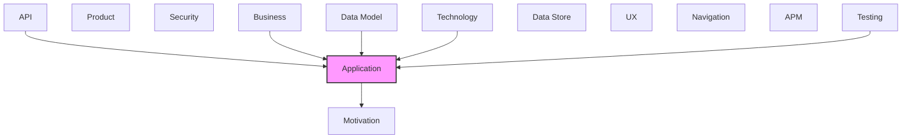

# Application

[← Back to README](../README.md)

Application components, services, and interactions.

## Report Index

- [Layer Introduction](#layer-introduction)
- [Intra-Layer Relationships](#intra-layer-relationships)
- [Inter-Layer Dependencies](#inter-layer-dependencies)
- [Inter-Layer Relationships Table](#inter-layer-relationships-table)
- [Element Reference](#element-reference)

## Layer Introduction

| Metric                    | Count |
| ------------------------- | ----- |
| Elements                  | 31    |
| Intra-Layer Relationships | 49    |
| Inter-Layer Relationships | 34    |
| Inbound Relationships     | 30    |
| Outbound Relationships    | 4     |

**Cross-Layer References**:

- **Upstream layers**: [API](./07-api-layer-report.md), [Business](./02-business-layer-report.md), [Data Model](./08-data-model-layer-report.md), [Technology](./06-technology-layer-report.md), [Testing](./13-testing-layer-report.md)
- **Downstream layers**: [Motivation](./01-motivation-layer-report.md)

## Intra-Layer Relationships

*This layer has >30 elements. Summary table shown instead of diagram.*

| Element                                                                          | Type                       | Relationships |
| -------------------------------------------------------------------------------- | -------------------------- | ------------- |
| `application.applicationcollaboration.graph-canvas-layoutviewport-collaboration` | `applicationcollaboration` | 5             |
| `application.applicationcomponent.graph-canvas-component`                        | `applicationcomponent`     | 21            |
| `application.applicationcomponent.graph-collapse-control-component`              | `applicationcomponent`     | 1             |
| `application.applicationcomponent.graph-edge-component`                          | `applicationcomponent`     | 2             |
| `application.applicationcomponent.graph-edge-inspector-component`                | `applicationcomponent`     | 1             |
| `application.applicationcomponent.graph-edge-shape-component`                    | `applicationcomponent`     | 2             |
| `application.applicationcomponent.graph-inspector-component`                     | `applicationcomponent`     | 1             |
| `application.applicationcomponent.graph-node-component`                          | `applicationcomponent`     | 1             |
| `application.applicationcomponent.graph-toolbar-component`                       | `applicationcomponent`     | 1             |
| `application.applicationevent.node-drag-end-event`                               | `applicationevent`         | 1             |
| `application.applicationevent.node-hover-change-event`                           | `applicationevent`         | 1             |
| `application.applicationfunction.bezier-edge-path-computation`                   | `applicationfunction`      | 1             |
| `application.applicationfunction.cluster-circle-packing`                         | `applicationfunction`      | 1             |
| `application.applicationfunction.clustered-force-layout-algorithm`               | `applicationfunction`      | 5             |
| `application.applicationfunction.edge-label-clear-position-search`               | `applicationfunction`      | 1             |
| `application.applicationfunction.force-directed-layout-algorithm`                | `applicationfunction`      | 6             |
| `application.applicationfunction.galaxy-aspect-ratio-resolution`                 | `applicationfunction`      | 2             |
| `application.applicationfunction.galaxy-live-simulation-step`                    | `applicationfunction`      | 4             |
| `application.applicationfunction.galaxy-radial-orbit-layout-algorithm`           | `applicationfunction`      | 5             |
| `application.applicationfunction.louvain-community-clustering`                   | `applicationfunction`      | 1             |
| `application.applicationfunction.navigation-edge-orthogonal-routing`             | `applicationfunction`      | 1             |
| `application.applicationfunction.node-overlap-separation-pass`                   | `applicationfunction`      | 3             |
| `application.applicationfunction.radial-tree-layout-algorithm`                   | `applicationfunction`      | 3             |
| `application.applicationfunction.structural-forest-construction`                 | `applicationfunction`      | 3             |
| `application.applicationfunction.ux-navigation-tree-layout-algorithm`            | `applicationfunction`      | 3             |
| `application.applicationinteraction.panzoom-gesture-handling`                    | `applicationinteraction`   | 1             |
| `application.applicationprocess.graph-render-and-layout-recomputation-pipeline`  | `applicationprocess`       | 4             |
| `application.applicationservice.graph-layout-engine-service`                     | `applicationservice`       | 6             |
| `application.applicationservice.live-galaxy-simulation-service`                  | `applicationservice`       | 3             |
| `application.dataobject.node-position-map`                                       | `dataobject`               | 5             |
| `application.dataobject.node-rect-registry`                                      | `dataobject`               | 3             |

## Inter-Layer Dependencies

## Inter-Layer Relationships Table

| Relationship ID                                                        | Source Node                                                                                      | Dest Node                                                                                   | Dest Layer    | Predicate    | Cardinality  | Strength |
| ---------------------------------------------------------------------- | ------------------------------------------------------------------------------------------------ | ------------------------------------------------------------------------------------------- | ------------- | ------------ | ------------ | -------- |
| `api.operation.realizes.application.applicationfunction`               | `api.operation.build-structural-forest`                                                          | `application.applicationfunction.structural-forest-construction`                            | `application` | `realizes`   | many-to-many | medium   |
| `api.operation.realizes.application.applicationfunction`               | `api.operation.clustered-force-layout`                                                           | `application.applicationfunction.clustered-force-layout-algorithm`                          | `application` | `realizes`   | many-to-many | medium   |
| `api.operation.realizes.application.applicationfunction`               | `api.operation.compute-edge-path`                                                                | `application.applicationfunction.bezier-edge-path-computation`                              | `application` | `realizes`   | many-to-many | medium   |
| `api.operation.realizes.application.applicationfunction`               | `api.operation.force-layout`                                                                     | `application.applicationfunction.force-directed-layout-algorithm`                           | `application` | `realizes`   | many-to-many | medium   |
| `api.operation.realizes.application.applicationfunction`               | `api.operation.galaxy-layout`                                                                    | `application.applicationfunction.galaxy-radial-orbit-layout-algorithm`                      | `application` | `realizes`   | many-to-many | medium   |
| `api.operation.references.application.applicationservice`              | `api.operation.graph-canvas`                                                                     | `application.applicationservice.graph-layout-engine-service`                                | `application` | `references` | many-to-many | medium   |
| `api.operation.references.application.applicationservice`              | `api.operation.graph-canvas`                                                                     | `application.applicationservice.live-galaxy-simulation-service`                             | `application` | `references` | many-to-many | medium   |
| `api.operation.realizes.application.applicationfunction`               | `api.operation.louvain-cluster`                                                                  | `application.applicationfunction.louvain-community-clustering`                              | `application` | `realizes`   | many-to-many | medium   |
| `api.operation.realizes.application.applicationfunction`               | `api.operation.pack-clusters`                                                                    | `application.applicationfunction.cluster-circle-packing`                                    | `application` | `realizes`   | many-to-many | medium   |
| `api.operation.realizes.application.applicationfunction`               | `api.operation.radial-tree-layout`                                                               | `application.applicationfunction.radial-tree-layout-algorithm`                              | `application` | `realizes`   | many-to-many | medium   |
| `api.operation.realizes.application.applicationfunction`               | `api.operation.ux-nav-layout`                                                                    | `application.applicationfunction.ux-navigation-tree-layout-algorithm`                       | `application` | `realizes`   | many-to-many | medium   |
| `api.operation.realizes.application.applicationfunction`               | `api.operation.visible-navigation-edge-ids`                                                      | `application.applicationfunction.ux-navigation-tree-layout-algorithm`                       | `application` | `realizes`   | many-to-many | medium   |
| `application.applicationcomponent.realizes.motivation.goal`            | `application.applicationcomponent.graph-canvas-component`                                        | `motivation.goal.readable-layout-for-structurally-complex-graphs`                           | `motivation`  | `realizes`   | many-to-many | medium   |
| `application.applicationcomponent.realizes.motivation.principle`       | `application.applicationcomponent.graph-canvas-component`                                        | `motivation.principle.zero-literal-node-overlap-guarantee`                                  | `motivation`  | `realizes`   | many-to-many | medium   |
| `application.applicationfunction.satisfies.motivation.requirement`     | `application.applicationfunction.clustered-force-layout-algorithm`                               | `motivation.requirement.layout-engines-must-be-pluggable-without-breaking-existing-callers` | `motivation`  | `satisfies`  | many-to-many | medium   |
| `application.applicationfunction.satisfies.motivation.requirement`     | `application.applicationfunction.force-directed-layout-algorithm`                                | `motivation.requirement.layout-engines-must-be-pluggable-without-breaking-existing-callers` | `motivation`  | `satisfies`  | many-to-many | medium   |
| `business.businessprocess.aggregates.application.applicationprocess`   | `business.businessprocess.render-graph-from-domain-data-to-interactive-view`                     | `application.applicationprocess.graph-render-and-layout-recomputation-pipeline`             | `application` | `aggregates` | many-to-many | medium   |
| `data-model.schemadefinition.realizes.application.dataobject`          | `data-model.schemadefinition.graph-node-data`                                                    | `application.dataobject.node-rect-registry`                                                 | `application` | `realizes`   | many-to-many | medium   |
| `data-model.schemadefinition.realizes.application.dataobject`          | `data-model.schemadefinition.layout-node`                                                        | `application.dataobject.node-position-map`                                                  | `application` | `realizes`   | many-to-many | medium   |
| `technology.technologyfunction.serves.application.applicationfunction` | `technology.technologyfunction.automated-test-execution`                                         | `application.applicationfunction.force-directed-layout-algorithm`                           | `application` | `serves`     | many-to-many | medium   |
| `testing.coveragerequirement.covers.application.applicationfunction`   | `testing.coveragerequirement.zero-literal-node-overlap-under-layout-simulation`                  | `application.applicationfunction.node-overlap-separation-pass`                              | `application` | `covers`     | many-to-many | medium   |
| `testing.testcasesketch.tests.application.applicationfunction`         | `testing.testcasesketch.clustered-view-bubble-packing-integration`                               | `application.applicationfunction.clustered-force-layout-algorithm`                          | `application` | `tests`      | many-to-many | medium   |
| `testing.testcasesketch.tests.application.applicationfunction`         | `testing.testcasesketch.galaxy-layout-lab-poc-dataset-stress-test`                               | `application.applicationfunction.galaxy-radial-orbit-layout-algorithm`                      | `application` | `tests`      | many-to-many | medium   |
| `testing.testcasesketch.tests.application.applicationfunction`         | `testing.testcasesketch.large-card-nodes-stay-non-overlapping-in-a-bushy-hub-and-spoke-topology` | `application.applicationfunction.force-directed-layout-algorithm`                           | `application` | `tests`      | many-to-many | medium   |
| `testing.testcasesketch.tests.application.applicationfunction`         | `testing.testcasesketch.radial-tree-layout-collapsed-nodes`                                      | `application.applicationfunction.radial-tree-layout-algorithm`                              | `application` | `tests`      | many-to-many | medium   |
| `testing.testcasesketch.tests.application.applicationfunction`         | `testing.testcasesketch.route-navigation-edge-avoids-obstacles`                                  | `application.applicationfunction.navigation-edge-orthogonal-routing`                        | `application` | `tests`      | many-to-many | medium   |
| `testing.testcoveragemodel.covers.application.applicationcomponent`    | `testing.testcoveragemodel.heimdall-graph-layout-test-coverage`                                  | `application.applicationcomponent.graph-canvas-component`                                   | `application` | `covers`     | many-to-many | medium   |
| `testing.testcoveragetarget.tests.application.applicationcomponent`    | `testing.testcoveragetarget.edge-label-placement-and-styling`                                    | `application.applicationcomponent.graph-canvas-component`                                   | `application` | `tests`      | many-to-many | medium   |
| `testing.testcoveragetarget.covers.application.applicationservice`     | `testing.testcoveragetarget.force-force-clustered-layout-algorithms`                             | `application.applicationservice.graph-layout-engine-service`                                | `application` | `covers`     | many-to-many | medium   |
| `testing.testcoveragetarget.covers.application.applicationservice`     | `testing.testcoveragetarget.galaxy-layout-and-live-simulation`                                   | `application.applicationservice.live-galaxy-simulation-service`                             | `application` | `covers`     | many-to-many | medium   |
| `testing.testcoveragetarget.tests.application.applicationcomponent`    | `testing.testcoveragetarget.graph-canvas-rendering-and-interaction`                              | `application.applicationcomponent.graph-canvas-component`                                   | `application` | `tests`      | many-to-many | medium   |
| `testing.testcoveragetarget.tests.application.applicationcomponent`    | `testing.testcoveragetarget.graph-edge-geometry-utilities`                                       | `application.applicationcomponent.graph-canvas-component`                                   | `application` | `tests`      | many-to-many | medium   |
| `testing.testcoveragetarget.tests.application.applicationcomponent`    | `testing.testcoveragetarget.navigation-edge-channel-routing`                                     | `application.applicationcomponent.graph-canvas-component`                                   | `application` | `tests`      | many-to-many | medium   |
| `testing.testcoveragetarget.covers.application.applicationservice`     | `testing.testcoveragetarget.radial-tree-layout-algorithm`                                        | `application.applicationservice.graph-layout-engine-service`                                | `application` | `covers`     | many-to-many | medium   |

## Element Reference

### GraphCanvas Layout/Viewport Collaboration {#graphcanvas-layout-viewport-collaboration}

**ID**: `application.applicationcollaboration.graph-canvas-layoutviewport-collaboration`

**Type**: `applicationcollaboration`

The runtime collaboration between GraphCanvas, its selected layout engine, usePanZoom, and (layout=galaxy) useGalaxySimulation — GraphCanvas owns state and orchestrates calls into the others each render/frame.

#### Relationships

| Type        | Related Element                                                 | Predicate        | Direction |
| ----------- | --------------------------------------------------------------- | ---------------- | --------- |
| intra-layer | `application.applicationcomponent.graph-canvas-component`       | `aggregates`     | outbound  |
| intra-layer | `application.applicationservice.live-galaxy-simulation-service` | `delivers-value` | outbound  |
| intra-layer | `application.applicationinteraction.panzoom-gesture-handling`   | `depends-on`     | outbound  |
| intra-layer | `application.dataobject.node-position-map`                      | `depends-on`     | outbound  |
| intra-layer | `application.applicationevent.node-hover-change-event`          | `triggers`       | inbound   |

### GraphCanvas Component {#graphcanvas-component}

**ID**: `application.applicationcomponent.graph-canvas-component`

**Type**: `applicationcomponent`

The primary orchestrating React component: manages node measurement, dispatches to whichever layout engine is selected, owns pan/zoom/selection/hover/collapse state, and renders nodes, edges, toolbar, tooltips, and popovers.

#### Attributes

| Name | Value             |
| ---- | ----------------- |
| type | service-component |

#### Relationships

| Type        | Related Element                                                                  | Predicate    | Direction |
| ----------- | -------------------------------------------------------------------------------- | ------------ | --------- |
| inter-layer | `motivation.goal.readable-layout-for-structurally-complex-graphs`                | `realizes`   | outbound  |
| inter-layer | `motivation.principle.zero-literal-node-overlap-guarantee`                       | `realizes`   | outbound  |
| inter-layer | `testing.testcoveragemodel.heimdall-graph-layout-test-coverage`                  | `covers`     | inbound   |
| inter-layer | `testing.testcoveragetarget.edge-label-placement-and-styling`                    | `tests`      | inbound   |
| inter-layer | `testing.testcoveragetarget.graph-canvas-rendering-and-interaction`              | `tests`      | inbound   |
| inter-layer | `testing.testcoveragetarget.graph-edge-geometry-utilities`                       | `tests`      | inbound   |
| inter-layer | `testing.testcoveragetarget.navigation-edge-channel-routing`                     | `tests`      | inbound   |
| intra-layer | `application.applicationcollaboration.graph-canvas-layoutviewport-collaboration` | `aggregates` | inbound   |
| intra-layer | `application.dataobject.node-position-map`                                       | `accesses`   | outbound  |
| intra-layer | `application.dataobject.node-rect-registry`                                      | `accesses`   | outbound  |
| intra-layer | `application.applicationfunction.bezier-edge-path-computation`                   | `composes`   | outbound  |
| intra-layer | `application.applicationfunction.clustered-force-layout-algorithm`               | `composes`   | outbound  |
| intra-layer | `application.applicationfunction.edge-label-clear-position-search`               | `composes`   | outbound  |
| intra-layer | `application.applicationfunction.force-directed-layout-algorithm`                | `composes`   | outbound  |
| intra-layer | `application.applicationfunction.galaxy-aspect-ratio-resolution`                 | `composes`   | outbound  |
| intra-layer | `application.applicationfunction.galaxy-radial-orbit-layout-algorithm`           | `composes`   | outbound  |
| intra-layer | `application.applicationfunction.navigation-edge-orthogonal-routing`             | `composes`   | outbound  |
| intra-layer | `application.applicationfunction.radial-tree-layout-algorithm`                   | `composes`   | outbound  |
| intra-layer | `application.applicationfunction.structural-forest-construction`                 | `composes`   | outbound  |
| intra-layer | `application.applicationfunction.ux-navigation-tree-layout-algorithm`            | `composes`   | outbound  |
| intra-layer | `application.applicationservice.graph-layout-engine-service`                     | `realizes`   | outbound  |
| intra-layer | `application.applicationservice.live-galaxy-simulation-service`                  | `realizes`   | outbound  |
| intra-layer | `application.applicationcomponent.graph-collapse-control-component`              | `uses`       | outbound  |
| intra-layer | `application.applicationcomponent.graph-edge-shape-component`                    | `uses`       | outbound  |
| intra-layer | `application.applicationcomponent.graph-node-component`                          | `uses`       | outbound  |
| intra-layer | `application.applicationcomponent.graph-toolbar-component`                       | `uses`       | outbound  |
| intra-layer | `application.applicationcomponent.graph-edge-inspector-component`                | `uses`       | inbound   |
| intra-layer | `application.applicationcomponent.graph-inspector-component`                     | `uses`       | inbound   |

### GraphCollapseControl Component {#graphcollapsecontrol-component}

**ID**: `application.applicationcomponent.graph-collapse-control-component`

**Type**: `applicationcomponent`

Floating foreignObject button rendered at a node's right edge for toggling structural collapse/expand, with a hidden-descendant-count badge.

#### Attributes

| Name | Value    |
| ---- | -------- |
| type | internal |

#### Relationships

| Type        | Related Element                                           | Predicate | Direction |
| ----------- | --------------------------------------------------------- | --------- | --------- |
| intra-layer | `application.applicationcomponent.graph-canvas-component` | `uses`    | inbound   |

### GraphEdge Component {#graphedge-component}

**ID**: `application.applicationcomponent.graph-edge-component`

**Type**: `applicationcomponent`

Standalone exported edge component (for use outside GraphCanvas's own internal edge renderer) — computes its own path via computeEdgePath and delegates drawing to GraphEdgeShape.

#### Attributes

| Name | Value    |
| ---- | -------- |
| type | internal |

#### Relationships

| Type        | Related Element                                               | Predicate  | Direction |
| ----------- | ------------------------------------------------------------- | ---------- | --------- |
| intra-layer | `application.dataobject.node-rect-registry`                   | `accesses` | outbound  |
| intra-layer | `application.applicationcomponent.graph-edge-shape-component` | `uses`     | outbound  |

### GraphEdgeInspector Component {#graphedgeinspector-component}

**ID**: `application.applicationcomponent.graph-edge-inspector-component`

**Type**: `applicationcomponent`

Lighter detail panel for a selected edge: predicate/title, source/target endpoint buttons, weight and scalar metadata.

#### Attributes

| Name | Value    |
| ---- | -------- |
| type | internal |

#### Relationships

| Type        | Related Element                                           | Predicate | Direction |
| ----------- | --------------------------------------------------------- | --------- | --------- |
| intra-layer | `application.applicationcomponent.graph-canvas-component` | `uses`    | outbound  |

### GraphEdgeShape Component {#graphedgeshape-component}

**ID**: `application.applicationcomponent.graph-edge-shape-component`

**Type**: `applicationcomponent`

Shared SVG drawing primitive for an edge: line, arrow markers (per variant), hit-target path, and collision-cleared label pill. Used by both GraphEdge and GraphCanvas's internal edge renderer to prevent visual drift between the two.

#### Attributes

| Name | Value    |
| ---- | -------- |
| type | internal |

#### Relationships

| Type        | Related Element                                           | Predicate | Direction |
| ----------- | --------------------------------------------------------- | --------- | --------- |
| intra-layer | `application.applicationcomponent.graph-canvas-component` | `uses`    | inbound   |
| intra-layer | `application.applicationcomponent.graph-edge-component`   | `uses`    | inbound   |

### GraphInspector Component {#graphinspector-component}

**ID**: `application.applicationcomponent.graph-inspector-component`

**Type**: `applicationcomponent`

Detail panel for a selected node: title/kind/domain badges, description, metadata key-value list, and outgoing/incoming relationship links.

#### Attributes

| Name | Value    |
| ---- | -------- |
| type | internal |

#### Relationships

| Type        | Related Element                                           | Predicate | Direction |
| ----------- | --------------------------------------------------------- | --------- | --------- |
| intra-layer | `application.applicationcomponent.graph-canvas-component` | `uses`    | outbound  |

### GraphNode Component {#graphnode-component}

**ID**: `application.applicationcomponent.graph-node-component`

**Type**: `applicationcomponent`

Default node renderer: label/kind/domain swatch, click/keyboard select, Shift+Enter collapse toggle, popover trigger.

#### Attributes

| Name | Value    |
| ---- | -------- |
| type | internal |

#### Relationships

| Type        | Related Element                                           | Predicate | Direction |
| ----------- | --------------------------------------------------------- | --------- | --------- |
| intra-layer | `application.applicationcomponent.graph-canvas-component` | `uses`    | inbound   |

### GraphToolbar Component {#graphtoolbar-component}

**ID**: `application.applicationcomponent.graph-toolbar-component`

**Type**: `applicationcomponent`

Floating zoom in/out/fit, pan-lock, fullscreen, and (layout=galaxy only) live-simulation toggle controls, reading/writing GraphCanvasContext.

#### Attributes

| Name | Value    |
| ---- | -------- |
| type | internal |

#### Relationships

| Type        | Related Element                                           | Predicate | Direction |
| ----------- | --------------------------------------------------------- | --------- | --------- |
| intra-layer | `application.applicationcomponent.graph-canvas-component` | `uses`    | inbound   |

### Node Drag End Event {#node-drag-end-event}

**ID**: `application.applicationevent.node-drag-end-event`

**Type**: `applicationevent`

onNodeDragEnd callback fired once a node drag ends past DRAG_THRESHOLD, carrying the node's id and new position — a UI-domain event, not a system/integration one.

#### Attributes

| Name      | Value  |
| --------- | ------ |
| eventType | domain |

#### Relationships

| Type        | Related Element                                                                 | Predicate  | Direction |
| ----------- | ------------------------------------------------------------------------------- | ---------- | --------- |
| intra-layer | `application.applicationprocess.graph-render-and-layout-recomputation-pipeline` | `triggers` | outbound  |

### Node Hover Change Event {#node-hover-change-event}

**ID**: `application.applicationevent.node-hover-change-event`

**Type**: `applicationevent`

onNodeHover callback fired with a node's id on pointer-enter and undefined on pointer-leave, mirrored in GraphCanvasContext.hoveredNodeId; drives structural/navigation edge visibility.

#### Attributes

| Name      | Value  |
| --------- | ------ |
| eventType | domain |

#### Relationships

| Type        | Related Element                                                                  | Predicate  | Direction |
| ----------- | -------------------------------------------------------------------------------- | ---------- | --------- |
| intra-layer | `application.applicationcollaboration.graph-canvas-layoutviewport-collaboration` | `triggers` | outbound  |

### Bezier Edge Path Computation {#bezier-edge-path-computation}

**ID**: `application.applicationfunction.bezier-edge-path-computation`

**Type**: `applicationfunction`

computeEdgePath()/bezierPath()/cubicBezierPath(): resolves the rendered curve between two node rectangles, choosing quadratic vs. cubic bezier depending on whether either endpoint has a fixed anchor side.

#### Relationships

| Type        | Related Element                                           | Predicate  | Direction |
| ----------- | --------------------------------------------------------- | ---------- | --------- |
| inter-layer | `api.operation.compute-edge-path`                         | `realizes` | inbound   |
| intra-layer | `application.applicationcomponent.graph-canvas-component` | `composes` | inbound   |

### Cluster Circle Packing {#cluster-circle-packing}

**ID**: `application.applicationfunction.cluster-circle-packing`

**Type**: `applicationfunction`

packClusters(): wraps d3-hierarchy's pack() to turn a Louvain dendrogram into concrete non-overlapping nested circles sized to each leaf's real bounding box.

#### Relationships

| Type        | Related Element                                                    | Predicate    | Direction |
| ----------- | ------------------------------------------------------------------ | ------------ | --------- |
| inter-layer | `api.operation.pack-clusters`                                      | `realizes`   | inbound   |
| intra-layer | `application.applicationfunction.clustered-force-layout-algorithm` | `depends-on` | inbound   |

### Clustered Force Layout Algorithm {#clustered-force-layout-algorithm}

**ID**: `application.applicationfunction.clustered-force-layout-algorithm`

**Type**: `applicationfunction`

clusteredForceLayout(): opt-in nested-bubble layout — Louvain clustering + circle packing + a macro force pass over cluster pseudo-nodes + a micro force pass over real nodes gravity-biased toward their cluster centroid.

#### Relationships

| Type        | Related Element                                                                             | Predicate    | Direction |
| ----------- | ------------------------------------------------------------------------------------------- | ------------ | --------- |
| inter-layer | `api.operation.clustered-force-layout`                                                      | `realizes`   | inbound   |
| inter-layer | `motivation.requirement.layout-engines-must-be-pluggable-without-breaking-existing-callers` | `satisfies`  | outbound  |
| inter-layer | `testing.testcasesketch.clustered-view-bubble-packing-integration`                          | `tests`      | inbound   |
| intra-layer | `application.applicationcomponent.graph-canvas-component`                                   | `composes`   | inbound   |
| intra-layer | `application.applicationfunction.cluster-circle-packing`                                    | `depends-on` | outbound  |
| intra-layer | `application.applicationfunction.force-directed-layout-algorithm`                           | `depends-on` | outbound  |
| intra-layer | `application.applicationfunction.louvain-community-clustering`                              | `depends-on` | outbound  |
| intra-layer | `application.applicationservice.graph-layout-engine-service`                                | `realizes`   | outbound  |

### Edge Label Clear-Position Search {#edge-label-clear-position-search}

**ID**: `application.applicationfunction.edge-label-clear-position-search`

**Type**: `applicationfunction`

findClearLabelPosition(): samples candidate points along an edge's path and picks the first whose label footprint clears every node, falling back to the exact midpoint.

#### Relationships

| Type        | Related Element                                           | Predicate  | Direction |
| ----------- | --------------------------------------------------------- | ---------- | --------- |
| intra-layer | `application.applicationcomponent.graph-canvas-component` | `composes` | inbound   |

### Force-Directed Layout Algorithm {#force-directed-layout-algorithm}

**ID**: `application.applicationfunction.force-directed-layout-algorithm`

**Type**: `applicationfunction`

forceLayout(): spring/repulsion/collision/center-gravity simulation placing nodes without explicit coordinates, followed by a capped-displacement overlap-resolution post-process (resolveOverlaps/separationPass).

#### Relationships

| Type        | Related Element                                                                                  | Predicate    | Direction |
| ----------- | ------------------------------------------------------------------------------------------------ | ------------ | --------- |
| inter-layer | `api.operation.force-layout`                                                                     | `realizes`   | inbound   |
| inter-layer | `motivation.requirement.layout-engines-must-be-pluggable-without-breaking-existing-callers`      | `satisfies`  | outbound  |
| inter-layer | `technology.technologyfunction.automated-test-execution`                                         | `serves`     | inbound   |
| inter-layer | `testing.testcasesketch.large-card-nodes-stay-non-overlapping-in-a-bushy-hub-and-spoke-topology` | `tests`      | inbound   |
| intra-layer | `application.applicationcomponent.graph-canvas-component`                                        | `composes`   | inbound   |
| intra-layer | `application.applicationfunction.clustered-force-layout-algorithm`                               | `depends-on` | inbound   |
| intra-layer | `application.dataobject.node-position-map`                                                       | `accesses`   | outbound  |
| intra-layer | `application.applicationfunction.node-overlap-separation-pass`                                   | `depends-on` | outbound  |
| intra-layer | `application.applicationservice.graph-layout-engine-service`                                     | `realizes`   | outbound  |
| intra-layer | `application.applicationprocess.graph-render-and-layout-recomputation-pipeline`                  | `depends-on` | inbound   |

### Galaxy Aspect-Ratio Resolution {#galaxy-aspect-ratio-resolution}

**ID**: `application.applicationfunction.galaxy-aspect-ratio-resolution`

**Type**: `applicationfunction`

resolveAspectRatioScale(): binary-searches how much a galaxy layout's orbital ellipse can be warped toward a container's aspect ratio without inflating rendered area past a cap.

#### Relationships

| Type        | Related Element                                               | Predicate    | Direction |
| ----------- | ------------------------------------------------------------- | ------------ | --------- |
| intra-layer | `application.applicationcomponent.graph-canvas-component`     | `composes`   | inbound   |
| intra-layer | `application.applicationfunction.galaxy-live-simulation-step` | `depends-on` | inbound   |

### Galaxy Live Simulation Step {#galaxy-live-simulation-step}

**ID**: `application.applicationfunction.galaxy-live-simulation-step`

**Type**: `applicationfunction`

galaxySimulationStep(): one settle iteration of the galaxy algorithm — recomputed orbital home positions, collision separation, homeStrength nudge — driven either as a bounded batch (galaxyLayout) or continuously per animation frame for live dragging.

#### Relationships

| Type        | Related Element                                                        | Predicate    | Direction |
| ----------- | ---------------------------------------------------------------------- | ------------ | --------- |
| intra-layer | `application.applicationfunction.galaxy-aspect-ratio-resolution`       | `depends-on` | outbound  |
| intra-layer | `application.applicationfunction.structural-forest-construction`       | `depends-on` | outbound  |
| intra-layer | `application.applicationservice.live-galaxy-simulation-service`        | `realizes`   | outbound  |
| intra-layer | `application.applicationfunction.galaxy-radial-orbit-layout-algorithm` | `depends-on` | inbound   |

### Galaxy Radial Orbit Layout Algorithm {#galaxy-radial-orbit-layout-algorithm}

**ID**: `application.applicationfunction.galaxy-radial-orbit-layout-algorithm`

**Type**: `applicationfunction`

galaxyLayout(): positions nodes as a radial hierarchy of orbits from structural edges, settled over repeated galaxySimulationStep cycles, then group-separated so independent root subtrees don't overlap.

#### Relationships

| Type        | Related Element                                                    | Predicate    | Direction |
| ----------- | ------------------------------------------------------------------ | ------------ | --------- |
| inter-layer | `api.operation.galaxy-layout`                                      | `realizes`   | inbound   |
| inter-layer | `testing.testcasesketch.galaxy-layout-lab-poc-dataset-stress-test` | `tests`      | inbound   |
| intra-layer | `application.applicationcomponent.graph-canvas-component`          | `composes`   | inbound   |
| intra-layer | `application.dataobject.node-position-map`                         | `accesses`   | outbound  |
| intra-layer | `application.applicationfunction.galaxy-live-simulation-step`      | `depends-on` | outbound  |
| intra-layer | `application.applicationfunction.node-overlap-separation-pass`     | `depends-on` | outbound  |
| intra-layer | `application.applicationservice.graph-layout-engine-service`       | `realizes`   | outbound  |

### Louvain Community Clustering {#louvain-community-clustering}

**ID**: `application.applicationfunction.louvain-community-clustering`

**Type**: `applicationfunction`

louvainCluster(): deterministic multi-level Louvain modularity clustering producing a nested dendrogram, used as the community structure clusteredForceLayout packs and lays out.

#### Relationships

| Type        | Related Element                                                    | Predicate    | Direction |
| ----------- | ------------------------------------------------------------------ | ------------ | --------- |
| inter-layer | `api.operation.louvain-cluster`                                    | `realizes`   | inbound   |
| intra-layer | `application.applicationfunction.clustered-force-layout-algorithm` | `depends-on` | inbound   |

### Navigation Edge Orthogonal Routing {#navigation-edge-orthogonal-routing}

**ID**: `application.applicationfunction.navigation-edge-orthogonal-routing`

**Type**: `applicationfunction`

routeNavigationEdge/routeNavigationEdges(): builds obstacle-avoiding orthogonal (right-angle) paths for ux-navigation route edges, with a nudge pass spreading overlapping parallel segments.

#### Relationships

| Type        | Related Element                                                 | Predicate  | Direction |
| ----------- | --------------------------------------------------------------- | ---------- | --------- |
| inter-layer | `testing.testcasesketch.route-navigation-edge-avoids-obstacles` | `tests`    | inbound   |
| intra-layer | `application.applicationcomponent.graph-canvas-component`       | `composes` | inbound   |

### Node Overlap Separation Pass {#node-overlap-separation-pass}

**ID**: `application.applicationfunction.node-overlap-separation-pass`

**Type**: `applicationfunction`

separationPass(): pushes every currently-overlapping node pair apart along the least-movement axis, capped per node — shared post-process reused by forceLayout, galaxyLayout, and radialTreeLayout.

#### Relationships

| Type        | Related Element                                                                 | Predicate    | Direction |
| ----------- | ------------------------------------------------------------------------------- | ------------ | --------- |
| inter-layer | `testing.coveragerequirement.zero-literal-node-overlap-under-layout-simulation` | `covers`     | inbound   |
| intra-layer | `application.applicationfunction.force-directed-layout-algorithm`               | `depends-on` | inbound   |
| intra-layer | `application.applicationfunction.galaxy-radial-orbit-layout-algorithm`          | `depends-on` | inbound   |
| intra-layer | `application.applicationfunction.radial-tree-layout-algorithm`                  | `depends-on` | inbound   |

### Radial Tree Layout Algorithm {#radial-tree-layout-algorithm}

**ID**: `application.applicationfunction.radial-tree-layout-algorithm`

**Type**: `applicationfunction`

radialTreeLayout(): per-trunk sizing, d3.tree()-based polar placement of descendants on depth rings, trunk packing (d3 packSiblings), and a global separation pass.

#### Relationships

| Type        | Related Element                                                | Predicate    | Direction |
| ----------- | -------------------------------------------------------------- | ------------ | --------- |
| inter-layer | `api.operation.radial-tree-layout`                             | `realizes`   | inbound   |
| inter-layer | `testing.testcasesketch.radial-tree-layout-collapsed-nodes`    | `tests`      | inbound   |
| intra-layer | `application.applicationcomponent.graph-canvas-component`      | `composes`   | inbound   |
| intra-layer | `application.applicationfunction.node-overlap-separation-pass` | `depends-on` | outbound  |
| intra-layer | `application.applicationservice.graph-layout-engine-service`   | `realizes`   | outbound  |

### Structural Forest Construction {#structural-forest-construction}

**ID**: `application.applicationfunction.structural-forest-construction`

**Type**: `applicationfunction`

buildStructuralForest(): derives a parent/child forest from structural edges only, breaking structural cycles by promoting one node per cycle to a root. Shared by galaxyLayout, radialTreeLayout, uxNavLayout, and GraphCanvas's collapse/expand logic.

#### Relationships

| Type        | Related Element                                                       | Predicate    | Direction |
| ----------- | --------------------------------------------------------------------- | ------------ | --------- |
| inter-layer | `api.operation.build-structural-forest`                               | `realizes`   | inbound   |
| intra-layer | `application.applicationcomponent.graph-canvas-component`             | `composes`   | inbound   |
| intra-layer | `application.applicationfunction.galaxy-live-simulation-step`         | `depends-on` | inbound   |
| intra-layer | `application.applicationfunction.ux-navigation-tree-layout-algorithm` | `depends-on` | inbound   |

### UX Navigation Tree Layout Algorithm {#ux-navigation-tree-layout-algorithm}

**ID**: `application.applicationfunction.ux-navigation-tree-layout-algorithm`

**Type**: `applicationfunction`

uxNavLayout(): positions page nodes as independent top-down d3.tree() hierarchies and view nodes as horizontal fans attached to their parent pages, handling multi-parent views and orphan views.

#### Relationships

| Type        | Related Element                                                  | Predicate    | Direction |
| ----------- | ---------------------------------------------------------------- | ------------ | --------- |
| inter-layer | `api.operation.ux-nav-layout`                                    | `realizes`   | inbound   |
| inter-layer | `api.operation.visible-navigation-edge-ids`                      | `realizes`   | inbound   |
| intra-layer | `application.applicationcomponent.graph-canvas-component`        | `composes`   | inbound   |
| intra-layer | `application.applicationfunction.structural-forest-construction` | `depends-on` | outbound  |
| intra-layer | `application.applicationservice.graph-layout-engine-service`     | `realizes`   | outbound  |

### Pan/Zoom Gesture Handling {#pan-zoom-gesture-handling}

**ID**: `application.applicationinteraction.panzoom-gesture-handling`

**Type**: `applicationinteraction`

usePanZoom(): wheel/pinch/drag/keyboard-driven pan and zoom with inertia, anchored-zoom math, and bounds clamping — reacts continuously to pointer/wheel/keyboard events rather than a single request/response.

#### Attributes

| Name    | Value        |
| ------- | ------------ |
| pattern | event-driven |

#### Relationships

| Type        | Related Element                                                                  | Predicate    | Direction |
| ----------- | -------------------------------------------------------------------------------- | ------------ | --------- |
| intra-layer | `application.applicationcollaboration.graph-canvas-layoutviewport-collaboration` | `depends-on` | inbound   |

### Graph Render and Layout Recomputation Pipeline {#graph-render-and-layout-recomputation-pipeline}

**ID**: `application.applicationprocess.graph-render-and-layout-recomputation-pipeline`

**Type**: `applicationprocess`

GraphCanvas's core pipeline: measure node dimensions -&gt; run the selected layout engine once dims are ready -&gt; commit positions to state -&gt; compute per-edge geometry (path/label) against the committed node rects -&gt; render nodes/edges/toolbar.

#### Relationships

| Type        | Related Element                                                              | Predicate    | Direction |
| ----------- | ---------------------------------------------------------------------------- | ------------ | --------- |
| inter-layer | `business.businessprocess.render-graph-from-domain-data-to-interactive-view` | `aggregates` | inbound   |
| intra-layer | `application.applicationevent.node-drag-end-event`                           | `triggers`   | inbound   |
| intra-layer | `application.applicationfunction.force-directed-layout-algorithm`            | `depends-on` | outbound  |
| intra-layer | `application.dataobject.node-position-map`                                   | `depends-on` | outbound  |
| intra-layer | `application.dataobject.node-rect-registry`                                  | `depends-on` | outbound  |

### Graph Layout Engine Service {#graph-layout-engine-service}

**ID**: `application.applicationservice.graph-layout-engine-service`

**Type**: `applicationservice`

The set of one-shot layout engines (forceLayout/clusteredForceLayout/galaxyLayout/uxNavLayout/radialTreeLayout) GraphCanvas dispatches to synchronously by its layout prop to compute node positions from graph structure.

#### Attributes

| Name        | Value       |
| ----------- | ----------- |
| serviceType | synchronous |

#### Relationships

| Type        | Related Element                                                        | Predicate    | Direction |
| ----------- | ---------------------------------------------------------------------- | ------------ | --------- |
| inter-layer | `api.operation.graph-canvas`                                           | `references` | inbound   |
| inter-layer | `testing.testcoveragetarget.force-force-clustered-layout-algorithms`   | `covers`     | inbound   |
| inter-layer | `testing.testcoveragetarget.radial-tree-layout-algorithm`              | `covers`     | inbound   |
| intra-layer | `application.applicationcomponent.graph-canvas-component`              | `realizes`   | inbound   |
| intra-layer | `application.applicationfunction.clustered-force-layout-algorithm`     | `realizes`   | inbound   |
| intra-layer | `application.applicationfunction.force-directed-layout-algorithm`      | `realizes`   | inbound   |
| intra-layer | `application.applicationfunction.galaxy-radial-orbit-layout-algorithm` | `realizes`   | inbound   |
| intra-layer | `application.applicationfunction.radial-tree-layout-algorithm`         | `realizes`   | inbound   |
| intra-layer | `application.applicationfunction.ux-navigation-tree-layout-algorithm`  | `realizes`   | inbound   |

### Live Galaxy Simulation Service {#live-galaxy-simulation-service}

**ID**: `application.applicationservice.live-galaxy-simulation-service`

**Type**: `applicationservice`

useGalaxySimulation(): a continuous, self-scheduling requestAnimationFrame loop over galaxySimulationStep — the 'live' counterpart to galaxyLayout's bounded one-shot settle loop, coalescing input changes into at most one commit per frame.

#### Attributes

| Name        | Value        |
| ----------- | ------------ |
| serviceType | event-driven |

#### Relationships

| Type        | Related Element                                                                  | Predicate        | Direction |
| ----------- | -------------------------------------------------------------------------------- | ---------------- | --------- |
| inter-layer | `api.operation.graph-canvas`                                                     | `references`     | inbound   |
| inter-layer | `testing.testcoveragetarget.galaxy-layout-and-live-simulation`                   | `covers`         | inbound   |
| intra-layer | `application.applicationcollaboration.graph-canvas-layoutviewport-collaboration` | `delivers-value` | inbound   |
| intra-layer | `application.applicationcomponent.graph-canvas-component`                        | `realizes`       | inbound   |
| intra-layer | `application.applicationfunction.galaxy-live-simulation-step`                    | `realizes`       | inbound   |

### Node Position Map {#node-position-map}

**ID**: `application.dataobject.node-position-map`

**Type**: `dataobject`

Map&lt;string, \{x, y\}&gt; — the universal output shape every layout engine (forceLayout, galaxyLayout, uxNavLayout, radialTreeLayout, clusteredForceLayout) returns, consumed uniformly by GraphCanvas regardless of which engine produced it.

#### Relationships

| Type        | Related Element                                                                  | Predicate    | Direction |
| ----------- | -------------------------------------------------------------------------------- | ------------ | --------- |
| inter-layer | `data-model.schemadefinition.layout-node`                                        | `realizes`   | inbound   |
| intra-layer | `application.applicationcollaboration.graph-canvas-layoutviewport-collaboration` | `depends-on` | inbound   |
| intra-layer | `application.applicationcomponent.graph-canvas-component`                        | `accesses`   | inbound   |
| intra-layer | `application.applicationfunction.force-directed-layout-algorithm`                | `accesses`   | inbound   |
| intra-layer | `application.applicationfunction.galaxy-radial-orbit-layout-algorithm`           | `accesses`   | inbound   |
| intra-layer | `application.applicationprocess.graph-render-and-layout-recomputation-pipeline`  | `depends-on` | inbound   |

### Node Rect Registry {#node-rect-registry}

**ID**: `application.dataobject.node-rect-registry`

**Type**: `dataobject`

GraphCanvasContext's nodeRects/getNodeRect — every currently-visible node's measured rect, used by edge components to compute paths and keep labels clear of node boxes.

#### Relationships

| Type        | Related Element                                                                 | Predicate    | Direction |
| ----------- | ------------------------------------------------------------------------------- | ------------ | --------- |
| inter-layer | `data-model.schemadefinition.graph-node-data`                                   | `realizes`   | inbound   |
| intra-layer | `application.applicationcomponent.graph-canvas-component`                       | `accesses`   | inbound   |
| intra-layer | `application.applicationcomponent.graph-edge-component`                         | `accesses`   | inbound   |
| intra-layer | `application.applicationprocess.graph-render-and-layout-recomputation-pipeline` | `depends-on` | inbound   |

---

Generated: 2026-09-18T14:45:21.203Z | Model Version: 0.1.0
