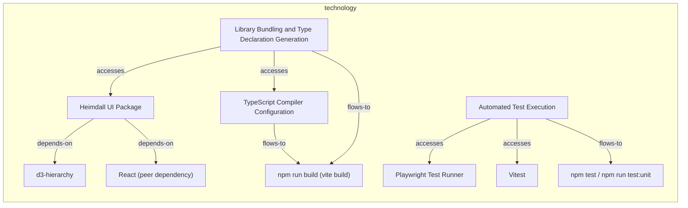
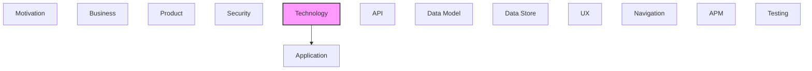

# Technology

[← Back to README](../README.md)

Infrastructure, platforms, systems, and technology components.

## Report Index

- [Layer Introduction](#layer-introduction)
- [Intra-Layer Relationships](#intra-layer-relationships)
- [Inter-Layer Dependencies](#inter-layer-dependencies)
- [Inter-Layer Relationships Table](#inter-layer-relationships-table)
- [Element Reference](#element-reference)

## Layer Introduction

| Metric                    | Count |
| ------------------------- | ----- |
| Elements                  | 10    |
| Intra-Layer Relationships | 9     |
| Inter-Layer Relationships | 1     |
| Inbound Relationships     | 0     |
| Outbound Relationships    | 1     |

**Cross-Layer References**:

- **Downstream layers**: [Application](./05-application-layer-report.md)

## Intra-Layer Relationships

## Inter-Layer Dependencies

## Inter-Layer Relationships Table

| Relationship ID                                                        | Source Node                                              | Dest Node                                                         | Dest Layer    | Predicate | Cardinality  | Strength |
| ---------------------------------------------------------------------- | -------------------------------------------------------- | ----------------------------------------------------------------- | ------------- | --------- | ------------ | -------- |
| `technology.technologyfunction.serves.application.applicationfunction` | `technology.technologyfunction.automated-test-execution` | `application.applicationfunction.force-directed-layout-algorithm` | `application` | `serves`  | many-to-many | medium   |

## Element Reference

### d3-hierarchy {#d3-hierarchy}

**ID**: `technology.artifact.d3-hierarchy`

**Type**: `artifact`

Real runtime dependency used directly by uxNavLayout (tree), radialTreeLayout (tree, packSiblings), and graphPacking (pack, hierarchy) for tree layout and circle packing.

#### Attributes

| Name         | Value   |
| ------------ | ------- |
| artifactType | library |

#### Relationships

| Type        | Related Element                           | Predicate    | Direction |
| ----------- | ----------------------------------------- | ------------ | --------- |
| intra-layer | `technology.artifact.heimdall-ui-package` | `depends-on` | inbound   |

### Heimdall UI Package {#heimdall-ui-package}

**ID**: `technology.artifact.heimdall-ui-package`

**Type**: `artifact`

The published @tinkermonkey/heimdall-ui npm package artifact (library) whose graph-visualization surface (GraphCanvas + layout engines) this model covers.

#### Attributes

| Name         | Value   |
| ------------ | ------- |
| artifactType | library |

#### Relationships

| Type        | Related Element                                                                  | Predicate    | Direction |
| ----------- | -------------------------------------------------------------------------------- | ------------ | --------- |
| intra-layer | `technology.artifact.d3-hierarchy`                                               | `depends-on` | outbound  |
| intra-layer | `technology.artifact.react-peer-dependency`                                      | `depends-on` | outbound  |
| intra-layer | `technology.technologyfunction.library-bundling-and-type-declaration-generation` | `accesses`   | inbound   |

### Playwright Test Runner {#playwright-test-runner}

**ID**: `technology.artifact.playwright-test-runner`

**Type**: `artifact`

@playwright/test devDependency driving the browser-based visual/behavioral regression suite in tests/, including all graph-\*.spec.ts files.

#### Attributes

| Name         | Value   |
| ------------ | ------- |
| artifactType | library |

#### Relationships

| Type        | Related Element                                          | Predicate  | Direction |
| ----------- | -------------------------------------------------------- | ---------- | --------- |
| intra-layer | `technology.technologyfunction.automated-test-execution` | `accesses` | inbound   |

### React (peer dependency) {#react-peer-dependency}

**ID**: `technology.artifact.react-peer-dependency`

**Type**: `artifact`

React 18/19 peer dependency GraphCanvas and all other components are built against.

#### Attributes

| Name         | Value   |
| ------------ | ------- |
| artifactType | library |

#### Relationships

| Type        | Related Element                           | Predicate    | Direction |
| ----------- | ----------------------------------------- | ------------ | --------- |
| intra-layer | `technology.artifact.heimdall-ui-package` | `depends-on` | inbound   |

### TypeScript Compiler Configuration {#typescript-compiler-configuration}

**ID**: `technology.artifact.type-script-compiler-configuration`

**Type**: `artifact`

tsconfig.json — strict TypeScript configuration, including allowImportingTsExtensions so scripts/render-and-score.mjs (in the sibling layout-loop harness) can import graphLayout.ts directly via Node's --experimental-strip-types without a build step.

#### Attributes

| Name         | Value         |
| ------------ | ------------- |
| artifactType | configuration |

#### Relationships

| Type        | Related Element                                                                  | Predicate  | Direction |
| ----------- | -------------------------------------------------------------------------------- | ---------- | --------- |
| intra-layer | `technology.technologyprocess.npm-run-build-vite-build`                          | `flows-to` | outbound  |
| intra-layer | `technology.technologyfunction.library-bundling-and-type-declaration-generation` | `accesses` | inbound   |

### Vitest {#vitest}

**ID**: `technology.artifact.vitest`

**Type**: `artifact`

vitest devDependency running pure-function unit tests for layout/routing algorithms (channelRouter.test.ts, radialTreeLayout.test.ts).

#### Attributes

| Name         | Value   |
| ------------ | ------- |
| artifactType | library |

#### Relationships

| Type        | Related Element                                          | Predicate  | Direction |
| ----------- | -------------------------------------------------------- | ---------- | --------- |
| intra-layer | `technology.technologyfunction.automated-test-execution` | `accesses` | inbound   |

### Automated Test Execution {#automated-test-execution}

**ID**: `technology.technologyfunction.automated-test-execution`

**Type**: `technologyfunction`

The capability of running heimdall's graph-visualization test suite — Playwright browser tests (tests/graph-\*.spec.ts) and Vitest unit tests (src/utils/\*.test.ts) — via 'npm test' / 'npm run test:unit'.

#### Relationships

| Type        | Related Element                                                   | Predicate  | Direction |
| ----------- | ----------------------------------------------------------------- | ---------- | --------- |
| inter-layer | `application.applicationfunction.force-directed-layout-algorithm` | `serves`   | outbound  |
| intra-layer | `technology.artifact.playwright-test-runner`                      | `accesses` | outbound  |
| intra-layer | `technology.artifact.vitest`                                      | `accesses` | outbound  |
| intra-layer | `technology.technologyprocess.npm-test-npm-run-testunit`          | `flows-to` | outbound  |

### Library Bundling and Type Declaration Generation {#library-bundling-and-type-declaration-generation}

**ID**: `technology.technologyfunction.library-bundling-and-type-declaration-generation`

**Type**: `technologyfunction`

Vite library-mode build (rollup under the hood) plus vite-plugin-dts, producing dist/index.js and dist/index.d.ts from src/index.ts's barrel export, with react/react-dom externalized.

#### Relationships

| Type        | Related Element                                          | Predicate  | Direction |
| ----------- | -------------------------------------------------------- | ---------- | --------- |
| intra-layer | `technology.artifact.heimdall-ui-package`                | `accesses` | outbound  |
| intra-layer | `technology.artifact.type-script-compiler-configuration` | `accesses` | outbound  |
| intra-layer | `technology.technologyprocess.npm-run-build-vite-build`  | `flows-to` | outbound  |

### npm run build (vite build) {#npm-run-build-vite-build}

**ID**: `technology.technologyprocess.npm-run-build-vite-build`

**Type**: `technologyprocess`

The package.json 'build'/'prepare' script that invokes the Vite build — runs automatically on npm install via the prepare lifecycle hook, producing the dist/ artifact this package publishes.

#### Relationships

| Type        | Related Element                                                                  | Predicate  | Direction |
| ----------- | -------------------------------------------------------------------------------- | ---------- | --------- |
| intra-layer | `technology.artifact.type-script-compiler-configuration`                         | `flows-to` | inbound   |
| intra-layer | `technology.technologyfunction.library-bundling-and-type-declaration-generation` | `flows-to` | inbound   |

### npm test / npm run test:unit {#npm-test-npm-run-test-unit}

**ID**: `technology.technologyprocess.npm-test-npm-run-testunit`

**Type**: `technologyprocess`

The package.json scripts invoking Playwright ('test'/'test:ui') and Vitest ('test:unit') against the graph-visualization test suite.

#### Relationships

| Type        | Related Element                                          | Predicate  | Direction |
| ----------- | -------------------------------------------------------- | ---------- | --------- |
| intra-layer | `technology.technologyfunction.automated-test-execution` | `flows-to` | inbound   |

---

Generated: 2026-09-18T14:45:21.203Z | Model Version: 0.1.0
