# API

[← Back to README](../README.md)

REST APIs, operations, endpoints, and API integrations.

## Report Index

- [Layer Introduction](#layer-introduction)
- [Intra-Layer Relationships](#intra-layer-relationships)
- [Inter-Layer Dependencies](#inter-layer-dependencies)
- [Inter-Layer Relationships Table](#inter-layer-relationships-table)
- [Element Reference](#element-reference)

## Layer Introduction

| Metric                    | Count |
| ------------------------- | ----- |
| Elements                  | 20    |
| Intra-Layer Relationships | 19    |
| Inter-Layer Relationships | 12    |
| Inbound Relationships     | 0     |
| Outbound Relationships    | 12    |

**Cross-Layer References**:

- **Downstream layers**: [Application](./05-application-layer-report.md)

## Intra-Layer Relationships

```mermaid
flowchart LR
  subgraph api
    api_operation_build_structural_forest["buildStructuralForest"]
    api_operation_clustered_force_layout["clusteredForceLayout"]
    api_operation_compute_edge_path["computeEdgePath"]
    api_operation_force_layout["forceLayout"]
    api_operation_galaxy_layout["galaxyLayout"]
    api_operation_graph_canvas["GraphCanvas"]
    api_operation_graph_collapse_control["GraphCollapseControl"]
    api_operation_graph_edge["GraphEdge"]
    api_operation_graph_edge_inspector["GraphEdgeInspector"]
    api_operation_graph_edge_shape["GraphEdgeShape"]
    api_operation_graph_inspector["GraphInspector"]
    api_operation_graph_node["GraphNode"]
    api_operation_graph_toolbar["GraphToolbar"]
    api_operation_louvain_cluster["louvainCluster"]
    api_operation_pack_clusters["packClusters"]
    api_operation_radial_tree_layout["radialTreeLayout"]
    api_operation_use_pan_zoom["usePanZoom"]
    api_operation_ux_nav_layout["uxNavLayout"]
    api_operation_visible_navigation_edge_ids["visibleNavigationEdgeIds"]
    api_tag_graph["graph"]
    api_operation_build_structural_forest -->|aggregates| api_tag_graph
    api_operation_clustered_force_layout -->|aggregates| api_tag_graph
    api_operation_compute_edge_path -->|aggregates| api_tag_graph
    api_operation_force_layout -->|aggregates| api_tag_graph
    api_operation_galaxy_layout -->|aggregates| api_tag_graph
    api_operation_graph_canvas -->|aggregates| api_tag_graph
    api_operation_graph_collapse_control -->|aggregates| api_tag_graph
    api_operation_graph_edge -->|aggregates| api_tag_graph
    api_operation_graph_edge_inspector -->|aggregates| api_tag_graph
    api_operation_graph_edge_shape -->|aggregates| api_tag_graph
    api_operation_graph_inspector -->|aggregates| api_tag_graph
    api_operation_graph_node -->|aggregates| api_tag_graph
    api_operation_graph_toolbar -->|aggregates| api_tag_graph
    api_operation_louvain_cluster -->|aggregates| api_tag_graph
    api_operation_pack_clusters -->|aggregates| api_tag_graph
    api_operation_radial_tree_layout -->|aggregates| api_tag_graph
    api_operation_use_pan_zoom -->|aggregates| api_tag_graph
    api_operation_ux_nav_layout -->|aggregates| api_tag_graph
    api_operation_visible_navigation_edge_ids -->|aggregates| api_tag_graph
  end
```

## Inter-Layer Dependencies

## Inter-Layer Relationships Table

| Relationship ID                                           | Source Node                                 | Dest Node                                                              | Dest Layer    | Predicate    | Cardinality  | Strength |
| --------------------------------------------------------- | ------------------------------------------- | ---------------------------------------------------------------------- | ------------- | ------------ | ------------ | -------- |
| `api.operation.realizes.application.applicationfunction`  | `api.operation.build-structural-forest`     | `application.applicationfunction.structural-forest-construction`       | `application` | `realizes`   | many-to-many | medium   |
| `api.operation.realizes.application.applicationfunction`  | `api.operation.clustered-force-layout`      | `application.applicationfunction.clustered-force-layout-algorithm`     | `application` | `realizes`   | many-to-many | medium   |
| `api.operation.realizes.application.applicationfunction`  | `api.operation.compute-edge-path`           | `application.applicationfunction.bezier-edge-path-computation`         | `application` | `realizes`   | many-to-many | medium   |
| `api.operation.realizes.application.applicationfunction`  | `api.operation.force-layout`                | `application.applicationfunction.force-directed-layout-algorithm`      | `application` | `realizes`   | many-to-many | medium   |
| `api.operation.realizes.application.applicationfunction`  | `api.operation.galaxy-layout`               | `application.applicationfunction.galaxy-radial-orbit-layout-algorithm` | `application` | `realizes`   | many-to-many | medium   |
| `api.operation.references.application.applicationservice` | `api.operation.graph-canvas`                | `application.applicationservice.graph-layout-engine-service`           | `application` | `references` | many-to-many | medium   |
| `api.operation.references.application.applicationservice` | `api.operation.graph-canvas`                | `application.applicationservice.live-galaxy-simulation-service`        | `application` | `references` | many-to-many | medium   |
| `api.operation.realizes.application.applicationfunction`  | `api.operation.louvain-cluster`             | `application.applicationfunction.louvain-community-clustering`         | `application` | `realizes`   | many-to-many | medium   |
| `api.operation.realizes.application.applicationfunction`  | `api.operation.pack-clusters`               | `application.applicationfunction.cluster-circle-packing`               | `application` | `realizes`   | many-to-many | medium   |
| `api.operation.realizes.application.applicationfunction`  | `api.operation.radial-tree-layout`          | `application.applicationfunction.radial-tree-layout-algorithm`         | `application` | `realizes`   | many-to-many | medium   |
| `api.operation.realizes.application.applicationfunction`  | `api.operation.ux-nav-layout`               | `application.applicationfunction.ux-navigation-tree-layout-algorithm`  | `application` | `realizes`   | many-to-many | medium   |
| `api.operation.realizes.application.applicationfunction`  | `api.operation.visible-navigation-edge-ids` | `application.applicationfunction.ux-navigation-tree-layout-algorithm`  | `application` | `realizes`   | many-to-many | medium   |

## Element Reference

### buildStructuralForest {#buildstructuralforest}

**ID**: `api.operation.build-structural-forest`

**Type**: `operation`

Exported function deriving a parent/child forest from structural edges.

#### Attributes

| Name        | Value                                             |
| ----------- | ------------------------------------------------- |
| operationId | buildStructuralForest                             |
| summary     | Build a structural parent/child forest from edges |
| tags        | graph                                             |

#### Relationships

| Type        | Related Element                                                  | Predicate    | Direction |
| ----------- | ---------------------------------------------------------------- | ------------ | --------- |
| inter-layer | `application.applicationfunction.structural-forest-construction` | `realizes`   | outbound  |
| intra-layer | `api.tag.graph`                                                  | `aggregates` | outbound  |

### clusteredForceLayout {#clusteredforcelayout}

**ID**: `api.operation.clustered-force-layout`

**Type**: `operation`

Exported function running the Louvain-clustered nested-bubble force layout.

#### Attributes

| Name        | Value                                      |
| ----------- | ------------------------------------------ |
| operationId | clusteredForceLayout                       |
| summary     | Compute a community-clustered force layout |
| tags        | graph                                      |

#### Relationships

| Type        | Related Element                                                    | Predicate    | Direction |
| ----------- | ------------------------------------------------------------------ | ------------ | --------- |
| inter-layer | `application.applicationfunction.clustered-force-layout-algorithm` | `realizes`   | outbound  |
| intra-layer | `api.tag.graph`                                                    | `aggregates` | outbound  |

### computeEdgePath {#computeedgepath}

**ID**: `api.operation.compute-edge-path`

**Type**: `operation`

Exported function resolving the rendered bezier path between two node rectangles.

#### Attributes

| Name        | Value                                                 |
| ----------- | ----------------------------------------------------- |
| operationId | computeEdgePath                                       |
| summary     | Compute the rendered path between two node rectangles |
| tags        | graph                                                 |

#### Relationships

| Type        | Related Element                                                | Predicate    | Direction |
| ----------- | -------------------------------------------------------------- | ------------ | --------- |
| inter-layer | `application.applicationfunction.bezier-edge-path-computation` | `realizes`   | outbound  |
| intra-layer | `api.tag.graph`                                                | `aggregates` | outbound  |

### forceLayout {#forcelayout}

**ID**: `api.operation.force-layout`

**Type**: `operation`

Exported function running the spring/repulsion force-directed layout algorithm.

#### Attributes

| Name        | Value                                               |
| ----------- | --------------------------------------------------- |
| operationId | forceLayout                                         |
| summary     | Compute a force-directed layout for a node/edge set |
| tags        | graph                                               |

#### Relationships

| Type        | Related Element                                                   | Predicate    | Direction |
| ----------- | ----------------------------------------------------------------- | ------------ | --------- |
| inter-layer | `application.applicationfunction.force-directed-layout-algorithm` | `realizes`   | outbound  |
| intra-layer | `api.tag.graph`                                                   | `aggregates` | outbound  |

### galaxyLayout {#galaxylayout}

**ID**: `api.operation.galaxy-layout`

**Type**: `operation`

Exported function running the radial-orbit galaxy layout algorithm.

#### Attributes

| Name        | Value                                    |
| ----------- | ---------------------------------------- |
| operationId | galaxyLayout                             |
| summary     | Compute a radial-hierarchy galaxy layout |
| tags        | graph                                    |

#### Relationships

| Type        | Related Element                                                        | Predicate    | Direction |
| ----------- | ---------------------------------------------------------------------- | ------------ | --------- |
| inter-layer | `application.applicationfunction.galaxy-radial-orbit-layout-algorithm` | `realizes`   | outbound  |
| intra-layer | `api.tag.graph`                                                        | `aggregates` | outbound  |

### GraphCanvas {#graphcanvas}

**ID**: `api.operation.graph-canvas`

**Type**: `operation`

Exported React component — the public entry point for rendering an interactive graph.

#### Attributes

| Name        | Value                                                                    |
| ----------- | ------------------------------------------------------------------------ |
| operationId | GraphCanvas                                                              |
| summary     | Render an interactive, pan/zoomable graph with a pluggable layout engine |
| tags        | graph                                                                    |

#### Relationships

| Type        | Related Element                                                 | Predicate    | Direction |
| ----------- | --------------------------------------------------------------- | ------------ | --------- |
| inter-layer | `application.applicationservice.graph-layout-engine-service`    | `references` | outbound  |
| inter-layer | `application.applicationservice.live-galaxy-simulation-service` | `references` | outbound  |
| intra-layer | `api.tag.graph`                                                 | `aggregates` | outbound  |

### GraphCollapseControl {#graphcollapsecontrol}

**ID**: `api.operation.graph-collapse-control`

**Type**: `operation`

Exported collapse/expand affordance button for a node with structural children.

#### Attributes

| Name        | Value                                              |
| ----------- | -------------------------------------------------- |
| operationId | GraphCollapseControl                               |
| summary     | Collapse/expand affordance for a hierarchical node |
| tags        | graph                                              |

#### Relationships

| Type        | Related Element | Predicate    | Direction |
| ----------- | --------------- | ------------ | --------- |
| intra-layer | `api.tag.graph` | `aggregates` | outbound  |

### GraphEdge {#graphedge}

**ID**: `api.operation.graph-edge`

**Type**: `operation`

Exported standalone edge component for use outside GraphCanvas's own internal edge renderer.

#### Attributes

| Name        | Value                           |
| ----------- | ------------------------------- |
| operationId | GraphEdge                       |
| summary     | Standalone graph edge component |
| tags        | graph                           |

#### Relationships

| Type        | Related Element | Predicate    | Direction |
| ----------- | --------------- | ------------ | --------- |
| intra-layer | `api.tag.graph` | `aggregates` | outbound  |

### GraphEdgeInspector {#graphedgeinspector}

**ID**: `api.operation.graph-edge-inspector`

**Type**: `operation`

Exported detail panel component for a selected edge's endpoints and metadata.

#### Attributes

| Name        | Value                                  |
| ----------- | -------------------------------------- |
| operationId | GraphEdgeInspector                     |
| summary     | Detail panel for a selected graph edge |
| tags        | graph                                  |

#### Relationships

| Type        | Related Element | Predicate    | Direction |
| ----------- | --------------- | ------------ | --------- |
| intra-layer | `api.tag.graph` | `aggregates` | outbound  |

### GraphEdgeShape {#graphedgeshape}

**ID**: `api.operation.graph-edge-shape`

**Type**: `operation`

Exported low-level SVG edge-drawing primitive (line, markers, hit target, label pill), for fully custom renderEdge callbacks.

#### Attributes

| Name        | Value                              |
| ----------- | ---------------------------------- |
| operationId | GraphEdgeShape                     |
| summary     | Low-level SVG edge shape primitive |
| tags        | graph                              |

#### Relationships

| Type        | Related Element | Predicate    | Direction |
| ----------- | --------------- | ------------ | --------- |
| intra-layer | `api.tag.graph` | `aggregates` | outbound  |

### GraphInspector {#graphinspector}

**ID**: `api.operation.graph-inspector`

**Type**: `operation`

Exported detail panel component for a selected node's metadata and relationships.

#### Attributes

| Name        | Value                                  |
| ----------- | -------------------------------------- |
| operationId | GraphInspector                         |
| summary     | Detail panel for a selected graph node |
| tags        | graph                                  |

#### Relationships

| Type        | Related Element | Predicate    | Direction |
| ----------- | --------------- | ------------ | --------- |
| intra-layer | `api.tag.graph` | `aggregates` | outbound  |

### GraphNode {#graphnode}

**ID**: `api.operation.graph-node`

**Type**: `operation`

Exported default node renderer component, usable standalone or via GraphCanvas's renderNode.

#### Attributes

| Name        | Value                       |
| ----------- | --------------------------- |
| operationId | GraphNode                   |
| summary     | Default graph node renderer |
| tags        | graph                       |

#### Relationships

| Type        | Related Element | Predicate    | Direction |
| ----------- | --------------- | ------------ | --------- |
| intra-layer | `api.tag.graph` | `aggregates` | outbound  |

### GraphToolbar {#graphtoolbar}

**ID**: `api.operation.graph-toolbar`

**Type**: `operation`

Exported floating zoom/pan/lock/fullscreen/live-simulation control cluster, for a custom toolbar placement.

#### Attributes

| Name        | Value                                            |
| ----------- | ------------------------------------------------ |
| operationId | GraphToolbar                                     |
| summary     | Zoom/pan/lock/fullscreen toolbar for GraphCanvas |
| tags        | graph                                            |

#### Relationships

| Type        | Related Element | Predicate    | Direction |
| ----------- | --------------- | ------------ | --------- |
| intra-layer | `api.tag.graph` | `aggregates` | outbound  |

### louvainCluster {#louvaincluster}

**ID**: `api.operation.louvain-cluster`

**Type**: `operation`

Exported function running deterministic multi-level Louvain community clustering.

#### Attributes

| Name        | Value                                              |
| ----------- | -------------------------------------------------- |
| operationId | louvainCluster                                     |
| summary     | Compute a deterministic Louvain cluster dendrogram |
| tags        | graph                                              |

#### Relationships

| Type        | Related Element                                                | Predicate    | Direction |
| ----------- | -------------------------------------------------------------- | ------------ | --------- |
| inter-layer | `application.applicationfunction.louvain-community-clustering` | `realizes`   | outbound  |
| intra-layer | `api.tag.graph`                                                | `aggregates` | outbound  |

### packClusters {#packclusters}

**ID**: `api.operation.pack-clusters`

**Type**: `operation`

Exported function packing a cluster dendrogram into non-overlapping nested circles.

#### Attributes

| Name        | Value                                         |
| ----------- | --------------------------------------------- |
| operationId | packClusters                                  |
| summary     | Pack a cluster dendrogram into nested circles |
| tags        | graph                                         |

#### Relationships

| Type        | Related Element                                          | Predicate    | Direction |
| ----------- | -------------------------------------------------------- | ------------ | --------- |
| inter-layer | `application.applicationfunction.cluster-circle-packing` | `realizes`   | outbound  |
| intra-layer | `api.tag.graph`                                          | `aggregates` | outbound  |

### radialTreeLayout {#radialtreelayout}

**ID**: `api.operation.radial-tree-layout`

**Type**: `operation`

Exported function running the radial-tree (concentric ring) layout algorithm.

#### Attributes

| Name        | Value                                         |
| ----------- | --------------------------------------------- |
| operationId | radialTreeLayout                              |
| summary     | Compute a radial-tree layout with depth rings |
| tags        | graph                                         |

#### Relationships

| Type        | Related Element                                                | Predicate    | Direction |
| ----------- | -------------------------------------------------------------- | ------------ | --------- |
| inter-layer | `application.applicationfunction.radial-tree-layout-algorithm` | `realizes`   | outbound  |
| intra-layer | `api.tag.graph`                                                | `aggregates` | outbound  |

### usePanZoom {#usepanzoom}

**ID**: `api.operation.use-pan-zoom`

**Type**: `operation`

Exported React hook implementing wheel/pinch/drag/keyboard pan-and-zoom with inertia.

#### Attributes

| Name        | Value                               |
| ----------- | ----------------------------------- |
| operationId | usePanZoom                          |
| summary     | Pan/zoom viewport hook with inertia |
| tags        | graph                               |

#### Relationships

| Type        | Related Element | Predicate    | Direction |
| ----------- | --------------- | ------------ | --------- |
| intra-layer | `api.tag.graph` | `aggregates` | outbound  |

### uxNavLayout {#uxnavlayout}

**ID**: `api.operation.ux-nav-layout`

**Type**: `operation`

Exported function running the page/view navigation tree layout algorithm.

#### Attributes

| Name        | Value                                            |
| ----------- | ------------------------------------------------ |
| operationId | uxNavLayout                                      |
| summary     | Compute a page-tree + view-fan navigation layout |
| tags        | graph                                            |

#### Relationships

| Type        | Related Element                                                       | Predicate    | Direction |
| ----------- | --------------------------------------------------------------------- | ------------ | --------- |
| inter-layer | `application.applicationfunction.ux-navigation-tree-layout-algorithm` | `realizes`   | outbound  |
| intra-layer | `api.tag.graph`                                                       | `aggregates` | outbound  |

### visibleNavigationEdgeIds {#visiblenavigationedgeids}

**ID**: `api.operation.visible-navigation-edge-ids`

**Type**: `operation`

Exported function computing which ux-navigation route edges should be visible for a given hover/collapse state.

#### Attributes

| Name        | Value                                                       |
| ----------- | ----------------------------------------------------------- |
| operationId | visibleNavigationEdgeIds                                    |
| summary     | Compute visible navigation-route edge ids for a hover state |
| tags        | graph                                                       |

#### Relationships

| Type        | Related Element                                                       | Predicate    | Direction |
| ----------- | --------------------------------------------------------------------- | ------------ | --------- |
| inter-layer | `application.applicationfunction.ux-navigation-tree-layout-algorithm` | `realizes`   | outbound  |
| intra-layer | `api.tag.graph`                                                       | `aggregates` | outbound  |

### graph {#graph}

**ID**: `api.tag.graph`

**Type**: `tag`

Graph visualization and layout portion of @tinkermonkey/heimdall-ui's public exported API surface (src/index.ts).

#### Relationships

| Type        | Related Element                             | Predicate    | Direction |
| ----------- | ------------------------------------------- | ------------ | --------- |
| intra-layer | `api.operation.build-structural-forest`     | `aggregates` | inbound   |
| intra-layer | `api.operation.clustered-force-layout`      | `aggregates` | inbound   |
| intra-layer | `api.operation.compute-edge-path`           | `aggregates` | inbound   |
| intra-layer | `api.operation.force-layout`                | `aggregates` | inbound   |
| intra-layer | `api.operation.galaxy-layout`               | `aggregates` | inbound   |
| intra-layer | `api.operation.graph-canvas`                | `aggregates` | inbound   |
| intra-layer | `api.operation.graph-collapse-control`      | `aggregates` | inbound   |
| intra-layer | `api.operation.graph-edge`                  | `aggregates` | inbound   |
| intra-layer | `api.operation.graph-edge-inspector`        | `aggregates` | inbound   |
| intra-layer | `api.operation.graph-edge-shape`            | `aggregates` | inbound   |
| intra-layer | `api.operation.graph-inspector`             | `aggregates` | inbound   |
| intra-layer | `api.operation.graph-node`                  | `aggregates` | inbound   |
| intra-layer | `api.operation.graph-toolbar`               | `aggregates` | inbound   |
| intra-layer | `api.operation.louvain-cluster`             | `aggregates` | inbound   |
| intra-layer | `api.operation.pack-clusters`               | `aggregates` | inbound   |
| intra-layer | `api.operation.radial-tree-layout`          | `aggregates` | inbound   |
| intra-layer | `api.operation.use-pan-zoom`                | `aggregates` | inbound   |
| intra-layer | `api.operation.ux-nav-layout`               | `aggregates` | inbound   |
| intra-layer | `api.operation.visible-navigation-edge-ids` | `aggregates` | inbound   |

---

Generated: 2026-09-18T14:44:15.109Z | Model Version: 0.1.0
