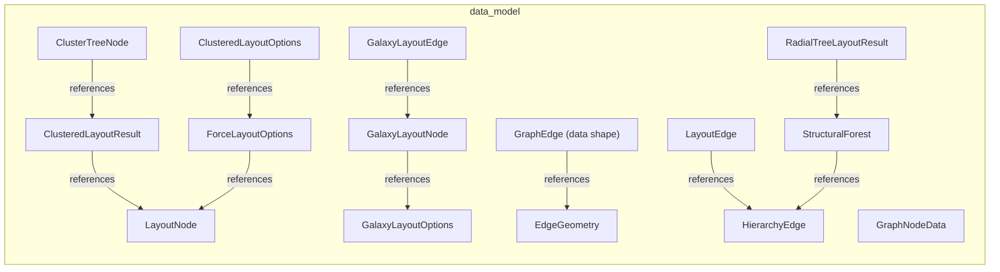

# Data Model

[← Back to README](../README.md)

Data entities, relationships, and data structure definitions.

## Report Index

- [Layer Introduction](#layer-introduction)
- [Intra-Layer Relationships](#intra-layer-relationships)
- [Inter-Layer Dependencies](#inter-layer-dependencies)
- [Inter-Layer Relationships Table](#inter-layer-relationships-table)
- [Element Reference](#element-reference)

## Layer Introduction

| Metric                    | Count |
| ------------------------- | ----- |
| Elements                  | 15    |
| Intra-Layer Relationships | 10    |
| Inter-Layer Relationships | 2     |
| Inbound Relationships     | 0     |
| Outbound Relationships    | 2     |

**Cross-Layer References**:

- **Downstream layers**: [Application](./05-application-layer-report.md)

## Intra-Layer Relationships

## Inter-Layer Dependencies

## Inter-Layer Relationships Table

| Relationship ID                                               | Source Node                                   | Dest Node                                   | Dest Layer    | Predicate  | Cardinality  | Strength |
| ------------------------------------------------------------- | --------------------------------------------- | ------------------------------------------- | ------------- | ---------- | ------------ | -------- |
| `data-model.schemadefinition.realizes.application.dataobject` | `data-model.schemadefinition.graph-node-data` | `application.dataobject.node-rect-registry` | `application` | `realizes` | many-to-many | medium   |
| `data-model.schemadefinition.realizes.application.dataobject` | `data-model.schemadefinition.layout-node`     | `application.dataobject.node-position-map`  | `application` | `realizes` | many-to-many | medium   |

## Element Reference

### ClusterTreeNode {#clustertreenode}

**ID**: `data-model.schemadefinition.cluster-tree-node`

**Type**: `schemadefinition`

d3-hierarchy-compatible dendrogram node produced by louvainCluster: leaves are real node ids, internal nodes are synthetic cluster ids with children.

#### Attributes

| Name  | Value           |
| ----- | --------------- |
| title | ClusterTreeNode |
| type  | object          |

#### Relationships

| Type        | Related Element                                       | Predicate    | Direction |
| ----------- | ----------------------------------------------------- | ------------ | --------- |
| intra-layer | `data-model.schemadefinition.clustered-layout-result` | `references` | outbound  |

### ClusteredLayoutOptions {#clusteredlayoutoptions}

**ID**: `data-model.schemadefinition.clustered-layout-options`

**Type**: `schemadefinition`

Extends ForceLayoutOptions with clusterPadding and macro-pass overrides for clusteredForceLayout's cluster-to-cluster force pass.

#### Attributes

| Name  | Value                  |
| ----- | ---------------------- |
| title | ClusteredLayoutOptions |
| type  | object                 |

#### Relationships

| Type        | Related Element                                    | Predicate    | Direction |
| ----------- | -------------------------------------------------- | ------------ | --------- |
| intra-layer | `data-model.schemadefinition.force-layout-options` | `references` | outbound  |

### ClusteredLayoutResult {#clusteredlayoutresult}

**ID**: `data-model.schemadefinition.clustered-layout-result`

**Type**: `schemadefinition`

Return shape of clusteredForceLayout: final node positions plus an approximate bounding circle per top-level Louvain cluster.

#### Attributes

| Name  | Value                 |
| ----- | --------------------- |
| title | ClusteredLayoutResult |
| type  | object                |

#### Relationships

| Type        | Related Element                                 | Predicate    | Direction |
| ----------- | ----------------------------------------------- | ------------ | --------- |
| intra-layer | `data-model.schemadefinition.cluster-tree-node` | `references` | inbound   |
| intra-layer | `data-model.schemadefinition.layout-node`       | `references` | outbound  |

### EdgeGeometry {#edgegeometry}

**ID**: `data-model.schemadefinition.edge-geometry`

**Type**: `schemadefinition`

Computed rendering geometry passed to a custom renderEdge callback: SVG path string, curve midpoint, collision-cleared label position, tangent angle, selected/hovered state.

#### Attributes

| Name  | Value        |
| ----- | ------------ |
| title | EdgeGeometry |
| type  | object       |

#### Relationships

| Type        | Related Element                                     | Predicate    | Direction |
| ----------- | --------------------------------------------------- | ------------ | --------- |
| intra-layer | `data-model.schemadefinition.graph-edge-data-shape` | `references` | inbound   |

### ForceLayoutOptions {#forcelayoutoptions}

**ID**: `data-model.schemadefinition.force-layout-options`

**Type**: `schemadefinition`

Tuning parameters for forceLayout: iterations, springLength/Strength, repulsion, damping, centerStrength, collisionStrength, nodeMargin.

#### Attributes

| Name  | Value              |
| ----- | ------------------ |
| title | ForceLayoutOptions |
| type  | object             |

#### Relationships

| Type        | Related Element                                        | Predicate    | Direction |
| ----------- | ------------------------------------------------------ | ------------ | --------- |
| intra-layer | `data-model.schemadefinition.clustered-layout-options` | `references` | inbound   |
| intra-layer | `data-model.schemadefinition.layout-node`              | `references` | outbound  |

### GalaxyLayoutEdge {#galaxylayoutedge}

**ID**: `data-model.schemadefinition.galaxy-layout-edge`

**Type**: `schemadefinition`

Extends HierarchyEdge with a structural flag distinguishing orbit-defining edges from layout-irrelevant relational edges.

#### Attributes

| Name  | Value            |
| ----- | ---------------- |
| title | GalaxyLayoutEdge |
| type  | object           |

#### Relationships

| Type        | Related Element                                  | Predicate    | Direction |
| ----------- | ------------------------------------------------ | ------------ | --------- |
| intra-layer | `data-model.schemadefinition.galaxy-layout-node` | `references` | outbound  |

### GalaxyLayoutNode {#galaxylayoutnode}

**ID**: `data-model.schemadefinition.galaxy-layout-node`

**Type**: `schemadefinition`

Node shape for galaxyLayout/galaxySimulationStep: id, width/height, optional explicit x/y and pinned (cascades to the whole structural subtree).

#### Attributes

| Name  | Value            |
| ----- | ---------------- |
| title | GalaxyLayoutNode |
| type  | object           |

#### Relationships

| Type        | Related Element                                     | Predicate    | Direction |
| ----------- | --------------------------------------------------- | ------------ | --------- |
| intra-layer | `data-model.schemadefinition.galaxy-layout-edge`    | `references` | inbound   |
| intra-layer | `data-model.schemadefinition.galaxy-layout-options` | `references` | outbound  |

### GalaxyLayoutOptions {#galaxylayoutoptions}

**ID**: `data-model.schemadefinition.galaxy-layout-options`

**Type**: `schemadefinition`

Tuning parameters for galaxyLayout: nodeSpread, startAngle, settleCycles, homeStrength, nodeMargin, separateGroups, aspectRatio, resolvedAspectScale.

#### Attributes

| Name  | Value               |
| ----- | ------------------- |
| title | GalaxyLayoutOptions |
| type  | object              |

#### Relationships

| Type        | Related Element                                  | Predicate    | Direction |
| ----------- | ------------------------------------------------ | ------------ | --------- |
| intra-layer | `data-model.schemadefinition.galaxy-layout-node` | `references` | inbound   |

### GraphEdge (data shape) {#graphedge-data-shape}

**ID**: `data-model.schemadefinition.graph-edge-data-shape`

**Type**: `schemadefinition`

Public data shape for a graph edge: id/sourceId/targetId plus optional label, variant, weight (0-100, mapped to stroke width), opacity, strokeDash, per-endpoint anchor, and curvature.

#### Attributes

| Name  | Value     |
| ----- | --------- |
| title | GraphEdge |
| type  | object    |

#### Relationships

| Type        | Related Element                             | Predicate    | Direction |
| ----------- | ------------------------------------------- | ------------ | --------- |
| intra-layer | `data-model.schemadefinition.edge-geometry` | `references` | outbound  |

### GraphNodeData {#graphnodedata}

**ID**: `data-model.schemadefinition.graph-node-data`

**Type**: `schemadefinition`

Public data shape for a graph node passed to GraphCanvas: id, label, optional kind/domainColor, optional explicit x/y (pins the node under any engine layout).

#### Attributes

| Name  | Value         |
| ----- | ------------- |
| title | GraphNodeData |
| type  | object        |

#### Relationships

| Type        | Related Element                             | Predicate  | Direction |
| ----------- | ------------------------------------------- | ---------- | --------- |
| inter-layer | `application.dataobject.node-rect-registry` | `realizes` | outbound  |

### HierarchyEdge {#hierarchyedge}

**ID**: `data-model.schemadefinition.hierarchy-edge`

**Type**: `schemadefinition`

Shared structural-edge shape (source=parent, target=child, structural flag) consumed by buildStructuralForest and reused by galaxyLayout/radialTreeLayout/uxNavLayout.

#### Attributes

| Name  | Value         |
| ----- | ------------- |
| title | HierarchyEdge |
| type  | object        |

#### Relationships

| Type        | Related Element                                 | Predicate    | Direction |
| ----------- | ----------------------------------------------- | ------------ | --------- |
| intra-layer | `data-model.schemadefinition.layout-edge`       | `references` | inbound   |
| intra-layer | `data-model.schemadefinition.structural-forest` | `references` | inbound   |

### LayoutEdge {#layoutedge}

**ID**: `data-model.schemadefinition.layout-edge`

**Type**: `schemadefinition`

Internal layout-engine edge shape: source/target node ids, used by forceLayout's spring-force pass.

#### Attributes

| Name  | Value      |
| ----- | ---------- |
| title | LayoutEdge |
| type  | object     |

#### Relationships

| Type        | Related Element                              | Predicate    | Direction |
| ----------- | -------------------------------------------- | ------------ | --------- |
| intra-layer | `data-model.schemadefinition.hierarchy-edge` | `references` | outbound  |

### LayoutNode {#layoutnode}

**ID**: `data-model.schemadefinition.layout-node`

**Type**: `schemadefinition`

Internal layout-engine node shape shared by forceLayout/clusteredForceLayout/separationPass: id, x/y, width/height, optional pinned, gravityTarget, gravityStrength.

#### Attributes

| Name  | Value      |
| ----- | ---------- |
| title | LayoutNode |
| type  | object     |

#### Relationships

| Type        | Related Element                                       | Predicate    | Direction |
| ----------- | ----------------------------------------------------- | ------------ | --------- |
| inter-layer | `application.dataobject.node-position-map`            | `realizes`   | outbound  |
| intra-layer | `data-model.schemadefinition.clustered-layout-result` | `references` | inbound   |
| intra-layer | `data-model.schemadefinition.force-layout-options`    | `references` | inbound   |

### RadialTreeLayoutResult {#radialtreelayoutresult}

**ID**: `data-model.schemadefinition.radial-tree-layout-result`

**Type**: `schemadefinition`

Return shape of radialTreeLayout: node positions, per-trunk boundary circles, and ring geometry for the optional depth-ring visualization.

#### Attributes

| Name  | Value                  |
| ----- | ---------------------- |
| title | RadialTreeLayoutResult |
| type  | object                 |

#### Relationships

| Type        | Related Element                                 | Predicate    | Direction |
| ----------- | ----------------------------------------------- | ------------ | --------- |
| intra-layer | `data-model.schemadefinition.structural-forest` | `references` | outbound  |

### StructuralForest {#structuralforest}

**ID**: `data-model.schemadefinition.structural-forest`

**Type**: `schemadefinition`

Output of buildStructuralForest: parentOf map, childrenOf map, and roots array describing the parent/child forest derived from structural edges.

#### Attributes

| Name  | Value            |
| ----- | ---------------- |
| title | StructuralForest |
| type  | object           |

#### Relationships

| Type        | Related Element                                         | Predicate    | Direction |
| ----------- | ------------------------------------------------------- | ------------ | --------- |
| intra-layer | `data-model.schemadefinition.radial-tree-layout-result` | `references` | inbound   |
| intra-layer | `data-model.schemadefinition.hierarchy-edge`            | `references` | outbound  |

---

Generated: 2026-09-18T14:44:15.109Z | Model Version: 0.1.0
