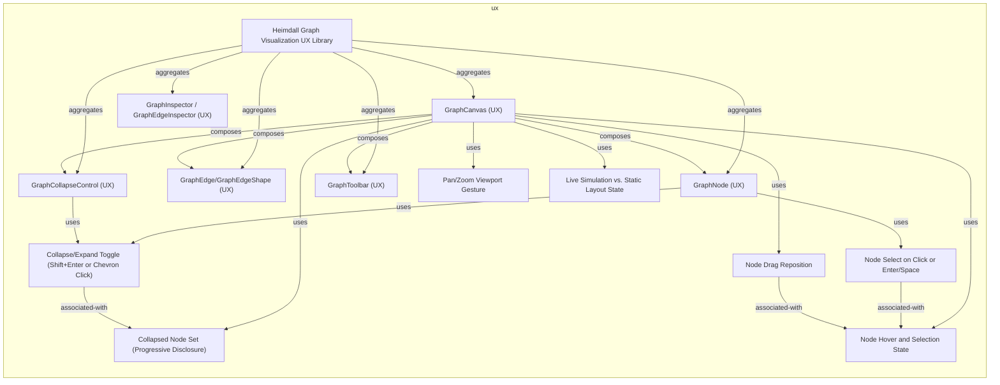

# UX

[← Back to README](../README.md)

User interface components, screens, and user experience elements.

## Report Index

- [Layer Introduction](#layer-introduction)
- [Intra-Layer Relationships](#intra-layer-relationships)
- [Inter-Layer Dependencies](#inter-layer-dependencies)
- [Element Reference](#element-reference)

## Layer Introduction

| Metric                    | Count |
| ------------------------- | ----- |
| Elements                  | 14    |
| Intra-Layer Relationships | 21    |
| Inter-Layer Relationships | 0     |
| Inbound Relationships     | 0     |
| Outbound Relationships    | 0     |

## Intra-Layer Relationships

## Inter-Layer Dependencies

```mermaid
flowchart TB
  classDef current fill:#f9f,stroke:#333,stroke-width:2px
  motivation["Motivation"]
  business["Business"]
  product["Product"]
  security["Security"]
  application["Application"]
  technology["Technology"]
  api["API"]
  data_model["Data Model"]
  data_store["Data Store"]
  ux["UX"]
  navigation["Navigation"]
  apm["APM"]
  testing["Testing"]
  class ux current
```

## Element Reference

### Collapse/Expand Toggle (Shift+Enter or Chevron Click) {#collapse-expand-toggle-shift-enter-or-chevron-click}

**ID**: `ux.actionpattern.collapseexpand-toggle-shiftenter-or-chevron-click`

**Type**: `actionpattern`

Shift+Enter on a focused hierarchical node, or clicking its chevron button, toggles collapsed state via onToggleCollapse — progressive disclosure for dense hierarchies.

#### Attributes

| Name     | Value     |
| -------- | --------- |
| category | crud      |
| feedback | animation |
| trigger  | keyboard  |

#### Relationships

| Type        | Related Element                                             | Predicate         | Direction |
| ----------- | ----------------------------------------------------------- | ----------------- | --------- |
| intra-layer | `ux.statepattern.collapsed-node-set-progressive-disclosure` | `associated-with` | outbound  |
| intra-layer | `ux.librarycomponent.graph-collapse-control-ux`             | `uses`            | inbound   |
| intra-layer | `ux.librarycomponent.graph-node-ux`                         | `uses`            | inbound   |

### Node Drag Reposition {#node-drag-reposition}

**ID**: `ux.actionpattern.node-drag-reposition`

**Type**: `actionpattern`

Dragging a node past DRAG_THRESHOLD pixels repositions it, persisting locally until the node list changes; onNodeDragEnd lets the caller persist it elsewhere.

#### Attributes

| Name     | Value |
| -------- | ----- |
| category | crud  |
| feedback | none  |
| trigger  | click |

#### Relationships

| Type        | Related Element                                  | Predicate         | Direction |
| ----------- | ------------------------------------------------ | ----------------- | --------- |
| intra-layer | `ux.statepattern.node-hover-and-selection-state` | `associated-with` | outbound  |
| intra-layer | `ux.librarycomponent.graph-canvas-ux`            | `uses`            | inbound   |

### Node Select on Click or Enter/Space {#node-select-on-click-or-enter-space}

**ID**: `ux.actionpattern.node-select-on-click-or-enterspace`

**Type**: `actionpattern`

Clicking a node, or pressing Enter/Space while it's focused, fires onSelect — GraphNode's primary interaction.

#### Attributes

| Name     | Value          |
| -------- | -------------- |
| category | crud           |
| feedback | inline-message |
| trigger  | click          |

#### Relationships

| Type        | Related Element                                  | Predicate         | Direction |
| ----------- | ------------------------------------------------ | ----------------- | --------- |
| intra-layer | `ux.statepattern.node-hover-and-selection-state` | `associated-with` | outbound  |
| intra-layer | `ux.librarycomponent.graph-node-ux`              | `uses`            | inbound   |

### Pan/Zoom Viewport Gesture {#pan-zoom-viewport-gesture}

**ID**: `ux.actionpattern.panzoom-viewport-gesture`

**Type**: `actionpattern`

Wheel/pinch zoom (anchored under the cursor), pointer-drag pan with release inertia, and +/-/arrow-key shortcuts, via usePanZoom.

#### Attributes

| Name     | Value      |
| -------- | ---------- |
| category | navigation |
| feedback | none       |
| trigger  | swipe      |

#### Relationships

| Type        | Related Element                       | Predicate | Direction |
| ----------- | ------------------------------------- | --------- | --------- |
| intra-layer | `ux.librarycomponent.graph-canvas-ux` | `uses`    | inbound   |

### GraphCanvas (UX) {#graphcanvas-ux}

**ID**: `ux.librarycomponent.graph-canvas-ux`

**Type**: `librarycomponent`

Interactive graph canvas: pan/zoom viewport, selectable/hoverable/draggable nodes and edges, tooltips/popovers, toolbar, and progressive-disclosure collapse controls.

#### Attributes

| Name | Value   |
| ---- | ------- |
| type | display |

#### Relationships

| Type        | Related Element                                             | Predicate    | Direction |
| ----------- | ----------------------------------------------------------- | ------------ | --------- |
| intra-layer | `ux.librarycomponent.graph-collapse-control-ux`             | `composes`   | outbound  |
| intra-layer | `ux.librarycomponent.graph-edgegraph-edge-shape-ux`         | `composes`   | outbound  |
| intra-layer | `ux.librarycomponent.graph-node-ux`                         | `composes`   | outbound  |
| intra-layer | `ux.librarycomponent.graph-toolbar-ux`                      | `composes`   | outbound  |
| intra-layer | `ux.actionpattern.node-drag-reposition`                     | `uses`       | outbound  |
| intra-layer | `ux.actionpattern.panzoom-viewport-gesture`                 | `uses`       | outbound  |
| intra-layer | `ux.statepattern.collapsed-node-set-progressive-disclosure` | `uses`       | outbound  |
| intra-layer | `ux.statepattern.live-simulation-vs-static-layout-state`    | `uses`       | outbound  |
| intra-layer | `ux.statepattern.node-hover-and-selection-state`            | `uses`       | outbound  |
| intra-layer | `ux.uxlibrary.heimdall-graph-visualization-ux-library`      | `aggregates` | inbound   |

### GraphCollapseControl (UX) {#graphcollapsecontrol-ux}

**ID**: `ux.librarycomponent.graph-collapse-control-ux`

**Type**: `librarycomponent`

Small floating button anchored to a node's right edge for toggling structural collapse/expand, with a hidden-descendant-count badge when collapsed.

#### Attributes

| Name | Value    |
| ---- | -------- |
| type | feedback |

#### Relationships

| Type        | Related Element                                                      | Predicate    | Direction |
| ----------- | -------------------------------------------------------------------- | ------------ | --------- |
| intra-layer | `ux.librarycomponent.graph-canvas-ux`                                | `composes`   | inbound   |
| intra-layer | `ux.actionpattern.collapseexpand-toggle-shiftenter-or-chevron-click` | `uses`       | outbound  |
| intra-layer | `ux.uxlibrary.heimdall-graph-visualization-ux-library`               | `aggregates` | inbound   |

### GraphEdge/GraphEdgeShape (UX) {#graphedge-graphedgeshape-ux}

**ID**: `ux.librarycomponent.graph-edgegraph-edge-shape-ux`

**Type**: `librarycomponent`

Default edge visual: curved or orthogonal line, directional arrow marker, optional collision-cleared label pill, variant-based (default/hot/irrelevant) styling.

#### Attributes

| Name | Value   |
| ---- | ------- |
| type | display |

#### Relationships

| Type        | Related Element                                        | Predicate    | Direction |
| ----------- | ------------------------------------------------------ | ------------ | --------- |
| intra-layer | `ux.librarycomponent.graph-canvas-ux`                  | `composes`   | inbound   |
| intra-layer | `ux.uxlibrary.heimdall-graph-visualization-ux-library` | `aggregates` | inbound   |

### GraphInspector / GraphEdgeInspector (UX) {#graphinspector-graphedgeinspector-ux}

**ID**: `ux.librarycomponent.graph-inspector-graph-edge-inspector-ux`

**Type**: `librarycomponent`

Detail-panel pair for a selected node or edge: title/badges, description, key-value metadata, and (node) outgoing/incoming relationship navigation links.

#### Attributes

| Name | Value   |
| ---- | ------- |
| type | display |

#### Relationships

| Type        | Related Element                                        | Predicate    | Direction |
| ----------- | ------------------------------------------------------ | ------------ | --------- |
| intra-layer | `ux.uxlibrary.heimdall-graph-visualization-ux-library` | `aggregates` | inbound   |

### GraphNode (UX) {#graphnode-ux}

**ID**: `ux.librarycomponent.graph-node-ux`

**Type**: `librarycomponent`

Default node visual: label, kind badge, domain-color swatch, selection ring, and (when hierarchical) a collapse/expand chevron with hidden-descendant-count badge.

#### Attributes

| Name | Value   |
| ---- | ------- |
| type | display |

#### Relationships

| Type        | Related Element                                                      | Predicate    | Direction |
| ----------- | -------------------------------------------------------------------- | ------------ | --------- |
| intra-layer | `ux.librarycomponent.graph-canvas-ux`                                | `composes`   | inbound   |
| intra-layer | `ux.actionpattern.collapseexpand-toggle-shiftenter-or-chevron-click` | `uses`       | outbound  |
| intra-layer | `ux.actionpattern.node-select-on-click-or-enterspace`                | `uses`       | outbound  |
| intra-layer | `ux.uxlibrary.heimdall-graph-visualization-ux-library`               | `aggregates` | inbound   |

### GraphToolbar (UX) {#graphtoolbar-ux}

**ID**: `ux.librarycomponent.graph-toolbar-ux`

**Type**: `librarycomponent`

Floating control cluster: zoom in/out/fit, pan-lock toggle, fullscreen toggle, and (galaxy layout only) live-simulation toggle.

#### Attributes

| Name | Value      |
| ---- | ---------- |
| type | navigation |

#### Relationships

| Type        | Related Element                                        | Predicate    | Direction |
| ----------- | ------------------------------------------------------ | ------------ | --------- |
| intra-layer | `ux.librarycomponent.graph-canvas-ux`                  | `composes`   | inbound   |
| intra-layer | `ux.uxlibrary.heimdall-graph-visualization-ux-library` | `aggregates` | inbound   |

### Collapsed Node Set (Progressive Disclosure) {#collapsed-node-set-progressive-disclosure}

**ID**: `ux.statepattern.collapsed-node-set-progressive-disclosure`

**Type**: `statepattern`

collapsedNodeIds (controlled by the caller) hides a collapsed node's structural descendants and any edge touching one, while the collapsed node itself keeps rendering.

#### Attributes

| Name     | Value        |
| -------- | ------------ |
| category | data-loading |

#### Relationships

| Type        | Related Element                                                      | Predicate         | Direction |
| ----------- | -------------------------------------------------------------------- | ----------------- | --------- |
| intra-layer | `ux.actionpattern.collapseexpand-toggle-shiftenter-or-chevron-click` | `associated-with` | inbound   |
| intra-layer | `ux.librarycomponent.graph-canvas-ux`                                | `uses`            | inbound   |

### Live Simulation vs. Static Layout State {#live-simulation-vs-static-layout-state}

**ID**: `ux.statepattern.live-simulation-vs-static-layout-state`

**Type**: `statepattern`

liveSimulation (galaxy layout only) switches GraphCanvas between a one-shot computed-then-frozen layout and a continuous, draggable elastic simulation.

#### Attributes

| Name     | Value        |
| -------- | ------------ |
| category | data-loading |

#### Relationships

| Type        | Related Element                       | Predicate | Direction |
| ----------- | ------------------------------------- | --------- | --------- |
| intra-layer | `ux.librarycomponent.graph-canvas-ux` | `uses`    | inbound   |

### Node Hover and Selection State {#node-hover-and-selection-state}

**ID**: `ux.statepattern.node-hover-and-selection-state`

**Type**: `statepattern`

hoveredNodeId/selectedNodeId (and their edge equivalents) tracked in GraphCanvasContext, driving highlighting, tooltip/popover visibility, and structural/relational edge reveal.

#### Attributes

| Name     | Value        |
| -------- | ------------ |
| category | data-loading |

#### Relationships

| Type        | Related Element                                       | Predicate         | Direction |
| ----------- | ----------------------------------------------------- | ----------------- | --------- |
| intra-layer | `ux.actionpattern.node-drag-reposition`               | `associated-with` | inbound   |
| intra-layer | `ux.actionpattern.node-select-on-click-or-enterspace` | `associated-with` | inbound   |
| intra-layer | `ux.librarycomponent.graph-canvas-ux`                 | `uses`            | inbound   |

### Heimdall Graph Visualization UX Library {#heimdall-graph-visualization-ux-library}

**ID**: `ux.uxlibrary.heimdall-graph-visualization-ux-library`

**Type**: `uxlibrary`

The graph-visualization subset of @tinkermonkey/heimdall-ui (v0.8.0): GraphCanvas and its supporting components, covering node/edge rendering and interaction behavior for embedding an interactive graph view.

#### Attributes

| Name    | Value |
| ------- | ----- |
| version | 0.8.0 |

#### Relationships

| Type        | Related Element                                               | Predicate    | Direction |
| ----------- | ------------------------------------------------------------- | ------------ | --------- |
| intra-layer | `ux.librarycomponent.graph-canvas-ux`                         | `aggregates` | outbound  |
| intra-layer | `ux.librarycomponent.graph-collapse-control-ux`               | `aggregates` | outbound  |
| intra-layer | `ux.librarycomponent.graph-edgegraph-edge-shape-ux`           | `aggregates` | outbound  |
| intra-layer | `ux.librarycomponent.graph-inspector-graph-edge-inspector-ux` | `aggregates` | outbound  |
| intra-layer | `ux.librarycomponent.graph-node-ux`                           | `aggregates` | outbound  |
| intra-layer | `ux.librarycomponent.graph-toolbar-ux`                        | `aggregates` | outbound  |

---

Generated: 2026-09-18T14:40:30.757Z | Model Version: 0.1.0
