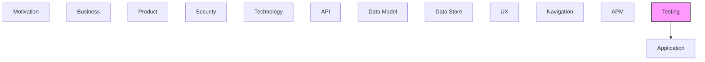

# Testing

[← Back to README](../README.md)

Test strategies, test cases, test data, and test coverage.

## Report Index

- [Layer Introduction](#layer-introduction)
- [Intra-Layer Relationships](#intra-layer-relationships)
- [Inter-Layer Dependencies](#inter-layer-dependencies)
- [Inter-Layer Relationships Table](#inter-layer-relationships-table)
- [Element Reference](#element-reference)

## Layer Introduction

| Metric                    | Count |
| ------------------------- | ----- |
| Elements                  | 15    |
| Intra-Layer Relationships | 20    |
| Inter-Layer Relationships | 14    |
| Inbound Relationships     | 0     |
| Outbound Relationships    | 14    |

**Cross-Layer References**:

- **Downstream layers**: [Application](./05-application-layer-report.md)

## Intra-Layer Relationships

```mermaid
flowchart LR
  subgraph testing
    testing_coveragerequirement_zero_literal_node_overlap_under_layout_simulation["Zero Literal Node-Overlap Under Layout Simulation"]
    testing_coveragesummary_graph_layout_rendering_test_coverage_summary["Graph Layout & Rendering Test Coverage Summary"]
    testing_testcasesketch_clustered_view_bubble_packing_integration["Clustered View Bubble Packing Integration"]
    testing_testcasesketch_galaxy_layout_lab_poc_dataset_stress_test["Galaxy Layout Lab POC Dataset Stress Test"]
    testing_testcasesketch_large_card_nodes_stay_non_overlapping_in_a_bushy_hub_and_spoke_topology["Large Card Nodes Stay Non-Overlapping in a Bushy Hub-and-Spoke Topology"]
    testing_testcasesketch_radial_tree_layout_collapsed_nodes["radialTreeLayout Collapsed Nodes"]
    testing_testcasesketch_route_navigation_edge_avoids_obstacles["routeNavigationEdge Avoids Obstacles"]
    testing_testcoveragemodel_heimdall_graph_layout_test_coverage["Heimdall Graph Layout Test Coverage"]
    testing_testcoveragetarget_edge_label_placement_and_styling["Edge Label Placement and Styling"]
    testing_testcoveragetarget_force_force_clustered_layout_algorithms["Force / Force-Clustered Layout Algorithms"]
    testing_testcoveragetarget_galaxy_layout_and_live_simulation["Galaxy Layout and Live Simulation"]
    testing_testcoveragetarget_graph_canvas_rendering_and_interaction["GraphCanvas Rendering and Interaction"]
    testing_testcoveragetarget_graph_edge_geometry_utilities["Graph Edge Geometry Utilities"]
    testing_testcoveragetarget_navigation_edge_channel_routing["Navigation Edge Channel Routing"]
    testing_testcoveragetarget_radial_tree_layout_algorithm["Radial Tree Layout Algorithm"]
    testing_coveragerequirement_zero_literal_node_overlap_under_layout_simulation -->|flows-to| testing_testcasesketch_large_card_nodes_stay_non_overlapping_in_a_bushy_hub_and_spoke_topology
    testing_coveragesummary_graph_layout_rendering_test_coverage_summary -->|aggregates| testing_coveragerequirement_zero_literal_node_overlap_under_layout_simulation
    testing_coveragesummary_graph_layout_rendering_test_coverage_summary -->|aggregates| testing_testcasesketch_large_card_nodes_stay_non_overlapping_in_a_bushy_hub_and_spoke_topology
    testing_coveragesummary_graph_layout_rendering_test_coverage_summary -->|serves| testing_testcoveragemodel_heimdall_graph_layout_test_coverage
    testing_testcasesketch_clustered_view_bubble_packing_integration -->|validates| testing_testcoveragetarget_force_force_clustered_layout_algorithms
    testing_testcasesketch_galaxy_layout_lab_poc_dataset_stress_test -->|validates| testing_testcoveragetarget_galaxy_layout_and_live_simulation
    testing_testcasesketch_large_card_nodes_stay_non_overlapping_in_a_bushy_hub_and_spoke_topology -->|validates| testing_coveragerequirement_zero_literal_node_overlap_under_layout_simulation
    testing_testcasesketch_radial_tree_layout_collapsed_nodes -->|validates| testing_testcoveragetarget_radial_tree_layout_algorithm
    testing_testcasesketch_route_navigation_edge_avoids_obstacles -->|validates| testing_testcoveragetarget_navigation_edge_channel_routing
    testing_testcoveragemodel_heimdall_graph_layout_test_coverage -->|aggregates| testing_testcoveragetarget_edge_label_placement_and_styling
    testing_testcoveragemodel_heimdall_graph_layout_test_coverage -->|aggregates| testing_testcoveragetarget_force_force_clustered_layout_algorithms
    testing_testcoveragemodel_heimdall_graph_layout_test_coverage -->|aggregates| testing_testcoveragetarget_galaxy_layout_and_live_simulation
    testing_testcoveragemodel_heimdall_graph_layout_test_coverage -->|aggregates| testing_testcoveragetarget_graph_canvas_rendering_and_interaction
    testing_testcoveragemodel_heimdall_graph_layout_test_coverage -->|aggregates| testing_testcoveragetarget_graph_edge_geometry_utilities
    testing_testcoveragemodel_heimdall_graph_layout_test_coverage -->|aggregates| testing_testcoveragetarget_navigation_edge_channel_routing
    testing_testcoveragemodel_heimdall_graph_layout_test_coverage -->|aggregates| testing_testcoveragetarget_radial_tree_layout_algorithm
    testing_testcoveragemodel_heimdall_graph_layout_test_coverage -->|composes| testing_coveragerequirement_zero_literal_node_overlap_under_layout_simulation
    testing_testcoveragemodel_heimdall_graph_layout_test_coverage -->|composes| testing_coveragesummary_graph_layout_rendering_test_coverage_summary
    testing_testcoveragetarget_force_force_clustered_layout_algorithms -->|composes| testing_coveragerequirement_zero_literal_node_overlap_under_layout_simulation
    testing_testcoveragetarget_radial_tree_layout_algorithm -->|composes| testing_coveragerequirement_zero_literal_node_overlap_under_layout_simulation
  end
```

## Inter-Layer Dependencies

## Inter-Layer Relationships Table

| Relationship ID                                                      | Source Node                                                                                      | Dest Node                                                              | Dest Layer    | Predicate | Cardinality  | Strength |
| -------------------------------------------------------------------- | ------------------------------------------------------------------------------------------------ | ---------------------------------------------------------------------- | ------------- | --------- | ------------ | -------- |
| `testing.coveragerequirement.covers.application.applicationfunction` | `testing.coveragerequirement.zero-literal-node-overlap-under-layout-simulation`                  | `application.applicationfunction.node-overlap-separation-pass`         | `application` | `covers`  | many-to-many | medium   |
| `testing.testcasesketch.tests.application.applicationfunction`       | `testing.testcasesketch.clustered-view-bubble-packing-integration`                               | `application.applicationfunction.clustered-force-layout-algorithm`     | `application` | `tests`   | many-to-many | medium   |
| `testing.testcasesketch.tests.application.applicationfunction`       | `testing.testcasesketch.galaxy-layout-lab-poc-dataset-stress-test`                               | `application.applicationfunction.galaxy-radial-orbit-layout-algorithm` | `application` | `tests`   | many-to-many | medium   |
| `testing.testcasesketch.tests.application.applicationfunction`       | `testing.testcasesketch.large-card-nodes-stay-non-overlapping-in-a-bushy-hub-and-spoke-topology` | `application.applicationfunction.force-directed-layout-algorithm`      | `application` | `tests`   | many-to-many | medium   |
| `testing.testcasesketch.tests.application.applicationfunction`       | `testing.testcasesketch.radial-tree-layout-collapsed-nodes`                                      | `application.applicationfunction.radial-tree-layout-algorithm`         | `application` | `tests`   | many-to-many | medium   |
| `testing.testcasesketch.tests.application.applicationfunction`       | `testing.testcasesketch.route-navigation-edge-avoids-obstacles`                                  | `application.applicationfunction.navigation-edge-orthogonal-routing`   | `application` | `tests`   | many-to-many | medium   |
| `testing.testcoveragemodel.covers.application.applicationcomponent`  | `testing.testcoveragemodel.heimdall-graph-layout-test-coverage`                                  | `application.applicationcomponent.graph-canvas-component`              | `application` | `covers`  | many-to-many | medium   |
| `testing.testcoveragetarget.tests.application.applicationcomponent`  | `testing.testcoveragetarget.edge-label-placement-and-styling`                                    | `application.applicationcomponent.graph-canvas-component`              | `application` | `tests`   | many-to-many | medium   |
| `testing.testcoveragetarget.covers.application.applicationservice`   | `testing.testcoveragetarget.force-force-clustered-layout-algorithms`                             | `application.applicationservice.graph-layout-engine-service`           | `application` | `covers`  | many-to-many | medium   |
| `testing.testcoveragetarget.covers.application.applicationservice`   | `testing.testcoveragetarget.galaxy-layout-and-live-simulation`                                   | `application.applicationservice.live-galaxy-simulation-service`        | `application` | `covers`  | many-to-many | medium   |
| `testing.testcoveragetarget.tests.application.applicationcomponent`  | `testing.testcoveragetarget.graph-canvas-rendering-and-interaction`                              | `application.applicationcomponent.graph-canvas-component`              | `application` | `tests`   | many-to-many | medium   |
| `testing.testcoveragetarget.tests.application.applicationcomponent`  | `testing.testcoveragetarget.graph-edge-geometry-utilities`                                       | `application.applicationcomponent.graph-canvas-component`              | `application` | `tests`   | many-to-many | medium   |
| `testing.testcoveragetarget.tests.application.applicationcomponent`  | `testing.testcoveragetarget.navigation-edge-channel-routing`                                     | `application.applicationcomponent.graph-canvas-component`              | `application` | `tests`   | many-to-many | medium   |
| `testing.testcoveragetarget.covers.application.applicationservice`   | `testing.testcoveragetarget.radial-tree-layout-algorithm`                                        | `application.applicationservice.graph-layout-engine-service`           | `application` | `covers`  | many-to-many | medium   |

## Element Reference

### Zero Literal Node-Overlap Under Layout Simulation {#zero-literal-node-overlap-under-layout-simulation}

**ID**: `testing.coveragerequirement.zero-literal-node-overlap-under-layout-simulation`

**Type**: `coveragerequirement`

Every layout engine's output must keep rendered node bounding boxes non-overlapping (within a small documented tolerance — see OVERLAP_TOLERANCE in tests/graph-layout.spec.ts) across default chip-sized and larger card-sized nodes.

#### Attributes

| Name             | Value           |
| ---------------- | --------------- |
| coverageCriteria | boundary-values |
| priority         | critical        |

#### Relationships

| Type        | Related Element                                                                                  | Predicate    | Direction |
| ----------- | ------------------------------------------------------------------------------------------------ | ------------ | --------- |
| inter-layer | `application.applicationfunction.node-overlap-separation-pass`                                   | `covers`     | outbound  |
| intra-layer | `testing.testcasesketch.large-card-nodes-stay-non-overlapping-in-a-bushy-hub-and-spoke-topology` | `flows-to`   | outbound  |
| intra-layer | `testing.coveragesummary.graph-layout-rendering-test-coverage-summary`                           | `aggregates` | inbound   |
| intra-layer | `testing.testcasesketch.large-card-nodes-stay-non-overlapping-in-a-bushy-hub-and-spoke-topology` | `validates`  | inbound   |
| intra-layer | `testing.testcoveragemodel.heimdall-graph-layout-test-coverage`                                  | `composes`   | inbound   |
| intra-layer | `testing.testcoveragetarget.force-force-clustered-layout-algorithms`                             | `composes`   | inbound   |
| intra-layer | `testing.testcoveragetarget.radial-tree-layout-algorithm`                                        | `composes`   | inbound   |

### Graph Layout & Rendering Test Coverage Summary {#graph-layout-rendering-test-coverage-summary}

**ID**: `testing.coveragesummary.graph-layout-rendering-test-coverage-summary`

**Type**: `coveragesummary`

Roll-up counts for this extraction's testing-layer coverage of heimdall's graph-visualization surface.

#### Attributes

| Name              | Value |
| ----------------- | ----- |
| totalRequirements | 1     |
| totalSketches     | 5     |
| totalTargets      | 7     |

#### Relationships

| Type        | Related Element                                                                                  | Predicate    | Direction |
| ----------- | ------------------------------------------------------------------------------------------------ | ------------ | --------- |
| intra-layer | `testing.coveragerequirement.zero-literal-node-overlap-under-layout-simulation`                  | `aggregates` | outbound  |
| intra-layer | `testing.testcasesketch.large-card-nodes-stay-non-overlapping-in-a-bushy-hub-and-spoke-topology` | `aggregates` | outbound  |
| intra-layer | `testing.testcoveragemodel.heimdall-graph-layout-test-coverage`                                  | `serves`     | outbound  |
| intra-layer | `testing.testcoveragemodel.heimdall-graph-layout-test-coverage`                                  | `composes`   | inbound   |

### Clustered View Bubble Packing Integration {#clustered-view-bubble-packing-integration}

**ID**: `testing.testcasesketch.clustered-view-bubble-packing-integration`

**Type**: `testcasesketch`

Integration test suite for layout="force-clustered": nested bubble boundaries render and separate correctly per top-level Louvain cluster.

#### Attributes

| Name                 | Value     |
| -------------------- | --------- |
| implementationFormat | automated |
| status               | automated |

#### Relationships

| Type        | Related Element                                                      | Predicate   | Direction |
| ----------- | -------------------------------------------------------------------- | ----------- | --------- |
| inter-layer | `application.applicationfunction.clustered-force-layout-algorithm`   | `tests`     | outbound  |
| intra-layer | `testing.testcoveragetarget.force-force-clustered-layout-algorithms` | `validates` | outbound  |

### Galaxy Layout Lab POC Dataset Stress Test {#galaxy-layout-lab-poc-dataset-stress-test}

**ID**: `testing.testcasesketch.galaxy-layout-lab-poc-dataset-stress-test`

**Type**: `testcasesketch`

Integration stress test exercising galaxy layout against a larger proof-of-concept dataset.

#### Attributes

| Name                 | Value     |
| -------------------- | --------- |
| implementationFormat | automated |
| status               | automated |

#### Relationships

| Type        | Related Element                                                        | Predicate   | Direction |
| ----------- | ---------------------------------------------------------------------- | ----------- | --------- |
| inter-layer | `application.applicationfunction.galaxy-radial-orbit-layout-algorithm` | `tests`     | outbound  |
| intra-layer | `testing.testcoveragetarget.galaxy-layout-and-live-simulation`         | `validates` | outbound  |

### Large Card Nodes Stay Non-Overlapping in a Bushy Hub-and-Spoke Topology {#large-card-nodes-stay-non-overlapping-in-a-bushy-hub-and-spoke-topology}

**ID**: `testing.testcasesketch.large-card-nodes-stay-non-overlapping-in-a-bushy-hub-and-spoke-topology`

**Type**: `testcasesketch`

forceLayout regression test verifying card-sized (not just default chip-sized) nodes resolve to non-overlapping positions in a hub-and-spoke graph.

#### Attributes

| Name                 | Value     |
| -------------------- | --------- |
| implementationFormat | automated |
| status               | automated |

#### Relationships

| Type        | Related Element                                                                 | Predicate    | Direction |
| ----------- | ------------------------------------------------------------------------------- | ------------ | --------- |
| inter-layer | `application.applicationfunction.force-directed-layout-algorithm`               | `tests`      | outbound  |
| intra-layer | `testing.coveragerequirement.zero-literal-node-overlap-under-layout-simulation` | `flows-to`   | inbound   |
| intra-layer | `testing.coveragesummary.graph-layout-rendering-test-coverage-summary`          | `aggregates` | inbound   |
| intra-layer | `testing.coveragerequirement.zero-literal-node-overlap-under-layout-simulation` | `validates`  | outbound  |

### radialTreeLayout Collapsed Nodes {#radialtreelayout-collapsed-nodes}

**ID**: `testing.testcasesketch.radial-tree-layout-collapsed-nodes`

**Type**: `testcasesketch`

Verifies radialTreeLayout positions only currently-visible (non-collapsed) nodes while still sizing trunk bubbles from the full tree.

#### Attributes

| Name                 | Value     |
| -------------------- | --------- |
| implementationFormat | automated |
| status               | automated |

#### Relationships

| Type        | Related Element                                                | Predicate   | Direction |
| ----------- | -------------------------------------------------------------- | ----------- | --------- |
| inter-layer | `application.applicationfunction.radial-tree-layout-algorithm` | `tests`     | outbound  |
| intra-layer | `testing.testcoveragetarget.radial-tree-layout-algorithm`      | `validates` | outbound  |

### routeNavigationEdge Avoids Obstacles {#routenavigationedge-avoids-obstacles}

**ID**: `testing.testcasesketch.route-navigation-edge-avoids-obstacles`

**Type**: `testcasesketch`

Verifies orthogonal navigation-edge routing detours around obstacle rectangles instead of crossing them.

#### Attributes

| Name                 | Value     |
| -------------------- | --------- |
| implementationFormat | automated |
| status               | automated |

#### Relationships

| Type        | Related Element                                                      | Predicate   | Direction |
| ----------- | -------------------------------------------------------------------- | ----------- | --------- |
| inter-layer | `application.applicationfunction.navigation-edge-orthogonal-routing` | `tests`     | outbound  |
| intra-layer | `testing.testcoveragetarget.navigation-edge-channel-routing`         | `validates` | outbound  |

### Heimdall Graph Layout Test Coverage {#heimdall-graph-layout-test-coverage}

**ID**: `testing.testcoveragemodel.heimdall-graph-layout-test-coverage`

**Type**: `testcoveragemodel`

Coverage model for heimdall's graph-visualization surface: Playwright browser tests (tests/graph-\*.spec.ts) plus Vitest pure-function unit tests (src/utils/\*.test.ts).

#### Attributes

| Name        | Value       |
| ----------- | ----------- |
| application | heimdall-ui |
| version     | 0.8.0       |

#### Relationships

| Type        | Related Element                                                                 | Predicate    | Direction |
| ----------- | ------------------------------------------------------------------------------- | ------------ | --------- |
| inter-layer | `application.applicationcomponent.graph-canvas-component`                       | `covers`     | outbound  |
| intra-layer | `testing.coveragesummary.graph-layout-rendering-test-coverage-summary`          | `serves`     | inbound   |
| intra-layer | `testing.testcoveragetarget.edge-label-placement-and-styling`                   | `aggregates` | outbound  |
| intra-layer | `testing.testcoveragetarget.force-force-clustered-layout-algorithms`            | `aggregates` | outbound  |
| intra-layer | `testing.testcoveragetarget.galaxy-layout-and-live-simulation`                  | `aggregates` | outbound  |
| intra-layer | `testing.testcoveragetarget.graph-canvas-rendering-and-interaction`             | `aggregates` | outbound  |
| intra-layer | `testing.testcoveragetarget.graph-edge-geometry-utilities`                      | `aggregates` | outbound  |
| intra-layer | `testing.testcoveragetarget.navigation-edge-channel-routing`                    | `aggregates` | outbound  |
| intra-layer | `testing.testcoveragetarget.radial-tree-layout-algorithm`                       | `aggregates` | outbound  |
| intra-layer | `testing.coveragerequirement.zero-literal-node-overlap-under-layout-simulation` | `composes`   | outbound  |
| intra-layer | `testing.coveragesummary.graph-layout-rendering-test-coverage-summary`          | `composes`   | outbound  |

### Edge Label Placement and Styling {#edge-label-placement-and-styling}

**ID**: `testing.testcoveragetarget.edge-label-placement-and-styling`

**Type**: `testcoveragetarget`

Unit coverage for findClearLabelPosition (collision-avoidance label placement) and the weight/marker/dash edge-style utilities.

#### Attributes

| Name       | Value        |
| ---------- | ------------ |
| priority   | low          |
| targetType | ui-component |

#### Relationships

| Type        | Related Element                                                 | Predicate    | Direction |
| ----------- | --------------------------------------------------------------- | ------------ | --------- |
| inter-layer | `application.applicationcomponent.graph-canvas-component`       | `tests`      | outbound  |
| intra-layer | `testing.testcoveragemodel.heimdall-graph-layout-test-coverage` | `aggregates` | inbound   |

### Force / Force-Clustered Layout Algorithms {#force-force-clustered-layout-algorithms}

**ID**: `testing.testcoveragetarget.force-force-clustered-layout-algorithms`

**Type**: `testcoveragetarget`

Unit + integration coverage for forceLayout/clusteredForceLayout: pinned-node behavior, non-overlap under chip and card-sized nodes, nodeMargin defaults, and the Clustered View bubble-packing integration suite.

#### Attributes

| Name       | Value        |
| ---------- | ------------ |
| priority   | critical     |
| targetType | ui-component |

#### Relationships

| Type        | Related Element                                                                 | Predicate    | Direction |
| ----------- | ------------------------------------------------------------------------------- | ------------ | --------- |
| inter-layer | `application.applicationservice.graph-layout-engine-service`                    | `covers`     | outbound  |
| intra-layer | `testing.testcasesketch.clustered-view-bubble-packing-integration`              | `validates`  | inbound   |
| intra-layer | `testing.testcoveragemodel.heimdall-graph-layout-test-coverage`                 | `aggregates` | inbound   |
| intra-layer | `testing.coveragerequirement.zero-literal-node-overlap-under-layout-simulation` | `composes`   | outbound  |

### Galaxy Layout and Live Simulation {#galaxy-layout-and-live-simulation}

**ID**: `testing.testcoveragetarget.galaxy-layout-and-live-simulation`

**Type**: `testcoveragetarget`

Integration coverage for galaxy layout: relations, aspect-ratio-aware layout, live simulation, and a dedicated Galaxy Layout Lab POC-dataset stress test.

#### Attributes

| Name       | Value        |
| ---------- | ------------ |
| priority   | high         |
| targetType | ui-component |

#### Relationships

| Type        | Related Element                                                    | Predicate    | Direction |
| ----------- | ------------------------------------------------------------------ | ------------ | --------- |
| inter-layer | `application.applicationservice.live-galaxy-simulation-service`    | `covers`     | outbound  |
| intra-layer | `testing.testcasesketch.galaxy-layout-lab-poc-dataset-stress-test` | `validates`  | inbound   |
| intra-layer | `testing.testcoveragemodel.heimdall-graph-layout-test-coverage`    | `aggregates` | inbound   |

### GraphCanvas Rendering and Interaction {#graphcanvas-rendering-and-interaction}

**ID**: `testing.testcoveragetarget.graph-canvas-rendering-and-interaction`

**Type**: `testcoveragetarget`

Integration coverage for GraphCanvas: fit-view/viewport controls, tooltips/popovers, bus-view edge anchors, hover-state cleanup, custom renderEdge.

#### Attributes

| Name       | Value        |
| ---------- | ------------ |
| priority   | critical     |
| targetType | ui-component |

#### Relationships

| Type        | Related Element                                                 | Predicate    | Direction |
| ----------- | --------------------------------------------------------------- | ------------ | --------- |
| inter-layer | `application.applicationcomponent.graph-canvas-component`       | `tests`      | outbound  |
| intra-layer | `testing.testcoveragemodel.heimdall-graph-layout-test-coverage` | `aggregates` | inbound   |

### Graph Edge Geometry Utilities {#graph-edge-geometry-utilities}

**ID**: `testing.testcoveragetarget.graph-edge-geometry-utilities`

**Type**: `testcoveragetarget`

Unit coverage for rectEdgePoint/bezierPath/anchoredEdgePoint/cubicBezierPath/computeEdgePath/computeFitViewport.

#### Attributes

| Name       | Value        |
| ---------- | ------------ |
| priority   | medium       |
| targetType | ui-component |

#### Relationships

| Type        | Related Element                                                 | Predicate    | Direction |
| ----------- | --------------------------------------------------------------- | ------------ | --------- |
| inter-layer | `application.applicationcomponent.graph-canvas-component`       | `tests`      | outbound  |
| intra-layer | `testing.testcoveragemodel.heimdall-graph-layout-test-coverage` | `aggregates` | inbound   |

### Navigation Edge Channel Routing {#navigation-edge-channel-routing}

**ID**: `testing.testcoveragetarget.navigation-edge-channel-routing`

**Type**: `testcoveragetarget`

Unit coverage for routeNavigationEdge/routeNavigationEdges: obstacle avoidance and multi-edge nudge-apart routing.

#### Attributes

| Name       | Value        |
| ---------- | ------------ |
| priority   | medium       |
| targetType | ui-component |

#### Relationships

| Type        | Related Element                                                 | Predicate    | Direction |
| ----------- | --------------------------------------------------------------- | ------------ | --------- |
| inter-layer | `application.applicationcomponent.graph-canvas-component`       | `tests`      | outbound  |
| intra-layer | `testing.testcasesketch.route-navigation-edge-avoids-obstacles` | `validates`  | inbound   |
| intra-layer | `testing.testcoveragemodel.heimdall-graph-layout-test-coverage` | `aggregates` | inbound   |

### Radial Tree Layout Algorithm {#radial-tree-layout-algorithm}

**ID**: `testing.testcoveragetarget.radial-tree-layout-algorithm`

**Type**: `testcoveragetarget`

Unit coverage for radialTreeLayout: single-node/multi-level/multiple-trunk trees, collapsed nodes, ring geometry, empty graphs, non-structural edges.

#### Attributes

| Name       | Value        |
| ---------- | ------------ |
| priority   | high         |
| targetType | ui-component |

#### Relationships

| Type        | Related Element                                                                 | Predicate    | Direction |
| ----------- | ------------------------------------------------------------------------------- | ------------ | --------- |
| inter-layer | `application.applicationservice.graph-layout-engine-service`                    | `covers`     | outbound  |
| intra-layer | `testing.testcasesketch.radial-tree-layout-collapsed-nodes`                     | `validates`  | inbound   |
| intra-layer | `testing.testcoveragemodel.heimdall-graph-layout-test-coverage`                 | `aggregates` | inbound   |
| intra-layer | `testing.coveragerequirement.zero-literal-node-overlap-under-layout-simulation` | `composes`   | outbound  |

---

Generated: 2026-09-18T14:44:15.109Z | Model Version: 0.1.0
